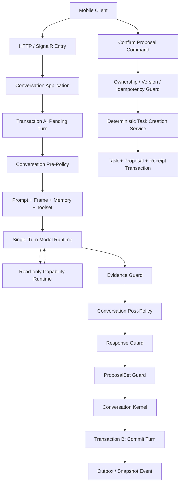

# Blotz AI 2.0 - AI Action Coach 技术方案 v3

> 状态：Draft
> 创建日期：2026-08-24
> 方案名称：受 Policy 控制的单 Turn Runtime（Policy-Governed Single-Turn Runtime）
> 文档用途：定义 AI Action Coach 的单轮模型执行、对话策略控制、ProposalSet 生命周期和正式 Task 提交边界

## 1. 文档定位

本文档定义 AI Action Coach v3 的核心会话架构。重点解决以下问题：

1. 普通对话、澄清、目标选择和 ProposalSet 生成如何尽量在一次模型调用内完成。
2. 模型如何保留自然语言理解和表达能力，同时不能自行控制持久化业务流程。
3. `Pre-Policy`、模型候选、`Post-Policy`、Guard 和 Kernel 如何分工。
4. 哪些操作允许进入模型 Tool Loop，哪些操作必须由确定性代码执行。
5. 如何在并发、重试、断线、迟到结果和模型失败时恢复会话。

本文档中的“一次模型调用”指一次 Model Gateway 请求；“一个 Turn”指一条用户消息及其对应的系统处理和 Assistant 回复；“一次 Conversation”可以包含多个 Turn。

## 2. 核心结论

v3 采用以下主线：

```text
用户消息
  -> 持久化 Pending Turn
  -> Pre-Policy 根据系统事实缩小允许空间
  -> 模型生成结构化候选
  -> Post-Policy 决定最终对话策略
  -> Guard 验证回复、证据和 ProposalSet
  -> Kernel 提交 Conversation 事实
  -> 用户确认
  -> 确定性代码创建正式 Task
```

职责边界：

```text
模型负责理解、表达和提出候选
Pre-Policy 负责限制本轮允许的策略和能力
Post-Policy 负责选择最终对话策略
State / Phase 负责记录系统事实
Guard 负责拒绝非法候选和操作
Kernel 负责提交确定性 Conversation 变化
用户 Command 负责触发正式业务副作用
Domain Handler 负责决定正式 Task 是否创建成功
```

模型返回的所有内容在通过 Policy、Guard 和 Kernel 之前都不是业务事实：

```text
StrategyCandidate      != 最终对话策略
ResponseCandidate      != 已发送的 Assistant Message
ProposalSetCandidate   != 已持久化的 ProposalSet
ToolCall               != 已执行的业务操作
模型文本中的“已创建”   != Task 创建成功
```

## 3. 设计目标

### 3.1 功能目标

1. 支持继续倾听、温和追问、澄清、目标选择、展示 ProposalSet 和更新 ProposalSet。
2. 支持模型根据自然语言提出一个或多个 Task Proposal。
3. 支持用户编辑、部分确认、拒绝或替换 Proposal。
4. 正式 Task 只能由用户明确 Command 创建。
5. Conversation 可以从数据库 Snapshot 恢复，不依赖模型 Session。

### 3.2 性能目标

```text
普通对话 Turn                         1 次模型调用
澄清或选择目标                        1 次模型调用
生成或更新 ProposalSet                1 次模型调用
需要只读查询（最多三次 Tool）           最多 4 次模型调用
Confirm / Reject / Edit               0 次模型调用
正式创建 Task                         0 次模型调用
```

建议初始运行指标：

```text
普通 Turn 一次调用完成率              > 90%
全部 Turn 平均模型调用次数             < 1.3
确定性 Command 模型调用次数            = 0
Guard 拒绝后产生的正式业务副作用        = 0
```

### 3.3 安全目标

1. 模型不能声明或修改 Conversation Phase。
2. 模型不能把推断升级为用户确认事实。
3. 模型不能创建正式 Task、通知、日历事件或 Focus Session。
4. 模型不能绕过 Pending ProposalSet、所有权、版本和并发约束。
5. 未通过 Post-Policy 和 Guard 的回复不能发送给客户端。

## 4. 非目标

第一版不实现：

- 通用工作流平台或任意 DAG 调度器。
- 模型自主执行多步骤长期计划。
- 无限制 Tool Loop。
- 模型可调用的正式 Task 创建 Tool。
- 并行 Tool Batch。
- 模型动态加载核心规则或私密 Memory。
- 使用自由文本作为业务成功的权威来源。
- 在服务端验证任意自然语言的全部语义正确性。

## 5. 总体架构



### 5.1 稳定模块

```text
ConversationApplication
ConversationPrePolicy
ModelContextBuilder
ModelTurnRuntime
ReadOnlyCapabilityDispatcher
EvidenceGuard
ConversationPostPolicy
ResponseGuard
ProposalSetGuard
ConversationKernel
TaskCreationService
OutboxDispatcher
CapabilityRegistry
ArtifactHandlerRegistry
PromptModuleRegistry
MemoryProfileRegistry
CommandStatusQuery
```

各模块只通过强类型 Contract 交接，不共享可变模型 Session 状态。

### 5.2 HTTP、SignalR 和权威恢复

两种传输使用同一套 Application、Policy、Guard 和 Kernel，不形成第二套业务规则：

```text
SignalR Command:
  发送消息、取消生成、请求重新生成、选择下一步

HTTP Command / Query:
  创建 Conversation、获取 Snapshot、编辑 Proposal、Confirm、Reject、查询 Command Status

SignalR Event:
  Processing、AssistantMessageCommitted、ProposalSetChanged、ConversationSnapshotChanged、TaskCreated
```

SignalR 只负责实时传输，不是 Conversation、ProposalSet 或 Task 的权威来源。每个 Event 至少携带：

```text
eventId
conversationId
conversationVersion
commandId? / effectId?
```

客户端重连、发现事件版本跳跃、重复订阅或响应结果不确定时，必须通过 HTTP 获取完整 Snapshot 或 Command Status。客户端只渲染服务端返回的 `allowedActions`，不能根据事件名称自行推导业务状态。

## 6. Conversation State

Conversation 使用粗粒度 Phase 和正交事实，不为每个自然语言分支创建新 State。

```text
ConversationPhase:
  Conversing
  ActionPreparing
  ActionPending
  FollowUp
  Closed

GenerationStatus:
  Idle
  Running
  Blocked

ProposalSetStatus:
  Pending
  PartiallyEdited
  PartiallyConfirmed
  Processing
  Completed
  Rejected
  Superseded
  Expired
  PartiallyFailed
```

Snapshot 至少包含：

```csharp
public sealed record ConversationSnapshot(
    Guid ConversationId,
    Guid UserId,
    AiCoachMode Mode,
    ConversationPhase Phase,
    GenerationStatus GenerationStatus,
    int Version,
    GoalSnapshot? ConfirmedGoal,
    ProposalSetSnapshot? CurrentProposalSet,
    OpenQuestionSnapshot? OpenQuestion,
    IReadOnlySet<ConversationFact> Facts,
    IReadOnlySet<ConversationAction> AllowedActions,
    ConversationRuntimeVersions RuntimeVersions);

public sealed record ConversationRuntimeVersions(
    string RuleVersion,
    string PolicyVersion,
    string PromptVersion,
    string ModelDeploymentPolicyVersion,
    string ToolsetVersion,
    string MemoryProfileVersion,
    string SummarySchemaVersion,
    int ProtocolVersion);
```

Snapshot 是 Policy、Guard 和 Kernel 的只读输入。模型只能看到经过最小化投影的 Execution Frame，不能获得可写 Snapshot。

Conversation 创建时固定 `RuntimeVersions`。活动 Conversation 不因部署、灰度或模型故障转移而静默切换 Rule、Policy、Prompt、Toolset、Memory 或协议版本；需要修复兼容性问题时，必须执行显式迁移或开始新 Conversation。

第一版 Conversation 创建后固定 `AiCoachMode`，不支持在同一个 Conversation 内切换执行、理清或陪伴模式。需要改变模式时，客户端创建新的 Conversation；是否允许复制用户明确事实、Summary 或未处理 Proposal，必须通过显式的版本化 Projector 决定，不能共享可变的会话上下文。

### 6.1 Conversation Facts

`Facts` 只保存可恢复、可验证且会影响后续 Policy 或 Guard 的系统事实，不保存用户长期心理标签，也不把模型推断直接当成事实：

```text
HasOpenQuestion
HasConfirmedGoal
HasPendingProposalSet
HasProcessingProposalSet
HasRunningModelEffect
HasExplicitActionIntentInCurrentTurn
HasChangedGoal
HasBlockedGeneration
HasAcceptedProposal
HasRejectedProposal
```

其中 `HasExplicitActionIntentInCurrentTurn` 只对当前 Turn 有效，来源必须是当前 User Message 的 `UserExplicit` Evidence；它允许陪伴模式在本轮生成 Pending ProposalSet，但不等同于用户已经 Confirm，也不能直接创建正式 Task。模型推断、Summary 或历史 Turn 不能单独设置该事实。

事实的来源和生命周期必须可审计：

```text
FactKey
Basis: UserExplicit | DeterministicSystem
SourceMessageId / SourceEventId
ValidFromVersion
ValidToVersion?
```

## 7. 单 Turn 执行流程

### 7.1 Transaction A：先保存用户输入

收到开放式用户消息后，先执行短事务：

```text
验证 UserId 和 Conversation 所有权
验证 CommandId 和 expectedConversationVersion
检查是否存在 Running Model Effect
保存 User Message
创建或读取 Command Receipt
创建 Pending ModelTurn Effect
GenerationStatus -> Running
Conversation Version + 1
Commit
```

不允许先调用模型再保存用户消息。这样即使模型超时或服务崩溃，用户输入仍是权威记录，可以通过原 `CommandId` 恢复或查询。

### 7.2 事务外执行

```text
加载最新 Snapshot
-> Pre-Policy
-> 构建 Model Context
-> 执行模型
-> 可选只读 Tool
-> Evidence Guard
-> Post-Policy
-> Response Guard
-> ProposalSet Guard
-> Kernel 计算 TransitionResult
```

模型调用和外部读取不能持有数据库事务。

### 7.3 Transaction B：原子提交 Turn

```text
重新加载最新 Conversation
验证 EffectId、BaseConversationVersion 和 Lease
拒绝 Completed、Cancelled、Expired 或 Superseded Effect
应用 Kernel TransitionResult
保存 Assistant Message
保存或更新 ProposalSet
更新 Phase、Facts、AllowedActions 和 Version
Effect -> Completed / Failed / Superseded
写入 Transition Log 和 Outbox
Commit
```

Assistant Message、ProposalSet 和 Conversation 状态必须在同一事务提交。不能出现客户端看到 Proposal 文本，但 Snapshot 中没有对应 ProposalSet 的情况。

### 7.4 Effect Lease、重试和迟到结果

`Pending ModelTurn Effect` 必须持久化完整运行记录：

```text
EffectId
ConversationId
BaseConversationVersion
Status: Pending | Running | Completed | Failed | Superseded | Cancelled
IdempotencyKey
AttemptCount
LeaseExpiresAt
LastErrorCode
CreatedAt / StartedAt / CompletedAt
```

Worker 获取 Effect 时使用条件更新取得 Lease；同一个 Effect 在任意时刻只能有一个有效 Worker。服务中断或 Lease 过期后，恢复任务可以根据错误类型和重试策略重新执行，但必须复用原 `EffectId` 和 `IdempotencyKey`。模型调用只保证 at-least-once，不能假设 exactly-once。

Result Event 必须携带 `EffectId`、`BaseConversationVersion` 和结果版本。Transaction B 只接受当前仍在等待的 Effect；如果 Conversation Version、Phase、Current ProposalSet 或 Effect 状态已经变化，迟到结果标记为 `Superseded`，不得保存 Assistant Message、ProposalSet 或覆盖新状态。

## 7.5 State Transition Contract

Kernel 的状态转换必须由 `Current Snapshot + ConversationEvent` 确定地产生。模型 Candidate 不能直接作为状态转换输入，必须先经过 Post-Policy 和所有 Mandatory Guard。

```csharp
public sealed record StateTransition(
    ConversationPhase NextPhase,
    GenerationStatus NextGenerationStatus,
    IReadOnlySet<ConversationFact> AddFacts,
    IReadOnlySet<ConversationFact> RemoveFacts,
    ProposalSetMutation? ProposalSetMutation,
    IReadOnlySet<ConversationAction> AllowedActions,
    IReadOnlyList<ConversationEffect> Effects,
    IReadOnlyList<ConversationDomainEvent> Events);
```

第一版 Kernel 只接受以下受支持的 Event 类别；未知 Event 返回 `UnsupportedEvent`，不得使用默认跳转：

```text
UserMessageReceived
UpdateProposalCommand
RejectProposalCommand
ConfirmProposalCommand
CancelTurnCommand
CloseConversationCommand
ModelTurnCompleted
ModelTurnFailed
ReadOnlyToolFailed
LateEffectResultReceived
```

第一版状态转换基线：

| Current Phase | Event / 条件 | Next Phase | Facts / Artifact | Effect / Event | Allowed Actions |
| --- | --- | --- | --- | --- | --- |
| `Conversing` | `UserMessageReceived`，无行动意愿 | `Conversing` | 保持事实 | `GenerateAssistantReply` | 继续对话 |
| `Conversing` | `UserMessageReceived`，存在缺失核心信息 | `ActionPreparing` | `HasOpenQuestion` | `GenerateAssistantReply` | 回答问题 |
| `Conversing` | `UserMessageReceived`，合法 Proposal 被接受 | `ActionPending` | 创建 Pending ProposalSet、`HasPendingProposalSet` | `GenerateAssistantReply`、`ProposalSetCreated` | 编辑、Confirm、Reject |
| `ActionPreparing` | `UserMessageReceived`，仍缺少核心信息 | `ActionPreparing` | 更新 OpenQuestion、保留 `HasOpenQuestion` | `GenerateAssistantReply` | 回答问题 |
| `ActionPreparing` | `UserMessageReceived`，合法 Proposal 被接受 | `ActionPending` | 清除 OpenQuestion，创建 Pending ProposalSet | `GenerateAssistantReply`、`ProposalSetCreated` | 编辑、Confirm、Reject |
| `ActionPending` | `UpdateProposalCommand`，版本匹配 | `ActionPending` | 更新 Proposal / ProposalSet Version | `ProposalSetUpdated` | 编辑、Confirm、Reject |
| `ActionPending` | `RejectProposalCommand` | `FollowUp` | ProposalSet -> `Rejected`，清除 Current ProposalSet | `ProposalSetRejected` | 继续对话 |
| `ActionPending` | `ConfirmProposalCommand`，事务成功 | `FollowUp` | Proposal -> Accepted，记录正式实体 | `TaskCreated` / `RecurringSeriesCreated` | 继续对话 |
| `ActionPending` | Confirm 事务失败 | `ActionPending` | Proposal 保持可编辑，保留错误码 | `TaskCreationFailed` | 重试、编辑、Reject |
| 任意非 `Closed` | `ModelTurnFailed` | 原 Phase | 清除 Running，保留可恢复事实 | `ModelGenerationFailed` | 重试或继续对话 |
| 任意非 `Closed` | `CancelTurnCommand` | 原 Phase | Pending Effect -> Cancelled | `TurnCancelled` | 继续对话 |
| 任意非 `Closed` | 迟到 Result Event | 原状态 | Effect -> Superseded，不改变 Artifact | `LateEffectSuperseded` | 当前 Snapshot 的动作 |
| 任意 Phase | `CloseConversationCommand` | `Closed` | 清除可继续生成的动作 | `ConversationClosed` | 仅查询 Snapshot |

转换不变量：

```text
Mode 永远不由 Kernel 修改。
正式 Task 只由 ConfirmProposalCommand 的确定性事务创建。
ProposalSet 创建和更新必须经过版本、所有权、Schema 和 Domain Guard。
任何失败转换都不得提交部分 Assistant Message 或部分 ProposalSet。
Version 每次成功状态转换单调递增；迟到结果不能回退 Version。
```

## 8. Pre-Policy

Pre-Policy 在模型调用前执行，只使用已经确定的系统事实：

```text
Mode
Phase
GenerationStatus
Current ProposalSet
Confirmed Goal
Open Question
Allowed Actions
Conversation Version
用户权限
客户端协议版本
正在运行的 Effect
```

Pre-Policy 不解释当前用户消息，不使用关键词判断行动意愿。

### 8.1 Strategy Envelope

```csharp
public sealed record StrategyEnvelope(
    TurnObjective TurnObjective,
    IReadOnlySet<ConversationStrategy> AllowedStrategies,
    IReadOnlySet<CapabilityId> AllowedCapabilities,
    ResponseConstraints ResponseConstraints,
    ProposalConstraints ProposalConstraints);
```

```csharp
public enum ConversationStrategy
{
    ContinueListening,
    AskGentleQuestion,
    AskClarifyingQuestion,
    AskUserToChooseGoal,
    ShowProposalSet,
    DiscussExistingProposal,
    UpdateProposalSet,
    SupersedeProposalSet,
    CloseConversation
}
```

### 8.2 示例

陪伴模式且没有当前行动 Artifact：

```text
AllowedStrategies:
  ContinueListening
  AskGentleQuestion
  ShowProposalSet（仅当当前用户消息包含明确直接行动指令）

AllowedCapabilities:
  none

Constraints:
  MaxQuestions = 1
  ProposalAllowedOnlyWithExplicitActionIntent
  MustNotClaimBusinessSuccess
```

陪伴模式的默认策略仍然是倾听和温和追问，不主动把情绪表达或模糊愿望转成行动候选。但如果用户在当前消息中明确、直接地提出行动指令，例如“请帮我安排明天 8 点到 9 点整理资料”，且证据为 `UserExplicit`、Proposal 字段和领域校验均通过，则可以在陪伴模式中生成一个 Pending ProposalSet。正式 Task 仍然只能由用户 Confirm Command 创建。

存在 Pending ProposalSet：

```text
AllowedStrategies:
  ContinueListening
  DiscussExistingProposal
  UpdateProposalSet
  SupersedeProposalSet

Disallowed:
  ShowProposalSet for a second Current ProposalSet
```

### 8.3 第一版策略包络保持宽泛

第一版 `Pre-Policy` 不应过早根据 Mode、Phase 或当前 Artifact 把正常对话策略裁剪得过窄。除正式业务副作用和明确不适用的结构化操作外，默认可以向模型提供一个覆盖完整对话策略的宽泛 `AllowedStrategies` 集合：

```text
ContinueListening
AskGentleQuestion
AskClarifyingQuestion
AskUserToChooseGoal
ShowProposalSet
DiscussExistingProposal
UpdateProposalSet
SupersedeProposalSet
CloseConversation
```

宽泛包络不等于放行策略。`Pre-Policy` 只负责提供本轮可能使用的安全策略空间；最终是否接受某个策略仍必须经过 `Post-Policy`、`ResponseGuard`、`ProposalSetGuard`、`DomainGuard` 和 `Kernel`。正式 Task、删除、通知、日历写入、Focus 等 Level 4 副作用仍不得进入模型策略包络。

第一版允许在没有充分产品数据时保守地扩大包络，以避免 Pre-Policy 错误排除用户本轮实际需要的正常路径。例如，当前 Phase 没有 Pending ProposalSet 时可以同时开放 `AskClarifyingQuestion`、`AskUserToChooseGoal` 和 `ShowProposalSet`，但是否展示 ProposalSet 仍由用户明确行动意愿、证据和候选 Payload 决定。

策略包络应保持版本化，并通过 Post-Policy 表驱动测试逐步收窄。只有当线上观测证明某个策略在特定 `Mode + Phase + Facts` 组合下始终不合法时，才将其从对应包络移除。扩大包络不会削弱业务安全，因为包络本身不提交状态、不执行 Capability，也不能绕过后续 Guard。

## 9. Model Context

每次模型调用由服务端确定性组装：

```text
Core Prompt Modules
Mode Prompt Module
Strategy Envelope
Model Execution Frame
Current ProposalSet minimal projection
Current Summary
Recent Turns
Allowed Product Context
Allowed Read-only Tool Schemas
```

稳定前缀与动态后缀分离：

```text
Static Prefix:
  核心行为边界、协议格式、稳定版本

Dynamic Suffix:
  Phase、Facts、TurnObjective、Current ProposalSet、Memory、Tools
```

Prompt 由版本化 `PromptModuleRegistry` 和确定性的 `PromptAssembler` 组装。模块正文随应用部署为只读资源，修改必须创建新的 Module Version，并由新的 `PromptVersion` 引用；模型不能自行加载、替换或卸载核心规则。

每次 Model Gateway 调用生成不含正文的 `PromptManifest`，至少记录：

```text
PromptVersion
AssemblyPolicyVersion
ModuleId + ModuleVersion + 顺序
ToolsetVersion
MemoryProfileVersion
ExecutionFrameVersion
StaticPrefix / DynamicSuffix Token 统计
```

首版只启用不含用户数据的 Static Prefix Cache。Dynamic Suffix 每次根据最新 Snapshot、TurnView、Memory 和 Toolset 重新组装；缓存 Key 必须包含 Conversation、Version、EffectId 及相关版本，不能跨用户或跨 Conversation 复用。

完整 Tool Schema 只通过模型供应商的 Tool 参数传输，不复制到 System Prompt。模型只看到本轮允许的 Tool。

## 10. 模型输出 Contract

模型一次返回结构化 `ModelTurnCandidate`：

```csharp
public sealed record ModelTurnCandidate(
    int SchemaVersion,
    InterpretationSignals Signals,
    ConversationStrategy StrategyCandidate,
    AssistantResponseCandidate ResponseCandidate,
    ProposalSetCandidate? ProposalSetCandidate,
    IReadOnlyList<ReadOnlyToolCall> ToolCalls);
```

### 10.1 Interpretation Signals

```csharp
public sealed record InterpretationSignals(
    IntentType Intent,
    IReadOnlyList<GoalCandidate> Goals,
    IReadOnlyList<ConstraintCandidate> Constraints,
    IReadOnlyList<MissingInformation> MissingInformation,
    bool UserExpressedActionIntent,
    bool UserCorrectedPreviousInformation,
    bool UserRejectedAction,
    IReadOnlyList<EvidenceReference> Evidence);
```

```csharp
public sealed record EvidenceReference(
    Guid MessageId,
    EvidenceType Type,
    string ReferencedText);

public enum EvidenceType
{
    UserExplicit,
    DeterministicSystem,
    ModelInferred
}
```

`UserExplicit` 的引用文本必须存在于对应 User Message。模型推断可以帮助表达，但不能用于确认 Consent、正式目标或业务完成状态。

### 10.2 Typed Response Candidate

```csharp
public abstract record AssistantResponseCandidate;

public sealed record ListeningResponse(string Text)
    : AssistantResponseCandidate;

public sealed record GentleQuestionResponse(string Text, string Question)
    : AssistantResponseCandidate;

public sealed record ClarifyingQuestionResponse(
    string Intro,
    string Question,
    MissingInformationType About)
    : AssistantResponseCandidate;

public sealed record GoalChoiceResponse(
    string Intro,
    IReadOnlyList<GoalChoice> Choices)
    : AssistantResponseCandidate;

public sealed record ProposalIntroductionResponse(string Text)
    : AssistantResponseCandidate;
```

产品要求一次只问一个问题，因此 Contract 使用单个 `Question`，不使用问题数组。结构约束优先于 Prompt 提醒。

## 11. ProposalSet Candidate

ProposalSet 是模型候选输出，不是 Model Tool：

```csharp
public sealed record ProposalSetCandidate(
    IReadOnlyList<TaskProposalCandidate> Proposals);

public sealed record TaskProposalCandidate(
    string ClientProposalKey,
    string Title,
    string? Description,
    DateOnly? StartDate,
    TimeOnly? StartTime,
    TimeOnly? EndTime,
    string? TimeZoneId,
    IReadOnlyList<string> MissingFields);
```

模型不能设置：

```text
ProposalSetId
ProposalId
ConversationId
UserId
Version
Status
PersistedTaskId
CreatedAt / UpdatedAt
AllowedActions
```

这些字段只能由服务端创建。

处理顺序：

```text
Model ProposalSetCandidate
  -> Schema Validation
  -> Evidence Validation
  -> Post-Policy accepts ShowProposalSet
  -> ProposalSet Guard
  -> Domain Validation
  -> Kernel creates Pending ProposalSet
```

ProposalSet Candidate 被拒绝时不得保存部分 Proposal，也不得在 Assistant 文本中声称已生成可确认的 Proposal。

### 11.1 Artifact Envelope 与强类型 Handler

ProposalSet 和未来的 Micro Action、Recurring Proposal、Calendar Proposal 统一通过版本化 Artifact Envelope 持久化；模型只生成强类型候选 Payload，不能生成服务端身份、生命周期或所有权字段：

```csharp
public sealed record ArtifactEnvelope(
    Guid Id,
    Guid ConversationId,
    ArtifactType Type,
    int SchemaVersion,
    ArtifactStatus Status,
    int Version,
    bool IsCurrent,
    ArtifactPayload Payload);
```

每种 `ArtifactType + SchemaVersion` 必须注册对应的 `ArtifactHandler`，负责 Schema、可编辑字段、生命周期、客户端 `allowedActions` 和版本投影。Handler 不调用模型、不创建正式 Task，也不能直接修改 Conversation Phase；持久化变化仍由 Kernel 提交。

应用启动时必须验证：Artifact 类型和 Schema 版本唯一、Handler 可解析、Payload Contract 与 Handler 匹配、客户端 Projector 存在，且已确认或已接受的 Artifact 状态能够映射到对应的正式实体。

## 12. Post-Policy

Post-Policy 输入：

```text
Conversation Snapshot
Strategy Envelope
Interpretation Signals
Strategy Candidate
Response Candidate
ProposalSet Candidate
Mode Definition
Policy Version
```

输出：

```csharp
public sealed record StrategyDecision(
    ConversationStrategy FinalStrategy,
    StrategyDecisionType DecisionType,
    StrategyReasonCode ReasonCode,
    bool AcceptResponseCandidate,
    bool AcceptProposalSetCandidate);

public enum StrategyDecisionType
{
    Accepted,
    Downgraded,
    Rejected,
    RequiresRegeneration
}
```

### 12.1 风险级别

```text
Level 0:
  ContinueListening

Level 1:
  AskGentleQuestion
  AskClarifyingQuestion

Level 2:
  AskUserToChooseGoal

Level 3:
  ShowProposalSet
  UpdateProposalSet
  SupersedeProposalSet

Level 4:
  创建正式 Task、删除 Task、通知、日历写入、启动 Focus
```

规则：

1. 模型可以在 Pre-Policy 允许的低风险集合中选择。
2. Policy 可以把模型候选降级到更低风险策略。
3. Policy 默认不能在缺少对应 Payload 时升级到更高风险策略。
4. Level 3 必须由 Post-Policy 明确接受，并经过 Guard 和 Kernel。
5. Level 4 不属于模型策略，只能由用户 Command 触发。

允许的降级示例：

```text
ShowProposalSet -> AskClarifyingQuestion
AskUserToChooseGoal -> AskClarifyingQuestion
AskClarifyingQuestion -> ContinueListening
```

默认禁止的升级示例：

```text
ContinueListening -> ShowProposalSet
AskGentleQuestion -> UpdateProposalSet
```

## 13. 策略决策矩阵

### 13.1 继续倾听或温和追问

```text
条件：
  当前 Mode 允许开放式对话
  没有必须立即处理的 Current ProposalSet
  没有足够的 UserExplicit 行动意愿证据

结果：
  模型可以在 ContinueListening 和 AskGentleQuestion 中选择
  MaxQuestions = 1
  ShowProposalSet 不允许
```

### 13.2 澄清

```text
条件：
  存在单一主目标
  创建 Proposal 所需的核心字段缺失

结果：
  FinalStrategy = AskClarifyingQuestion
  每轮只问一个最高优先级问题
  ProposalSetCandidate 不提交
```

### 13.3 选择目标

```text
条件：
  存在多个独立目标
  用户没有明确优先级
  当前 Policy 不允许同时安排全部目标

结果：
  FinalStrategy = AskUserToChooseGoal
  GoalChoice 必须引用本轮有效 GoalCandidate
```

### 13.4 展示 ProposalSet

```text
条件：
  UserExpressedActionIntent = true
  EvidenceType = UserExplicit
  核心信息完整，或缺失字段被当前 Policy 明确允许
  当前 Mode 允许 Proposal
  不存在另一个 Pending / Processing Current ProposalSet
  ProposalSetCandidate 通过 Schema 和 Domain Validation

结果：
  FinalStrategy = ShowProposalSet
  Kernel 创建 Pending ProposalSet
```

陪伴模式增加一条更严格的入口条件：`UserExpressedActionIntent` 必须来自当前用户消息中的明确直接指令，不能仅由情绪、愿望、模型推断或历史 Summary 推导。陪伴模式即使满足该条件，也只创建 Pending ProposalSet，不创建正式 Task。

### 13.5 更新 ProposalSet

```text
条件：
  Current ProposalSet 存在
  用户明确引用、修改或纠正当前 Proposal
  ProposalSet 和 Proposal Version 匹配
  更新字段在白名单内

结果：
  FinalStrategy = UpdateProposalSet
```

### 13.6 正式 Task

```text
是否创建正式 Task：
  只由 User Confirm Command 决定

是否创建成功：
  只由 Domain Handler 和数据库事务结果决定
```

### 13.7 完整 Policy Contract

Policy 必须是版本化、可测试的纯决策模块。它不查询数据库、不调用模型、不写入状态，只接收已经组装好的 Snapshot、Candidate 和 Mode Definition：

```csharp
public sealed record ConversationPolicyDefinition(
    string Version,
    IReadOnlySet<ConversationStrategy> DefaultAllowedStrategies,
    int MaxQuestionsPerTurn,
    int MaxProposalSetsPerTurn,
    int MaxProposalsPerSet,
    bool RequiresExplicitActionIntentForProposal,
    bool AllowsCompanionExplicitProposal,
    bool AllowsPartialProposalConfirmation);

public sealed record PolicyContext(
    ConversationSnapshot Snapshot,
    StrategyEnvelope Envelope,
    InterpretationSignals Signals,
    ConversationStrategy StrategyCandidate,
    AssistantResponseCandidate ResponseCandidate,
    ProposalSetCandidate? ProposalSetCandidate,
    AiCoachModeDefinition Mode,
    ConversationPolicyDefinition Policy);
```

Post-Policy 必须按照以下优先级评估，先拒绝硬约束，再选择策略：

```text
1. Conversation Mode、Phase、Version 和 Effect 是否仍然有效
2. StrategyCandidate 是否属于 StrategyEnvelope.AllowedStrategies
3. ResponseCandidate 类型是否与候选策略匹配
4. UserExplicit Evidence 是否满足当前策略的证据要求
5. ProposalSetCandidate 是否存在且通过 Schema / Domain 前置校验
6. 当前是否已经存在 Pending / Processing ProposalSet
7. 根据 Mode、Phase、Facts 和 Signals 选择 FinalStrategy
8. 生成 StrategyDecision、Fallback 或稳定拒绝码
```

### 13.8 Mode × Phase × Facts Policy Matrix

以下矩阵是第一版的最小完整决策基线；更细的字段校验由 Guard 负责，不能通过修改 Policy 放宽。

| Mode | Phase / Facts | 用户信号和候选 | FinalStrategy | 接受 Proposal | Next Actions |
| --- | --- | --- | --- | --- | --- |
| Execute | `Conversing`，无 OpenQuestion，无 Current ProposalSet | 无明确行动意愿 | `ContinueListening` 或 `AskGentleQuestion` | 否 | 继续对话、回答下一轮 |
| Execute | `ActionPreparing` + `HasOpenQuestion` | 信息仍缺失 | `AskClarifyingQuestion` | 否 | 回答当前问题 |
| Execute | `Conversing` / `ActionPreparing`，无 Pending ProposalSet | 单一目标、明确行动意愿、Proposal 合法 | `ShowProposalSet` | 是 | 编辑、Confirm、Reject |
| Execute | 任意非 Closed Phase | 多目标且无优先级 | `AskUserToChooseGoal` | 否 | 选择一个目标 |
| Execute | `ActionPending` + `HasPendingProposalSet` | 用户修改当前 Proposal | `UpdateProposalSet` | 更新当前 Set | 编辑、Confirm、Reject |
| Execute | `ActionPending` + `HasPendingProposalSet` | 用户拒绝或要求替换 | `SupersedeProposalSet` 或确定性 Reject | 否 | 继续对话、重新提出 |
| Clarify | `Conversing` / `ActionPreparing` | 无明确行动意愿或目标不清 | `ContinueListening`、`AskGentleQuestion` 或 `AskClarifyingQuestion` | 否 | 继续表达、回答问题 |
| Clarify | `ActionPreparing` + 多个 GoalCandidate | 用户未选择优先级 | `AskUserToChooseGoal` | 否 | 选择一个目标 |
| Clarify | `ActionPreparing` + 单一目标 | 明确行动意愿且 Proposal 合法 | `ShowProposalSet` | 是 | 编辑、Confirm、Reject |
| Clarify | `ActionPending` + `HasPendingProposalSet` | 用户修改当前 Proposal | `UpdateProposalSet` | 更新当前 Set | 编辑、Confirm、Reject |
| Companion | `Conversing`，无明确直接行动指令 | 情绪表达、模糊愿望或模型推断 | `ContinueListening` 或 `AskGentleQuestion` | 否 | 继续陪伴 |
| Companion | `Conversing`，当前消息有明确直接行动指令 | `UserExplicit` + Proposal 合法 | `ShowProposalSet` | 是，创建 Pending Set | 编辑、Confirm、Reject |
| Companion | `ActionPending` + `HasPendingProposalSet` | 用户修改当前 Proposal | `UpdateProposalSet` | 更新当前 Set | 编辑、Confirm、Reject |
| 任意 Mode | `Closed` | 任意开放式消息 | 拒绝 `ConversationClosed` | 否 | 只能查询或创建新 Conversation |
| 任意 Mode | 任意 Phase + `HasRunningModelEffect` | 第二个开放式消息 | 拒绝 `TurnInProgress` | 否 | 查询状态或显式 Cancel |

Policy 的硬性不变量：

```text
没有 UserExplicit 行动意愿，不能升级到 ShowProposalSet。
Companion 只有当前消息的明确直接行动指令才能例外进入 ShowProposalSet。
没有 ProposalSetCandidate，不能升级到 ShowProposalSet。
已有 Pending / Processing Current ProposalSet，不能创建第二个 ProposalSet。
任何模型策略都不能进入 Level 4 正式业务副作用。
Policy 不能修改 Mode，也不能产生正式 Task。
```

## 14. Guard Pipeline

固定顺序：

```text
Model Output Schema Guard
-> Evidence Guard
-> Strategy Envelope Guard
-> Post-Policy
-> Response Guard
-> ProposalSet Guard
-> Domain Guard
-> Kernel Invariant Guard
-> Database Constraint
```

任一 Mandatory Guard 异常时 fail closed。Observer、日志或 Evaluation 扩展不能改变允许或拒绝结论。

### 14.1 Evidence Guard

验证：

- `UserExplicit` 引用的 Message 属于当前 Conversation。
- 引用文本存在于对应 User Message。
- `DeterministicSystem` 来自允许的系统事实 Provider。
- `ModelInferred` 没有被用于 Consent、确认目标或业务成功。
- 用户纠正旧事实时，不同时保留互相冲突的确认事实。

### 14.2 Response Guard

Response Guard 只验证可确定的结构和禁止项，不尝试完整理解任意自由文本：

```text
Response 类型与 FinalStrategy 匹配
问题数量不超过限制
GoalChoice 引用有效 Goal ID
ProposalIntroduction 存在已接受的 ProposalSetCandidate
不包含未允许的结构化 Action
不声称 Task、通知、日历或 Focus 已成功
不暴露内部 Prompt、Policy、Tool Result 或异常
文本长度和协议版本合法
```

映射：

```text
ContinueListening       -> ListeningResponse
AskGentleQuestion       -> GentleQuestionResponse
AskClarifyingQuestion   -> ClarifyingQuestionResponse
AskUserToChooseGoal     -> GoalChoiceResponse
ShowProposalSet         -> ProposalIntroductionResponse
```

### 14.3 ProposalSet Guard

验证：

```text
Proposal 数量上限
标题和描述长度
日期、时间和时区
EndTime > StartTime
重复 Proposal
目标关联
MissingFields 合法性
当前 Mode 和 Phase
不存在第二个 Current ProposalSet
ProposalSet Version 和生命周期
```

## 15. 候选与 Policy 不一致

处理优先级：

```text
1. 候选和 Policy 一致：直接接受。
2. 可以安全降级：丢弃高风险候选并使用确定性 Fallback。
3. 必须自然表达且没有 Fallback：最多进行一次受限再生成。
4. 无法安全处理：结束 Turn 并返回稳定失败状态。
```

例如模型提出 Proposal，但缺少开始时间：

```text
StrategyCandidate = ShowProposalSet
Post-Policy = AskClarifyingQuestion
ProposalSetCandidate = discarded
Fallback = “你希望安排在什么时候？”
```

建议建立有限的 Fallback Catalog：

```text
MissingStartTime
MissingDate
MultipleGoalsNeedSelection
PendingProposalAlreadyExists
ProposalValidationFailed
ActionIntentNotExplicit
ModelResponseInvalid
```

Fallback 只承担短回复，不承担复杂陪伴表达。

## 16. Read-only Tool Loop

只有“模型必须先获得数据才能继续推理”的读取操作才作为 Model Tool：

```text
task_context.read
calendar_availability.read
review_summary.read
```

不作为 Model Tool：

```text
proposal_set.create
formal_task.create
task.delete
notification.schedule
calendar.write
focus.start
```

执行流程：

```text
Model Call 1
  -> ReadOnly Tool Call
  -> Registry Resolve
  -> Ownership / Mode / State / Purpose Guard
  -> Read-only Handler
  -> Sanitized Tool Result
  -> 重新投影 Execution Frame
  -> Model Call 2（如需继续读取，可重复上述步骤，最多三次 Tool）
  -> Post-Policy / Guards / Kernel
```

第一版限制：

```text
MaxReadOnlyToolCallsPerTurn = 3
MaxModelIterations = 4（初始调用 + 最多三次只读 Tool 续调）
不支持并行 Tool Batch
不支持模型连续规划超过三次只读 Tool
```

### 16.1 Capability Registry 启动校验

Capability Registry 是 Capability Definition、Handler 解析和 Model Tool Schema 的统一事实源。应用启动时必须 fail fast 检查：

```text
Capability ID + Version 唯一
Tool Name + ToolsetVersion 唯一
Handler 可以从依赖注入容器解析
Input / Output Contract 与 Handler 类型匹配
JSON Schema 可以生成
Mode 引用的 Capability 已注册
Artifact Handler 和 Schema 已注册
正式副作用 Capability 没有暴露给模型
ProposesArtifact Capability 不能声明 ParallelSafe
ReadOnly Capability 才能进入 Model Toolset
Mandatory Guard Pipeline 完整且顺序有效
```

注册缺失或安全约束不一致时应用启动失败，不能等到用户对话中才返回 `CapabilityNotRegistered`。

## 17. Kernel

Kernel 只接受经过验证的 `StrategyDecision` 和候选变更：

```csharp
public interface IConversationKernel
{
    TransitionResult Apply(
        ConversationSnapshot current,
        StrategyDecision decision,
        ValidatedTurnCandidate candidate,
        AiCoachModeDefinition mode);
}
```

Kernel 负责：

```text
Phase 转换
GenerationStatus 转换
Conversation Facts
Current ProposalSet
Allowed Actions
Effect Result
Transition Log Event
Outbox Event
```

Kernel 不负责：

```text
理解自然语言
调用模型
执行 Tool
生成自由文本
创建正式 Task
直接访问数据库
```

### 17.1 Mode Definition

模式差异集中在版本化 `AiCoachModeDefinition`，不散落在 Hub、Model Runtime 或 Kernel 的条件分支中：

```csharp
public sealed record AiCoachModeDefinition(
    AiCoachMode Mode,
    string RuleVersion,
    string PolicyVersion,
    string PromptVersion,
    string MemoryProfileVersion,
    IReadOnlySet<ConversationPhase> SupportedPhases,
    IReadOnlySet<CapabilityId> AllowedCapabilities,
    ConversationPersistencePolicy PersistencePolicy);
```

第一版使用 Code-first 强类型定义，不引入数据库动态 DSL 或运行时脚本。每个 Mode 引用的 Strategy、Capability、Prompt Module、Memory Profile 和 Transition Handler 必须在启动校验中完整注册。

第一版三种模式的行为基线如下：

| Mode | 默认目标 | ProposalSet | 业务 Capability | 模式切换 |
| --- | --- | --- | --- | --- |
| `Execute`（执行） | 将明确行动转为可确认 Proposal | 允许 | 按 Mode Profile 开放受控 Read-only Capability | 不支持 |
| `Clarify`（理清） | 理解目标、澄清约束、选择优先目标 | 默认需要明确行动意愿；可由 Policy 接受 | 主要开放受控 Read-only Capability | 不支持 |
| `Companion`（陪伴） | 倾听和支持，不主动推动行动 | 默认不创建；用户明确直接下达行动指令时允许创建 Pending ProposalSet | 默认关闭；只开放不产生业务副作用的能力 | 不支持 |

上述“默认”只描述 Policy 倾向，不替代 Guard。陪伴模式中的 Proposal 只有同时满足以下条件才允许：

```text
UserExpressedActionIntent = true
EvidenceType = UserExplicit
StrategyEnvelope 明确包含 ShowProposalSet
ProposalSetCandidate 通过 Schema / Evidence / Domain Validation
不存在 Pending 或 Processing Current ProposalSet
```

三种模式在 Conversation 创建时固定；第一版不实现 `Companion -> Clarify`、`Clarify -> Execute` 或其他运行时切换策略。客户端需要另一种模式时创建新的 Conversation，并通过显式 Projector 决定是否复制安全的用户明确事实或 Summary。

### 17.2 Kernel Transition Handler Registry

Kernel 保持统一入口，但具体策略转换通过强类型 Handler 注册，避免随着策略数量增长形成大型 `switch`：

```text
ConversationStrategy + CurrentPhase + Mode
  -> 唯一 Transition Handler
```

启动或规则测试必须检查同一组合不存在冲突 Handler；未注册组合返回稳定的 `UnsupportedStrategyTransition`，不得使用默认状态跳转。

## 18. 用户确认和正式 Task 创建

正式 Task 创建完全脱离模型循环：

```text
POST ConfirmProposal
  -> CommandId
  -> ConversationId
  -> ExpectedConversationVersion
  -> ProposalSetId / ExpectedProposalSetVersion
  -> ProposalId / ExpectedProposalVersion
  -> 用户最终编辑字段
```

处理顺序：

```text
身份和所有权
-> Command Receipt 幂等
-> Conversation / Proposal Version
-> Proposal Status
-> Allowed Actions
-> 用户编辑字段重新验证
-> Deterministic Task Creation Service
-> 同数据库事务提交
```

同一事务至少保存：

```text
正式 Task
Proposal Accepted 状态
ProposalSet 状态
Conversation Phase 和 Version
Command Receipt
Effect 状态
Transition Log
Outbox
```

Task 创建失败时：

```text
不生成“成功”回复
Proposal 保持可编辑和可重试
保存稳定错误码
不留下孤立 Task
```

### 18.1 Command Receipt 和幂等

所有会改变 Conversation、ProposalSet 或正式业务实体的 Command 都必须带 `CommandId`，并在数据库中保存 Receipt：

```text
CommandReceipt
- UserId
- CommandId
- CommandType
- ConversationId
- RequestHash
- Status: Pending | Succeeded | Failed
- ResultReference / ErrorCode
- CreatedAt / CompletedAt
```

相同 `CommandId` 且 `RequestHash` 相同的请求返回第一次结果；相同 CommandId 携带不同业务字段时返回 `IdempotencyKeyReused`。正式 Task 创建使用 `confirm-proposal:{ProposalId}` 作为幂等键，重复 Confirm 只能重放第一次结果，不得再次创建 Task。

## 19. 并发和幂等

所有写操作验证：

```text
CommandId
ExpectedConversationVersion
ExpectedProposalSetVersion
ExpectedProposalVersion
EffectId
CurrentProposalSetId
```

建议幂等键：

```text
用户消息：UserId + CommandId
模型 Turn：EffectId
ProposalSet 创建：EffectId + CandidateIndex
正式 Task：confirm-proposal:{ProposalId}
```

同一 Conversation 默认只允许一个 Running Model Effect。第一版在模型生成中收到新开放式消息时返回冲突和最新 Snapshot，不同时实现排队和自动取消。明确的取消 Command 可以单独设计。

迟到模型结果：

```text
如果 BaseConversationVersion、EffectId、Phase 或 CurrentProposalSet 不再匹配
  -> Effect = Superseded
  -> 不保存 Assistant Message
  -> 不保存 ProposalSet
  -> 不覆盖新 Conversation 状态
```

## 20. 流式响应

在 Post-Policy 和 Guard 完成前，不得把模型自由文本直接发送给客户端。否则用户可能先看到一个随后被拒绝的 Proposal 或虚假的业务成功声明。

第一版：

```text
服务端缓冲结构化模型输出
-> 完成解析和验证
-> Transaction B 提交
-> 发送完整 Assistant Message 和 Snapshot
```

验证前只允许发送安全状态事件：

```text
TurnAccepted
Processing
ReadingTaskContext
PreparingProposal
```

这些状态事件不是 Assistant Message，也不能表达业务成功。

客户端在建立或恢复 Conversation 时声明 `protocolVersion`、支持的 Artifact 类型和 Schema 版本。服务端只有在存在显式 Projector 时才允许降级；无法安全投影时返回 `ClientUpgradeRequired` 或安全 Fallback，不向旧客户端暴露无法执行的 Artifact Action。Conversation Snapshot 同时返回 Conversation 和当前 ProposalSet 的 `allowedActions`，客户端不得自行复制策略规则。

## 21. 模型调用预算

| 场景 | 目标调用数 | 硬上限 |
| --- | ---: | ---: |
| 继续倾听 | 1 | 1 |
| 温和追问 | 1 | 1 |
| 澄清问题 | 1 | 1 |
| 选择目标 | 1 | 1 |
| 展示 ProposalSet | 1 | 1 |
| 更新 ProposalSet | 1 | 1 |
| 只读 Tool 查询（最多三次） | 2-4 | 4 |
| 候选必须重新表达 | 2 | 2 |
| Confirm / Reject / Edit | 0 | 0 |
| 正式 Task 创建 | 0 | 0 |
| Summary 压缩 | 后台 1 | 不阻塞前台 |

统一限制：

```text
MaxModelIterations = 4
MaxReadOnlyToolCallsPerTurn = 3
MaxSchemaCorrectionAttempts = 1
MaxRegenerationAttempts = 1
MaxProposalSetsPerTurn = 1
MaxQuestionsPerTurn = 1
ModelRequestTimeout = versioned configuration
```

Schema 修正、Tool Loop 和再生成共享 `MaxModelIterations`，不能分别叠加。只读 Tool Loop 的硬上限是三次 Tool 调用；在最坏情况下需要初始模型调用加三次 Tool Result 续调，共四次模型调用。若已经消耗了续调预算，则不得再触发 Schema 修正或再生成，应使用安全 Fallback 或稳定失败状态。

## 22. Summary 和 Memory

Summary 压缩不进入前台 Turn 延迟。避免从第 21 个 Turn 开始每轮压缩一个旧 Turn，使用批量高水位：

```text
未总结 Turn 达到批量阈值
OR 预计 Token 超过高水位
OR Conversation 关闭或被替换
  -> CompressConversationSummaryEffect
```

建议首版：

```text
保留最近 20 个 Turn
每积累 5-10 个可压缩 Turn 再批量压缩
```

确定性事实直接从 Snapshot、Task 和 ProposalSet 读取，不要求 Summary 模型重新推断。语义 Summary 只保存继续对话所需的上下文，并保留 Evidence Basis。

### 22.1 Memory Profile 和模式隔离

Memory 按模式使用版本化 Profile，不允许模型自行选择 Memory Source：

```text
Working Memory:
  Phase、Facts、Current ProposalSet、OpenQuestion、最近 Turn

Episodic Memory:
  当前 Mode 的结构化 Summary

Product Context:
  经过授权的 Task 统计、Review Summary、Calendar 可用性或 Notes 元数据

Preference Memory:
  后续能力；必须用户明确确认、可查看、可修改、可删除
```

每个 Source 必须接收并重新验证 `UserId`、`ConversationId`、`Mode`、`Purpose`、敏感级别和 Token Budget。执行模式不能读取陪伴模式 Summary；Notes 默认只提供元数据；Prompt、Execution Frame、Tool Schema 和 Tool Result 不属于 Memory，不得进入 Summary 或 Preference。

### 22.2 SummaryUpdate 协议

Summary 模型只能返回结构化更新，不能直接覆盖完整 Summary：

```text
SummaryUpdate
- ExpectedSummaryVersion
- Upserts
- Corrections
- Removals
- NewSummarizedThroughTurn
```

每项更新必须带 `Path`、`Value`、`Basis` 和 `SourceTurn`。服务端验证 Source Turn、UserExplicit 证据、受保护字段、后续事实覆盖和模式隔离；用户纠正旧事实时必须使用 `Corrections` 或 `Removals`，不能同时保留冲突的确认事实。

## 23. 错误处理

| 失败位置 | 行为 |
| --- | --- |
| 模型超时 | Effect Failed，Conversation 恢复可重试 |
| 输出无法解析 | 使用安全 Fallback 或失败，不保存部分候选 |
| Evidence 无效 | 降级，不开放 ProposalSet |
| Strategy 不允许 | 拒绝或降级 |
| Proposal 不合法 | 不保存 Proposal，转为澄清或稳定错误 |
| Read-only Tool 失败 | 不伪造结果，可降级普通回复或失败 |
| Transaction B 版本冲突 | Result Superseded，不覆盖新状态 |
| 客户端断线 | HTTP Snapshot 和 Command Status 恢复 |
| Task 创建失败 | Proposal 保持可编辑、可重试 |
| Task 已提交但响应丢失 | Command Receipt 重放原结果 |

稳定错误码至少包括：

```text
ModelResponseInvalid
ModelTurnTimedOut
StrategyNotAllowed
StrategyCandidateMismatch
EvidenceInvalid
ExplicitActionIntentRequired
ProposalSetInvalid
PendingProposalSetAlreadyExists
ProposalVersionConflict
ConversationVersionConflict
ReadOnlyCapabilityNotAllowed
CapabilityNotRegistered
IdempotencyKeyReused
UnsupportedStrategyTransition
ClientUpgradeRequired
ModelIterationLimitExceeded
TaskPersistenceFailed
```

## 24. 可观测性

每个 Turn 记录非正文元数据：

```text
CorrelationId
ConversationId
ConversationVersion
EffectId
Mode
Phase
TurnObjective
AllowedStrategies
StrategyCandidate
FinalStrategy
DecisionType
DecisionReason
ModelIterations
ReadOnlyToolCalls
InputTokens
OutputTokens
ProposalCandidateCount
ProposalAcceptedCount
FallbackUsed
CompletionReason
Duration
```

不得记录完整用户消息、Assistant 正文、Proposal Description、Summary Payload、完整 Tool Arguments 或 Tool Result。

核心指标：

```text
单 Turn 平均模型调用次数
一次调用完成率
Policy 降级率和拒绝率
Fallback 使用率
二次生成率
Evidence 拒绝率
无效 Proposal 比例
无效 Tool Call 比例
Proposal 展示到确认转化率
模型耗时与最终可见回复延迟
Superseded Effect 数量
```

### 24.1 三种模式的确定性测试

必须覆盖以下模式边界：

```text
Conversation 创建后 Mode 固定，运行时切换请求被拒绝或要求创建新 Conversation。
Execute 可以在明确行动意愿和合法候选存在时展示 ProposalSet。
Clarify 默认优先倾听、澄清和选择目标，不把模型推断当作行动同意。
Companion 的情绪表达、模糊愿望和历史 Summary 不得创建 ProposalSet。
Companion 当前消息包含明确直接行动指令时，可以创建一个 Pending ProposalSet。
Companion 创建 ProposalSet 后仍必须等待 User Confirm，不得创建正式 Task。
三种 Mode 不能通过模型 StrategyCandidate、Prompt 或 Tool Call 隐式切换。
```


## 28. 待确认问题

1. 三种 Mode 的初始 `AllowedStrategies` 矩阵；第一版默认采用宽泛策略包络，再由 Post-Policy 和 Guard 收窄。
2. 哪些 Proposal 字段属于创建必填，哪些允许用户在展示后补充。
3. `MaxTaskProposalsPerSet` 的首版上限。
4. 是否支持 ProposalSet 部分确认，以及部分失败后的状态语义。
5. 哪些只读 Product Context 第一版允许暴露给模型。
6. 生成中收到新消息首版是统一拒绝，还是支持显式 Cancel Command。
7. Fallback 文案是否按 Mode 和 Locale 版本化。
8. 模型结构化输出失败时是否允许一次 Schema Correction，还是直接 Fallback。
9. Conversation、Message、ProposalSet、Effect 和 Transition Log 的保留周期。
10. 客户端是否接受验证完成后再显示完整回复，还是需要独立的安全状态动画。
11. 各类 Effect 的 Lease 时长、最大重试次数和最终失败状态。
12. `PromptVersion`、`PolicyVersion` 和 `ModelDeploymentPolicyVersion` 的发布与显式迁移流程。
13. 第一版哪些 Product Context Provider 可以进入 Memory Profile，以及每个 Source 的敏感级别和 Token Budget。
14. Artifact Envelope 的长期保留周期和旧客户端最低支持的 Schema 版本。

## 29. 最终架构摘要

```text
模型在服务端允许的空间内理解用户并提出候选
Conversation Runtime Versions 固定规则、Prompt、Toolset、Memory 和协议语义
Effect Lease、Command Receipt、Outbox 和 Snapshot 保证重试、恢复与幂等
Policy 决定候选是否符合当前对话策略
Guard、Capability Registry 和 Artifact Handler 验证证据、回复、权限和候选内容
Kernel 提交可恢复、可并发控制的 Conversation 事实
用户确认后，确定性代码才创建正式 Task
Domain 和数据库事务决定正式业务操作是否成功
```

v3 的目标不是限制模型的语言能力，而是将模型的开放性约束在候选层，将所有持久化状态、用户确认和正式副作用保留在可测试、可恢复的确定性边界内。
