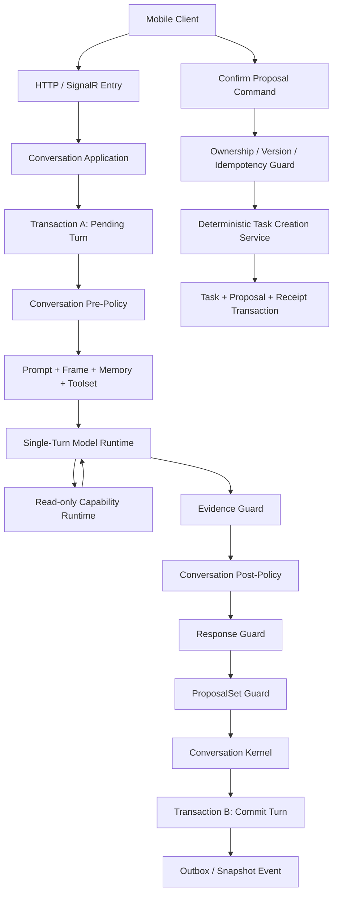

# Blotz AI 2.0 - AI Action Coach 技术方案 v3

> 状态：Reviewed design draft（当前原型与目标契约分开记录）
> 最近审查：2026-09-08；范围为单次会话设计，未同步实现代码
> 创建日期：2026-08-24
> 方案名称：受 Policy 控制的单 Turn Runtime（Policy-Governed Single-Turn Runtime）
> 文档用途：定义 AI Action Coach 的单轮模型执行、对话策略控制、ProposalSet 生命周期和正式 Task 提交边界

## 1. 文档定位

本文档定义 AI Action Coach v3 的核心会话架构。以下提交是历史设计来源，不再代表当前工作区的完整行为：

- `6563bbf3 Improving the execute mode`
- `2f288aad feat: separate planning readiness and proposal policy`

当前实现是审查证据，不是产品正确性的依据。本文中的“目标契约”用于指导后续实现；“当前原型”只说明已读到的代码，不代表部署状态或生产保证。17.2 保留历史演进记录，不覆盖本次审查后的规则。代码与目标之间的差异见 1.1，不要求本次一并实现。

重点解决以下问题：

1. 普通对话、澄清、目标选择和 ProposalSet 生成如何尽量在一次模型调用内完成。
2. 模型如何保留自然语言理解和表达能力，同时不能自行控制持久化业务流程。
3. `Pre-Policy`、模型候选、`Post-Policy`、Guard 和 Kernel 如何分工。
4. 哪些操作允许进入模型 Tool Loop，哪些操作必须由确定性代码执行。
5. 如何在并发、重试、断线、迟到结果和模型失败时恢复会话。

本文档中的“一次模型调用”指一次 Model Gateway 请求；“一个 Turn”指一条用户消息及其对应的系统处理和 Assistant 回复；“一次 Conversation”可以包含多个 Turn。

### 1.1 审查基线与实施范围

本次对照 2026-09-08 工作区（包括尚未提交的改动），而非只对照上述提交。重点代码包括 `Domain/Modes/AiCoachModeDefinition.cs`、`Domain/Policy/`、`Domain/Planning/`、`Domain/Support/`、`Domain/Guards/Guards.cs`、`Domain/Kernel/TransitionHandlers.cs`、`Ai/Runtime/`、`Ai/Prompts/`、`Application/Orchestration/ConversationApplication.cs`、`Application/Effects/EffectHandlers.cs` 和移动端 `useAiCoachChat.ts`。

| 能力 | 当前原型观察 | 本文目标 / 差距 |
| --- | --- | --- |
| Mode / Contract | Execution、Companion 已在 DI 注册；Clarify 未注册；当前 schema 为 3 | 注册不等于生产就绪；schema 3 尚不包含本文完整历史 Reference 协议 |
| 单轮治理 | 已有 Pre / Evidence / Planning / Support / Post / Guard / Kernel、修正预算和确定性生成器 | 保留单轮主线，修正下述语义、状态和降级契约 |
| 会话保存 | InMemory Store + 会话锁，Effect 在当前请求内执行 | 不保证进程重启恢复；DB 事务、持久 Receipt、Outbox、Worker 恢复属于后续阶段 |
| 正式任务保存 | Confirm 后逐项调用现有 AddTask Handler；允许记录部分成功 | 任务与内存会话不在一个事务；不能宣称崩溃窗口内不会重复创建 |
| 草案修改 | 客户端本地编辑，Confirm 时提交；模型修改关闭 | 回复必须准确说明操作入口；未来对话修改不得覆盖客户端未提交编辑 |
| Evidence | ActionRequest / Disposition 主要验证 Quote；Support 另有中英文关键词匹配 | 来源校验不等于语义证明，关键词匹配不能升级为通用理解层 |
| 意图与包络 | Reject 后 Intent 回到 Ready；Ready 时 Pre 可能只开放 ShowProposalSet | 会吞掉新拒绝/新话题，按 6.3、8.3 改善；本次仅记录差距 |
| Prompt | Execute 将“你觉得呢”列入委托；含“永不问时间”“所有事项都安排”等绝对规则 | 改为有上下文、受当前请求和数量/约束限制的建议，见 9.1–9.3 |
| 默认排期 | 生成器按本地时间与工作时段顺序排期 | 未证明理解自由文本时间约束、日历空闲或可用性；不得将默认时段叫作已查证空闲 |
| Companion | Support Preference、问题节奏已部分实现；无 Summary 恢复、历史引用和独立 Safety | 当前为会话原型；偏好作用域、恢复和未来 Safety 必须明确区分 |
| 客户端恢复 | 本地消息列表，部分以正文去重，发送时新建 CommandId | 后续使用 MessageId / CommandId 对账，失败重试不复制用户输入 |

本阶段优先完成设计与有限的交互闭环：文字输入、准确回应、一次有价值的澄清、可编辑草案、明确确认/拒绝、失败可解释。持久化生产恢复、只读 Tool、跨会话 Memory、通用 Artifact Registry、完整 Clarify 和 Safety 扩展可以独立推进，不能为了“架构齐全”成为验证一次会话的前置条件。

已有需求文档将 Focus 启动作为主要指标，同时明确首版不实现自定义危机流程；该背景不意味着陪伴必须转化任务，也不意味着本文 Safety 扩展已经获准纳入首版。当前设计以用户本轮目的得到满足为首要质量指标。上线范围及独立危机流程的产品决策仍需单独确认，本次不替产品扩大承诺。

### 1.1.1 本次内存原型修复进展（2026-09-08）

在上方审查基线之后，执行/陪伴的代码已进行一次有限修复，继续使用 InMemory Store，没有新增表或迁移：

- 模型 schema 4 增加 Support Request 的 `turn / conversation` 作用域；执行 Prompt v9、陪伴 Prompt v3。
- Pre 保留普通回应；当前观点/建议/叙述/暂停不因历史 Ready 状态进入 Proposal；Quote 无效时不拿旧计划兜底。
- Reject 草案终结自动复用；普通回复清理已处理规划问题；明确放弃当前未保存计划时撤回 Pending 草案。
- 持续偏好才写入内存；暂停不保存为永久偏好；“陪我聊”不等于“只听”。
- Payload 修正锁定本轮已校验理解，策略与卡片再生成共享额度。确定性生成器遇到自由文本约束或数量超限时不静默覆盖/截断。
- 历史工作项的复用、Intent 更新归入 PlanningStateRules；Frame 不再投影终态 Intent，动态文本使用 JSON 编码。

本轮没有实现完整的历史引用、字段级 Constraint Mutation、组合回应偏好、持久恢复或跨进程防重；执行模式的持续 Support Preference 尚未启用，当前回应要求由 Prompt 与 Planning 限制处理。旧 schema 2/3 的测试样本和旧行为断言需同步到新协议；验证结果以交付说明为准，不能把文档记录视为测试全部通过。

### 1.2 文档解释规则

- 当前能力只以 1.1 和实际代码核对；代码示意不是要求原样复制的完整实现。
- 目标设计发生冲突时，6.3–6.5 的会话状态语义、9.1–9.3 的表达契约、13.7 的统一裁决顺序优先于历史记录和模式示例。
- 所有模式复用同一套会话规则。Mode 是默认回应倾向，不是忽略用户当前请求的授权。
- 不确定的语义以不确定性保留；需要影响当前决策时才澄清，不能靠默认值补造同意、用户事实或约束。

## 2. 核心结论

v3 采用以下主线：

```text
用户消息
  -> 持久化 Pending Turn
  -> Pre-Policy 根据系统事实缩小允许空间
  -> 模型生成结构化候选
  -> Evidence Guard 验证当前 Turn 声明
  -> Planning Readiness 计算允许的规划动作
  -> Post-Policy 决定最终对话策略
  -> Guard 验证回复和 ProposalSet
  -> Kernel 提交 Conversation 事实
  -> 用户确认
  -> 确定性代码创建正式 Task
```

职责边界：

```text
模型负责理解、表达和提出候选
Pre-Policy 负责限制本轮允许的策略和能力
Evidence Guard 负责把模型声称的当前 Turn 证据转换成已验证规划上下文
Planning Readiness 负责判断是否可以澄清、建议或生成 Proposal
Post-Policy 负责在候选和规划准备状态之间做最终裁决
State / Phase 负责记录系统事实
Guard 负责拒绝非法候选和操作
Kernel 负责提交确定性 Conversation 变化
用户 Command 负责触发正式业务副作用
Domain Handler 负责决定正式 Task 是否创建成功
```

模型返回的所有内容在通过 Policy、Guard 和 Kernel 之前都不是业务事实：

```text
InterpretationCandidate != 已验证的用户事实
SuggestedAction        != 最终对话策略
ResponseCandidate      != 已发送的 Assistant Message
ProposalSetCandidate   != 已持久化的 ProposalSet
ToolCall               != 已执行的业务操作
模型文本中的“已创建”   != Task 创建成功
```

## 3. 设计目标

### 3.1 功能目标

1. 支持继续倾听、温和追问、澄清、目标选择、展示 ProposalSet 和更新 ProposalSet。
2. 支持模型根据自然语言提出一个或多个 Task Proposal。
3. 支持用户编辑、部分确认、拒绝或替换 Proposal。
4. 正式 Task 只能由用户明确 Command 创建。
5. Conversation 可以从数据库 Snapshot 恢复，不依赖模型 Session。

### 3.2 性能目标

```text
普通对话 Turn                         1 次模型调用
澄清或选择目标                        1 次模型调用
生成或更新 ProposalSet                1 次模型调用
需要只读查询（最多三次 Tool）           最多 4 次模型调用
Confirm / Reject / Edit               0 次模型调用
正式创建 Task                         0 次模型调用
```

建议初始运行指标：

```text
普通 Turn 一次调用完成率              > 90%
全部 Turn 平均模型调用次数             < 1.3
确定性 Command 模型调用次数            = 0
Guard 拒绝后产生的正式业务副作用        = 0
```

### 3.3 安全目标

1. 模型不能声明或修改 Conversation Phase。
2. 模型不能把推断升级为用户确认事实。
3. 模型不能创建正式 Task、通知、日历事件或 Focus Session。
4. 模型不能绕过 Pending ProposalSet、所有权、版本和并发约束。
5. 未通过 Post-Policy 和 Guard 的回复不能发送给客户端。

## 4. 非目标

第一版不实现：

- 通用工作流平台或任意 DAG 调度器。
- 模型自主执行多步骤长期计划。
- 无限制 Tool Loop。
- 模型可调用的正式 Task 创建 Tool。
- 并行 Tool Batch。
- 模型动态加载核心规则或私密 Memory。
- 使用自由文本作为业务成功的权威来源。
- 在服务端验证任意自然语言的全部语义正确性。

## 5. 总体架构



### 5.1 稳定职责与按需实现的模块

```text
ConversationApplication
ConversationPrePolicy
ModelContextBuilder
ModelTurnRuntime
ReadOnlyCapabilityDispatcher
EvidenceGuard
ConversationPostPolicy
ResponseGuard
ProposalSetGuard
ConversationKernel
TaskCreationService
OutboxDispatcher
CapabilityRegistry
ArtifactHandlerRegistry
PromptModuleRegistry
MemoryProfileRegistry
CommandStatusQuery
```

以上列出职责位置，不要求每项都成为独立服务或 Registry。当前只保留真实可替换的 Interface：ConversationApplication 面向客户端命令，ModelGateway 隔离供应商，Store 隔离存储。Policy、Calculator、Guard 和 Kernel 可在同一进程内组合为小型纯函数；没有第二种 Artifact / Capability 时，不预建通用插件平台。

各模块只通过强类型 Contract 交接，不共享可变模型 Session 状态。对 Application 而言，Runtime 的外部 Interface 应只返回完整 `ValidatedTurnOutcome` 或类型化失败，并包含提交所需的决策和候选；内部修正轮、Prompt 组装和 Generator 调用不泄漏给客户端。State Mutation 统一交给 Kernel，避免 Application 再拼接 Planning 或 Support 变化。

### 5.2 HTTP、SignalR 和权威恢复

两种传输使用同一套 Application、Policy、Guard 和 Kernel，不形成第二套业务规则：

```text
SignalR Command:
  发送消息、取消生成、请求重新生成、选择下一步

HTTP Command / Query:
  创建 Conversation、获取 Snapshot、编辑 Proposal、Confirm、Reject、查询 Command Status

SignalR Event:
  Processing、AssistantMessageCommitted、ProposalSetChanged、ConversationSnapshotChanged、TaskCreated
```

SignalR 只负责实时传输，不是 Conversation、ProposalSet 或 Task 的权威来源。每个 Event 至少携带：

```text
eventId
conversationId
conversationVersion
commandId? / effectId?
```

客户端重连、发现事件版本跳跃、重复订阅或响应结果不确定时，必须通过 HTTP 获取完整 Snapshot 或 Command Status。客户端只渲染服务端返回的 `allowedActions`，不能根据事件名称自行推导业务状态。

## 6. Conversation State

Conversation 使用粗粒度 Phase 和正交事实，不为每个自然语言分支创建新 State。

```text
ConversationPhase:
  Conversing
  ActionPreparing
  ActionPending
  FollowUp
  Closed

GenerationStatus:
  Idle
  Running
  Blocked

ProposalSetStatus:
  Pending
  PartiallyEdited
  PartiallyConfirmed
  Processing
  Completed
  Rejected
  Superseded
  Expired
  PartiallyFailed
```

Snapshot 至少包含：

```csharp
public sealed record ConversationSnapshot(
    Guid ConversationId,
    Guid UserId,
    AiCoachMode Mode,
    ConversationPhase Phase,
    GenerationStatus GenerationStatus,
    BlockedReason BlockedReason,
    int Version,
    ProposalSetSnapshot? CurrentProposalSet,
    OpenQuestionSnapshot? OpenQuestion,
    IReadOnlySet<ConversationFact> Facts,
    IReadOnlySet<ConversationAction> AllowedActions,
    ConversationRuntimeVersions RuntimeVersions,
    ActivePlanningIntentSnapshot? ActivePlanningIntent = null);

public sealed record ActivePlanningIntentSnapshot(
    Guid IntentId,
    Guid SourceMessageId,
    IReadOnlyList<PlanningItemSnapshot> Items,
    IReadOnlyList<PlanningConstraintSnapshot> Constraints,
    PlanningIntentStatus Status,
    IReadOnlySet<ClarificationTopic>? AskedTopics = null);

public sealed record PlanningItemSnapshot(
    string Text, string EvidenceQuote, Guid SourceMessageId, PlanningItemKind Kind);

public sealed record PlanningConstraintSnapshot(
    string Text, string EvidenceQuote, Guid SourceMessageId);

public sealed record ConversationRuntimeVersions(
    string RuleVersion,
    string PolicyVersion,
    string PromptVersion,
    string ToolsetVersion,
    string MemoryProfileVersion,
    ConversationPolicyComponentVersions PolicyComponents,
    int ModelContractSchemaVersion,
    int ProtocolVersion);

public sealed record ConversationPolicyComponentVersions(
    string PlanningPolicyVersion,
    string ProposalGenerationPolicyVersion,
    string? SupportPolicyVersion,
    string? SafetyPolicyVersion);
```

`Phase`、`Facts` 与 `AllowedActions` 若可由 Intent、OpenQuestion、ProposalSet 和 Effect 推导，只是 Kernel 同次提交的投影，不得各自维护独立状态机。恢复时由同一投影函数校验或重建；不一致返回可诊断错误，不能选择一个字段静默覆盖另一个。

Snapshot 是 Policy、Guard 和 Kernel 的只读输入。模型只能看到经过最小化投影的 Execution Frame，不能获得可写 Snapshot。

目标实现：Conversation 创建时固定完整 `RuntimeVersions`。版本号必须实际解析到不可变定义，而不只是保存字符串；当前按 Mode 查询单一定义的 Registry 尚不保证旧版本可执行。活动 Conversation 不因部署、灰度或模型故障转移而静默切换 Rule、Policy、Prompt、Toolset、Memory、Planning、Proposal Generation、Support、Safety、Model Contract Schema 或协议版本；不适用于某个 Mode 的可选组件固定为 `null`，不能在运行时回退到 Registry 的最新版本。需要修复兼容性问题时，必须执行显式迁移或开始新 Conversation。撤销权限或停用存在安全问题的版本可以立即拒绝执行旧会话；“固定版本”不得阻止撤权。记录停用原因并提供重新开始入口，不静默切到新行为。

第一版 Conversation 创建后固定 `AiCoachMode`，不支持在同一个 Conversation 内切换执行、理清或陪伴模式。需要改变模式时，客户端创建新的 Conversation；是否允许复制用户明确事实、Summary 或未处理 Proposal，必须通过显式的版本化 Projector 决定，不能共享可变的会话上下文。

### 6.1 Conversation Facts

`Facts` 只保存可恢复、可验证且会影响后续 Policy 或 Guard 的系统事实，不保存用户长期心理标签，也不把模型推断直接当成事实：

```text
HasOpenQuestion
HasConfirmedGoal
HasPendingProposalSet
HasProcessingProposalSet
HasRunningModelEffect
HasChangedGoal
HasBlockedGeneration
HasAcceptedProposal
HasRejectedProposal
```

当前实现不再把“行动意愿”作为独立的 Conversation Fact 持久化。它由当前 Turn 的 `InterpretationCandidate`、`EvidenceGuard` 和 `PlanningReadinessCalculator` 即时计算；历史规划材料通过 `ActivePlanningIntent` 恢复，但不会伪装成当前消息的证据。

事实的来源和生命周期必须可审计：

```text
FactKey
Basis: UserExplicit | DeterministicSystem
SourceMessageId / SourceEventId
ValidFromVersion
ValidToVersion?
```

### 6.2 Active Planning Intent

`ActivePlanningIntent` 是 Execute Mode 跨 Turn 保存规划上下文的权威工作状态：

```text
Collecting -> ReadyForProposal -> ProposalPending -> Completed
                                      |               |
                                      +-> Rejected / Superseded
其他终态：Abandoned / Expired
```

一次澄清由 `PlanningIntentId + ClarificationTopic` 绑定。`AskedTopics` 记录已经消耗的槽位；当前 Execute Policy 的 `MaxClarificationAttempts = 1`，因此不会通过改写问题重复追问。用户回答、表示不知道或委托 Coach 决定时，`UserTurnDisposition` 分别为 `Answered`、`CannotProvide` 或 `DelegatedToCoach`；用户拒绝行动时为 `RejectedAction`，Planning Readiness 进入 `Blocked`。

`PlanningStateRules` 只依据 `PlanningDecision` 和 Proposal 是否已接受推进状态，模型输出不能直接修改 Intent 状态。

### 6.3 单次会话：工作状态与真实用户行为（目标契约）

一次 Conversation 可以达成理解、建议或草案结果，也可以自然停止；不要求走完 `Conversing -> ActionPreparing -> ActionPending -> FollowUp`。`FollowUp` 仅表示最近一次草案处理完成，用户无需回答收尾问题；普通无问题回应回到 `Conversing`。`Closed` 是明确结束或过期后的服务端生命周期，不由模型猜测“聊完了”触发。

| 用户行为 / 已提交结果 | Intent / OpenQuestion | Artifact / Phase | 可见回应与下一步 |
| --- | --- | --- | --- |
| 寒暄、倾诉、问知识或要观点 | 不强建 PlanningIntent；普通 GentleQuestion 不建规划问题 | 无草案时 Conversing；有草案则保留 ActionPending | 回应本轮内容，不能强迫进入任务流程 |
| 明确行动请求且材料充分 | 本轮计算 Ready；草案提交后 ProposalPending；清除规划问题 | Pending / ActionPending | 一个可编辑草案；建议时间明确标注 |
| 缺少会改变下一步的必要信息 | Collecting；绑定 QuestionId、IntentId、Topic 和来源 | 无草案时 ActionPreparing | 一个聚焦问题，可以先给一句有内容的回应 |
| 回答、不知道、委托 | 只解析当前问题作用域；结束已处理问题 | 材料不足时 Conversing；有合法草案才 ActionPending | 不知道不等于委托；没有安全起点时允许停止规划 |
| “不是明天，是后天” | 对同一字段执行带来源的替换；旧值失效 | 已有草案仅修改对应目标或引导编辑 | 确认修正点，不追加两个冲突时间 |
| “我不想做了” | 当前目标 Abandoned；清除该目标的问题 | 待处理草案经已验证的撤回 Mutation 退出 Current；Processing 遵循提交锁 | 尊重停止，不用旧 Intent 自动重新提案 |
| 点击“不要这个” | 只拒绝当前草案，不断言用户放弃全部目标；停止自动复用 | 草案 Rejected，清除 Current，FollowUp | 简短接收；用户明确要求再拟时建立关联的新 Intent |
| “不喜欢这个时间，换到晚上” | 是字段修正，不是拒绝整个行动 | 当前草案保留；模型修改未开启时引导直接编辑 | 不清空所有目标，不声称已改好 |
| 改聊新主题 | 无关的新规划目标替换旧工作 Intent 时记录 Superseded；不自动合并 | Pending 卡片可以留存，不阻断普通回复 | 若需要替换卡片，明确提出替换范围；不要迫使先保存 |
| “先停一下”，之后主动问新问题 | 暂停本轮推进，旧 OpenQuestion 结束或标记暂停；新输入可继续 | 暂停不是 Closed，也不是 Reject Proposal | 停止追加问题；恢复后回答新请求 |
| Confirm 部分成功 | 已接受项不可再编辑；Intent 仅在目标项全处理后完成 | 仍有可处理项则 ActionPending；全部终态才 FollowUp | 明确成功与未成功项，不显示整组成功 |

上表是目标规则。当前原型的文本拒绝、替换和暂停 Mutation 尚未全部实现；未开放的操作必须解释实际可用入口，不能用 Assistant 文本模拟状态变化。

`ReadyForProposal` 表示材料足够，绝不表示“后续轮次必须生成”。每个 Turn 重新综合当前拒绝、修正、话题和请求。拒绝后的旧草案/终态 Intent 不自动复活；明确“再给个方案”可创建与旧目标有关联的新 Intent，并复制用户仍认可的事实。

### 6.4 语义理解、引用与事实更新

`Verified` 在现有类型名中仅表示通过已实现的来源/结构校验，不是数学意义上的语义真实性。Quote 包含“跑步”不能证明“我不想跑步”是在要求跑步；Quote 真实也不能证明模型选对 `DirectInstruction`、`DelegatedToCoach` 或 Support Kind。Evidence Guard 的硬保证是来源、角色、文本跨度、引用可见性和结构一致性；开放语义由模型候选、保守策略及行为评估承担。

目标 Interpretation 需要表达可复用语义，而非继续添加单句布尔开关：

| 信息 | 最小语义要求 |
| --- | --- |
| 请求 | 区分叙述、询问观点、建议、规划请求、具体安排；同轮可以并存，只有一个主回复策略 |
| 作用域 | 当前问题、某个 Item / Constraint / Proposal、整个目标或回应偏好；不明确则保持 unresolved |
| 更新 | Add / Replace / Remove / Select，携带当前证据及目标引用；禁止无条件拼接历史与当前 Items |
| 不确定性 | 指代不唯一、相互冲突、信息缺失；不以模型 confidence 数字直接授予权限 |
| 来源 | 用户明确内容、系统观察、Coach 建议和默认值分开；建议不得成为 UserExplicit |

这些是下一次 Contract 演进的设计要求，不声称 schema 3 已具备所有字段。实现时优先扩展现有通用 Item / Reference，版本化一次引入必要字段；仍保持一次主模型调用。

明确修正覆盖同作用域旧事实；同轮矛盾且无明确修正关系则不猜。只拒绝一个时间不会撤销整个目标。用户原话需保留完整否定和条件上下文，不能抽取有利子串。引号内他人指令、过去行动和假设不得直接转为当前请求。Evidence 无效时不得拿旧 Intent 兜底生成可能违反当前拒绝的草案；保留普通回应或有限澄清。

“第二个”“就那个”绑定最近已提交且仍有效的 Question / 有序选项 / Proposal Version。模型只选择本 Effect 提供的引用键，服务端校验映射；键存在仍不证明选对，指代有多个合理目标时问一个具体确认。裸“好”可回答当前问题，但不等于 Confirm Command。当前不支持引用时，简短请用户说明对象，不能重复整段规划访谈。

### 6.5 偏好和提问的作用域

回应偏好适用于三种 Mode，Companion 先实现不意味着 Execute 可以忽略“先别安排，告诉我你的看法”。默认偏好仅作用当前回应；只有“接下来只听我说”等持续请求才保存到会话状态。保存时需要来源、作用域、生效版本和清除规则。

“先别问”只限制问题，不自动禁止观点、建议或所有后续交流；“别给建议”不自动等于禁止提问；“你觉得怎么办”允许本轮建议，不把会话永久改成 Advice 模式。暂停后用户主动发出新请求可恢复本轮回应，已有持续限制按其作用域保留。当前单一 SupportRequestKind 无法表示组合偏好时，下次 Contract 演进使用正交的回应约束集合，不能靠枚举不断组合。

规划澄清预算以 Intent + 问题目标计数，只在问题成功提交后消耗，失败/重试不重复计数。Execute 默认 1、Clarify 目标默认 3，是交互上限而非必须问满。普通 GentleQuestion 不消耗规划预算，也不能绕过预算继续索要同一规划字段。用户主动改变目标可开新 Intent；仅改写问题不得重置额度。用户主动要求核对冲突信息时允许必要核对，但不能因为额度用尽而猜测授权或冲突约束。

## 7. 单 Turn 执行流程

### 7.1 Transaction A：先保存用户输入

收到开放式用户消息后，先执行短事务：

```text
验证 UserId 和 Conversation 所有权
验证 CommandId 和 expectedConversationVersion
检查是否存在 Running Model Effect
保存 User Message
创建或读取 Command Receipt
创建 Pending ModelTurn Effect
GenerationStatus -> Running
Conversation Version + 1
Commit
```

不允许先调用模型再保存用户消息。这样即使模型超时或服务崩溃，用户输入仍是权威记录，可以通过原 `CommandId` 恢复或查询。

### 7.2 事务外执行

```text
使用 Transaction A 锁内捕获的不可变 Snapshot、用户消息与 BaseConversationVersion
-> Pre-Policy
-> 构建 Model Context
-> 执行模型
-> 可选只读 Tool
-> Evidence Guard
-> Planning Readiness Calculator
-> Post-Policy
-> Response Guard
-> ProposalSet Guard
-> 可选 Deterministic Proposal Fallback
-> Kernel 计算 TransitionResult
```

`ActivePlanningIntent` 是跨 Turn 的可恢复工作状态，不是正式 Task，也不授权业务副作用。它保存已经验证的 `PlanningItemSnapshot`、`PlanningConstraintSnapshot`、当前状态和已询问的 `ClarificationTopic`。Runtime 只复用 `Collecting` 或 `ReadyForProposal` 的 Intent；`Completed`、`Rejected`、`Superseded` 等终态不会因历史内容被重新打开。

模型调用和外部读取不能持有数据库事务。

### 7.3 Transaction B：原子提交 Turn

```text
重新加载最新 Conversation
验证 EffectId、BaseConversationVersion 和 Lease
拒绝 Completed、Cancelled、Expired 或 Superseded Effect
应用 Kernel TransitionResult
保存 Assistant Message
保存或更新 ProposalSet
更新 Phase、Facts、AllowedActions 和 Version
Effect -> Completed / Failed / Superseded
写入 Transition Log 和 Outbox
Commit
```

Assistant Message、ProposalSet 和 Conversation 状态必须在同一事务提交。不能出现客户端看到 Proposal 文本，但 Snapshot 中没有对应 ProposalSet 的情况。

### 7.4 Effect Lease、重试和迟到结果

`Pending ModelTurn Effect` 必须持久化完整运行记录：

```text
EffectId
ConversationId
BaseConversationVersion
Status: Pending | Running | Completed | Failed | Superseded | Cancelled
IdempotencyKey
AttemptCount
LeaseExpiresAt
LastErrorCode
CreatedAt / StartedAt / CompletedAt
```

Worker 获取 Effect 时使用条件更新取得 Lease；同一个 Effect 在任意时刻只能有一个有效 Worker。服务中断或 Lease 过期后，恢复任务可以根据错误类型和重试策略重新执行，但必须复用原 `EffectId` 和 `IdempotencyKey`。模型调用只保证 at-least-once，不能假设 exactly-once。

Result Event 必须携带 `EffectId`、`BaseConversationVersion` 和结果版本。Transaction B 只接受当前仍在等待的 Effect；如果 Conversation Version、Phase、Current ProposalSet 或 Effect 状态已经变化，迟到结果标记为 `Superseded`，不得保存 Assistant Message、ProposalSet 或覆盖新状态。

## 7.5 State Transition Contract

Kernel 的状态转换必须由 `Current Snapshot + ConversationEvent` 确定地产生。模型 Candidate 不能直接作为状态转换输入，必须先经过 Post-Policy 和所有 Mandatory Guard。

```csharp
public sealed record StateTransition(
    ConversationPhase NextPhase,
    GenerationStatus NextGenerationStatus,
    IReadOnlySet<ConversationFact> AddFacts,
    IReadOnlySet<ConversationFact> RemoveFacts,
    ProposalSetMutation? ProposalSetMutation,
    IReadOnlySet<ConversationAction> AllowedActions,
    IReadOnlyList<ConversationEffect> Effects,
    IReadOnlyList<ConversationDomainEvent> Events);
```

第一版 Kernel 只接受以下受支持的 Event 类别；未知 Event 返回 `UnsupportedEvent`，不得使用默认跳转：

```text
UserMessageReceived
UpdateProposalCommand
RejectProposalCommand
ConfirmProposalCommand
CancelTurnCommand
CloseConversationCommand
ModelTurnCompleted
ModelTurnFailed
ReadOnlyToolFailed
LateEffectResultReceived
```

目标状态转换基线（接收输入与接受模型结果是两次不同转换）：

| Current Phase | Event / 条件 | Next Phase | Facts / Artifact | Effect / Event | Allowed Actions |
| --- | --- | --- | --- | --- | --- |
| 任意非 `Closed` | `UserMessageReceived`，命令合法且无 Running | 保持原 Phase | 保存用户输入，Generation -> Running；尚不判断语义 | `GenerateAssistantReply` | 查询；已实现时可取消 |
| `Conversing` / `ActionPreparing` / `FollowUp` | `ModelTurnCompleted`，接受普通无问题回应 | `Conversing` | 按已验证 Mutation 处理 Intent / OpenQuestion，Generation -> Idle | `AssistantMessageCommitted` | 继续对话 |
| 任意可交互 Phase | `ModelTurnCompleted`，普通 GentleQuestion | 有 Pending 保持 `ActionPending`，否则 `Conversing` | 不新建规划 Intent，不消耗规划预算 | `AssistantMessageCommitted` | 继续对话 |
| `Conversing` / `ActionPreparing` / `FollowUp` | `ModelTurnCompleted`，接受规划问题 | `ActionPreparing` | 更新 OpenQuestion 和已用 Topic，Generation -> Idle | `AssistantMessageCommitted` | 回答或改变话题 |
| `Conversing` / `ActionPreparing` / `FollowUp` | `ModelTurnCompleted`，接受合法 Proposal | `ActionPending` | 原子保存 Message、Pending Set、Intent；清除问题，Generation -> Idle | `ProposalSetCreated` | 对话、编辑、Confirm、Reject |
| `ActionPending` | `ModelTurnCompleted`，讨论或普通回应 | `ActionPending` | 保留 Current Set，不强制处理卡片，Generation -> Idle | `AssistantMessageCommitted` | 对话、编辑、Confirm、Reject |
| `ActionPending` | `UpdateProposalCommand`，版本匹配 | `ActionPending` | 更新 Proposal / ProposalSet Version | `ProposalSetUpdated` | 编辑、Confirm、Reject |
| `ActionPending` | `RejectProposalCommand` | `FollowUp` | ProposalSet -> `Rejected`，清除 Current ProposalSet | `ProposalSetRejected` | 继续对话 |
| `ActionPending` | Confirm 成功结果提交 | 有未处理项保持 `ActionPending`，全部处理才 `FollowUp` | Proposal -> Accepted，记录正式实体；派生 Set 状态 | `TaskCreated` | 处理剩余项或继续对话 |
| `ActionPending` | Confirm 事务失败 | `ActionPending` | Proposal 保持可编辑，保留错误码 | `TaskCreationFailed` | 重试、编辑、Reject |
| 任意非 `Closed` | `ModelTurnFailed` | 原 Phase | 清除 Running，保留可恢复事实 | `ModelGenerationFailed` | 重试或继续对话 |
| 任意非 `Closed` | `CancelTurnCommand` | 原 Phase | Pending Effect -> Cancelled | `TurnCancelled` | 继续对话 |
| 任意非 `Closed` | 迟到 Result Event | 原状态 | Effect -> Superseded，不改变 Artifact | `LateEffectSuperseded` | 当前 Snapshot 的动作 |
| 任意非 `Closed` | `CloseConversationCommand`，无 Processing 业务提交 | `Closed` | 取消 Running Model Effect；结束 OpenQuestion / Intent，未确认草案过期；不删除已创建 Task | `ConversationClosed` | 仅查询 Snapshot |

转换不变量：

```text
Mode 永远不由 Kernel 修改。
正式 Task 只由 ConfirmProposalCommand 的确定性事务创建。
ProposalSet 创建和更新必须经过版本、所有权、Schema 和 Domain Guard。
模型结果转换失败不得提交部分 Assistant Message 或部分 ProposalSet；正式 Confirm 的逐项结果采用 18.2 的独立契约。
Version 每次成功状态转换单调递增；迟到结果不能回退 Version。
Effect 身份、有效 Lease 和 BaseVersion 必须同时通过；取消先提交则迟到结果丢弃，结果先提交则取消返回已完成 Snapshot。
业务提交 Processing 时不允许 Reject、替换或关闭抹掉其结果；可继续读取，待结果明确后再处理生命周期。
```

## 8. Pre-Policy

Pre-Policy 在模型调用前执行，只使用已经确定的系统事实：

```text
Mode
Phase
GenerationStatus
Current ProposalSet
Confirmed Goal
Open Question
Allowed Actions
Conversation Version
用户权限
客户端协议版本
正在运行的 Effect
```

Pre-Policy 不解释当前用户消息，不使用关键词判断行动意愿。

### 8.1 Strategy Envelope

```csharp
public sealed record StrategyEnvelope(
    TurnObjective TurnObjective,
    IReadOnlySet<ConversationStrategy> AllowedStrategies,
    IReadOnlySet<CapabilityId> AllowedCapabilities,
    ResponseConstraints ResponseConstraints,
    ProposalConstraints ProposalConstraints);
```

```csharp
public enum ConversationStrategy
{
    ContinueListening,
    AskGentleQuestion,
    AskClarifyingQuestion,
    AskUserToChooseGoal,
    ShowProposalSet,
    DiscussExistingProposal,
    UpdateProposalSet,
    SupersedeProposalSet,
    CloseConversation
}
```

### 8.2 示例

陪伴模式且没有当前行动 Artifact：

```text
AllowedStrategies:
  ContinueListening
  AskGentleQuestion
  ShowProposalSet（仅当 PlanningDecision 允许 GenerateProposal，且 Proposal Trigger 已验证）

AllowedCapabilities:
  none

Constraints:
  MaxQuestions = 1
  ProposalAllowedOnlyWhenPlanningReady
  RequiresCurrentTurnDirectInstruction
  MustNotClaimBusinessSuccess
```

陪伴模式的默认策略仍然是倾听和温和追问，不主动把情绪表达或模糊愿望转成行动候选。但如果用户在当前消息中明确提出具体 Action，例如“请帮我安排明天 8 点到 9 点整理资料”，且其原文证据和 Proposal 领域校验均通过，则可以在陪伴模式中生成一个 Pending ProposalSet。正式 Task 仍然只能由用户 Confirm Command 创建。

存在 Pending ProposalSet：

```text
AllowedStrategies:
  ContinueListening
  DiscussExistingProposal
  UpdateProposalSet
  SupersedeProposalSet

Disallowed:
  ShowProposalSet for a second Current ProposalSet
```

### 8.3 第一版策略包络保持宽泛

Pre-Policy 只移除已知不可能的能力：未实现策略、权限不允许的 Tool、已有 Current Set 时新建第二套草案。普通回应路径必须保留；历史 `ReadyForProposal`、Mode 偏好和已用问题预算都不能把 Envelope 缩成只有 `ShowProposalSet`，否则当前消息的拒绝和转向将无法表达。

Envelope 是潜在能力集合，不依据本轮尚未计算的 Planning / Support Decision 条件构建。Companion 可预先暴露 ShowProposalSet，再由本轮 Post-Policy 检查直接请求；不能把这些后置条件当作 Pre 已经验证的事实。没有对应 Handler / 客户端能力的 Update、Supersede、Close 不得仅因“宽泛”就暴露。

目标最小集合包含 `ContinueListening`；其他问答策略在硬约束允许时开放。已有草案仍可回应新内容，只有第二张卡片受限。闭会话由显式 Command / 服务端过期触发；模型的自然收尾只是普通回应。策略扩展靠可达的业务能力决定，不必等线上数据才移除已知不合法的策略。

## 9. Model Context

每次模型调用由服务端确定性组装：

```text
Core Prompt Modules
Mode Prompt Module
Strategy Envelope
Model Execution Frame
Current ProposalSet minimal projection
Current Summary
Recent Turns
Allowed Product Context
Allowed Read-only Tool Schemas
```

稳定前缀与动态后缀分离：

```text
Static Prefix:
  核心行为边界、协议格式、稳定版本

Dynamic Suffix:
  Phase、Facts、TurnObjective、Current ProposalSet、Memory、Tools
```

Prompt 由版本化 `PromptModuleRegistry` 和确定性的 `PromptAssembler` 组装。模块正文随应用部署为只读资源，修改必须创建新的 Module Version，并由新的 `PromptVersion` 引用；模型不能自行加载、替换或卸载核心规则。

每次 Model Gateway 调用生成不含正文的 `PromptManifest`，至少记录：

```text
PromptVersion
AssemblyPolicyVersion
ModuleId + ModuleVersion + 顺序
ToolsetVersion
MemoryProfileVersion
ExecutionFrameVersion
StaticPrefix / DynamicSuffix Token 统计
```

首版只启用不含用户数据的 Static Prefix Cache。Dynamic Suffix 每次根据最新 Snapshot、TurnView、Memory 和 Toolset 重新组装；缓存 Key 必须包含 Conversation、Version、EffectId 及相关版本，不能跨用户或跨 Conversation 复用。

完整 Tool Schema 只通过模型供应商的 Tool 参数传输，不复制到 System Prompt。模型只看到本轮允许的 Tool。

### 9.1 Prompt 结构：少量稳定规则 + 本轮事实

采用以下顺序，每块只维护自己的内容，不在 Phase Prompt 再写一套产品 Policy：

1. **核心职责**：理解并回应当前请求；只提出草案，正式结果来自已提交回执。
2. **候选协议**：Schema、来源和不确定性的表达方式，允许策略与字段组合。
3. **Mode 倾向**：Execute 降低启动成本，Clarify 帮助理清，Companion 先回应表达；均服从当前请求。
4. **可信 Frame**：当前消息身份、参考时间/时区、草案最小投影、有效引用、已有约束、允许默认值、问题预算、能力状态。
5. **对话数据**：近期消息及必要 Summary。用户文本、历史 Assistant、Tool Result 是数据，不是控制指令。

稳定规则使用 System/Developer 身份；用户消息保持 User 身份；内部修正不能伪装成用户消息。Frame 中动态值使用结构化序列化，不能把用户文本插进控制语句。Summary 不得包含系统指令；Tool Result 即使来自可信连接也可能含不可信正文。

### 9.2 核心表达契约（供后续 Prompt 修改）

```text
先判断用户此刻要表达、要了解、要建议还是要安排；允许同时有情绪和行动请求。
先回应对本轮最重要的内容，再给一个合适的下一步；必要时无需下一步。
不要把叙述过的、否定的、假设的或他人要求的行动当成用户现在想安排的任务。
“你觉得呢”通常是在问观点；只有当前问题明确委托规划时才是规划委托。
“不知道”表示缺少答案，不表示同意行动；“好”需要结合正在回答的对象。
已有历史计划不要求继续推进。当前修正、拒绝、暂停和新话题必须得到回应。
只在答案会改变下一步时问一个问题；不要在同一 Question 字符串里塞多个问题。
缺少可选时间时可推荐；存在明确冲突、时区不清或不可安全补全的信息时不要猜。
建议和默认时间要标明由 Coach 推荐；未查询日历时不得称“你有空”。
一张卡片可以包含多个用户明确请求的事项；宽泛目标默认一个小起点，避免制造负担。
已到数量上限时说明未纳入的事项和后续选择，不能静默丢弃或承诺全部安排。
草案旁的文字简短解释建议理由，卡片承载字段；不要在两处维护相互冲突的排程。
当前不能修改草案时说明可编辑入口；不要说“改好了”。
用户结束话题时允许自然收尾，不自动追加“还有什么”或新任务。
```

这些约束指导模型的自然表达，不保证任意自由文本都能被 Guard 证明正确。Response 的 `supportMove`、`Question` 或类型自报并不能证明正文没偷偷建议或连问；确定性检查负责字段/数量/引用，语义一致性需要对照场景评估。涉及正式业务成功的 UI 文案由 Command Receipt 确定性投影，普通模型回复避免生成“已保存”等操作回执。

### 9.3 默认值、约束与草案一致性

已明确的日期、时段、截止时间、时长、顺序和“不安排”约束优先于默认值。时间以本 Turn 固定 `ReferenceNow + TimeZoneId` 解释，“明天”在重试中不随午夜移动；确认时重新验证是否仍可执行。目标 Contract 将可执行约束规范化并保留原文来源：明确时间窗可确定性校验，未解析的硬约束不能在 fallback 中忽略。

缺少日期/时长可以在 Policy 允许时推荐；不存在的本地时间、夏令时歧义、跨日区间和未知时区应明确处理，不静默回退 UTC。`NextAvailableSlot` 当前实际上是默认候选时段，未调用 Calendar 时不证明空闲。若默认生成器无法保留用户约束，则放弃生成并解释/澄清，不以“确定性”名义生成不合用户要求的卡片。

每个默认字段记录来源 `UserExplicit | CoachSuggested | PolicyDefault` 与适用约束。目标 Guard 检查结构化约束和 Proposal 的一致性；正文不复制所有具体字段。最终回复、说明和卡片来自同一次接受结果，修正或 fallback 替换卡片后必须一起验证/重建介绍文字，不能保留旧时间说明。

## 10. 模型输出 Contract

模型一次返回结构化 `ModelTurnCandidate`：

当前模型响应格式名为 `model_turn_candidate`，工作区 Schema Version 为 `3`（含 actionRequest / supportRequest / supportMove）；下方简化类型展示 schema 2 的核心形态，不是当前完整 DTO。历史引用等未来字段仍需另行版本化，不能再次用同名 schema 3 表示不兼容协议。顶层 `interpretation`、`suggestedAction`、`response` 和 `proposalSet` 均为必填字段；不生成卡片时 `proposalSet` 为 `null`。`suggestedAction` 只是模型建议，最终策略仍由 Post-Policy 决定。

```csharp
public sealed record ModelTurnCandidate(
    InterpretationCandidate Interpretation,
    ConversationStrategy SuggestedAction,
    AssistantResponseCandidate ResponseCandidate,
    ProposalSetCandidate? ProposalSetCandidate);
```

### 10.1 Interpretation Candidate

```csharp
public sealed record InterpretationCandidate(
    IntentType Intent,
    IReadOnlyList<PlanningItemCandidate>? PlanningItems,
    IReadOnlyList<ConstraintCandidate>? Constraints,
    UserTurnDispositionCandidate? Disposition);

public sealed record PlanningItemCandidate(string Text, EvidenceReference Evidence, PlanningItemKind Kind);
public sealed record ConstraintCandidate(string Text, EvidenceReference Evidence);
public sealed record EvidenceReference(string Quote);
public sealed record UserTurnDispositionCandidate(UserTurnDisposition Kind, EvidenceReference? Evidence);
```

`planningItems`、`constraints` 和 `disposition.evidence.quote` 只允许引用当前 User Message 的原文。它们是模型的未信任声明；`EvidenceGuard` 验证后才形成 `VerifiedPlanningContext`。历史 `ActivePlanningIntent` 可以参与准备度计算，但不能被模型复制成当前 Turn 证据。

### 10.2 Typed Response Candidate

```csharp
public abstract record AssistantResponseCandidate(string Text);

public sealed record ListeningResponse(string Text)
    : AssistantResponseCandidate(Text);

public sealed record GentleQuestionResponse(string Text, string Question, ClarificationTopic Topic)
    : AssistantResponseCandidate(Text);

public sealed record ClarifyingQuestionResponse(
    string Text, string Question, ClarificationTopic Topic)
    : AssistantResponseCandidate(Text);

public sealed record GoalChoiceResponse(
    string Text, string Question, ClarificationTopic Topic)
    : AssistantResponseCandidate(Text);

public sealed record ProposalIntroductionResponse(string Text)
    : AssistantResponseCandidate(Text);
```

产品目标是一次一个聚焦问题，因此 Contract 使用单个 `Question`。单个字符串可能包含多个问题，Schema 只能保证字段形态，不能保证语义上的单问题；见 9.2 的表达契约和 24.2 的行为评估。

## 11. ProposalSet Candidate

ProposalSet 是模型候选输出，不是 Model Tool：

```csharp
public sealed record ProposalSetCandidate(
    IReadOnlyList<TaskProposalCandidate> Proposals);

public sealed record TaskProposalCandidate(
    string ClientProposalKey,
    string Title,
    string? Description,
    DateOnly Date,
    TimeOnly StartTime,
    TimeOnly EndTime,
    int? LabelId);
```

模型不能设置：

```text
ProposalSetId
ProposalId
ConversationId
UserId
Version
Status
PersistedTaskId
CreatedAt / UpdatedAt
AllowedActions
```

这些字段只能由服务端创建。

处理顺序：

```text
Model ProposalSetCandidate
  -> Schema Validation
  -> Evidence Validation
  -> Post-Policy accepts ShowProposalSet
  -> ProposalSet Guard
  -> Domain Validation
  -> Kernel creates Pending ProposalSet
```

ProposalSet Candidate 被拒绝时不得保存部分 Proposal，也不得在 Assistant 文本中声称已生成可确认的 Proposal。

### 11.1 Artifact Envelope 与强类型 Handler

ProposalSet 和未来的 Micro Action、Recurring Proposal、Calendar Proposal 统一通过版本化 Artifact Envelope 持久化；模型只生成强类型候选 Payload，不能生成服务端身份、生命周期或所有权字段：

```csharp
public sealed record ArtifactEnvelope(
    Guid Id,
    Guid ConversationId,
    ArtifactType Type,
    int SchemaVersion,
    ArtifactStatus Status,
    int Version,
    bool IsCurrent,
    ArtifactPayload Payload);
```

每种 `ArtifactType + SchemaVersion` 必须注册对应的 `ArtifactHandler`，负责 Schema、可编辑字段、生命周期、客户端 `allowedActions` 和版本投影。Handler 不调用模型、不创建正式 Task，也不能直接修改 Conversation Phase；持久化变化仍由 Kernel 提交。

应用启动时必须验证：Artifact 类型和 Schema 版本唯一、Handler 可解析、Payload Contract 与 Handler 匹配、客户端 Projector 存在，且已确认或已接受的 Artifact 状态能够映射到对应的正式实体。

## 12. Post-Policy

Post-Policy 输入：

```text
Conversation Snapshot
Strategy Envelope
ModelTurnCandidate
AiCoachModeDefinition
VerifiedPlanningContext
PlanningDecision
```

输出：

```csharp
public sealed record StrategyDecision(
    ConversationStrategy FinalStrategy,
    StrategyDecisionType DecisionType,
    StrategyReasonCode ReasonCode,
    bool AcceptResponseCandidate,
    bool AcceptProposalSetCandidate,
    RegenerationDirective? Regeneration = null,
    PolicyFallbackPlan? Fallback = null);

public sealed record RegenerationDirective(
    ConversationStrategy RequiredStrategy,
    IReadOnlyList<string> RequiredFields,
    IReadOnlySet<AllowedAssumption> AllowedAssumptions);

public sealed record PolicyFallbackPlan(
    PolicyFallbackAction Action,
    ConversationStrategy FailureStrategy);

public enum StrategyDecisionType
{
    Accepted,
    Downgraded,
    Rejected,
    RequiresRegeneration
}
```

### 12.1 风险级别

```text
Level 0:
  ContinueListening

Level 1:
  AskGentleQuestion
  AskClarifyingQuestion

Level 2:
  AskUserToChooseGoal

Level 3:
  ShowProposalSet
  UpdateProposalSet
  SupersedeProposalSet

Level 4:
  创建正式 Task、删除 Task、通知、日历写入、启动 Focus
```

规则：

1. 模型可以在 Pre-Policy 允许的低风险集合中选择。
2. Policy 可以把模型候选降级到更低风险策略。
3. Policy 默认不能在缺少对应 Payload 时升级到更高风险策略。
4. Level 3 必须由 Post-Policy 明确接受，并经过 Guard 和 Kernel。
5. Level 4 不属于模型策略，只能由用户 Command 触发。

允许的降级示例：

```text
ShowProposalSet -> AskClarifyingQuestion
AskUserToChooseGoal -> AskClarifyingQuestion
AskClarifyingQuestion -> ContinueListening
```

默认禁止的升级示例：

```text
ContinueListening -> ShowProposalSet
AskGentleQuestion -> UpdateProposalSet
```

## 13. 策略决策矩阵

在 Post-Policy 之前，`PlanningReadinessCalculator` 先把已验证材料归约为统一决策：

```text
PlanningReadiness:
  Insufficient
  ReadyForClarification
  ReadyForSuggestion
  ReadyForProposal
  Blocked

AllowedPlanningAction:
  ContinueConversation
  AskClarification
  OfferSuggestion
  GenerateProposal
```

目标准备度基线（需同时满足 6.4 的当前请求与作用域；非所有项均已实现）：

| 已验证材料 / 用户处置 | Mode Policy | Readiness | 允许动作 |
| --- | --- | --- | --- |
| 没有规划材料，仍有澄清额度 | 任意 | `ReadyForClarification` | 继续对话、澄清 |
| 没有规划材料，澄清额度已用尽 | 任意 | `Insufficient` | 继续对话 |
| 存在 `Action`，且满足当前 Mode 的 Proposal Trigger | 当前 Mode 允许 Proposal | `ReadyForProposal` | 继续对话、生成 Proposal |
| 只有 Goal / Domain | Execute 允许保守目标提案 | `ReadyForProposal` | 生成保守 Proposal |
| 用户明确委托当前规划，且存在有效材料 | Policy 允许分解 | `ReadyForProposal` | 使用安全假设生成 Proposal |
| 用户无法补充信息，仍有有效规划请求和材料 | Execute Policy 允许安全默认值 | `ReadyForProposal` | 使用安全默认值生成 Proposal |
| 用户无法补充信息 | Clarify Policy | `ReadyForSuggestion` | 简短综合或建议，不自动生成 Proposal |
| 只有 Goal / Domain，不能生成 Proposal | Clarify / Companion 基线 | `ReadyForSuggestion` | 建议；若有额度可澄清 |
| 用户拒绝行动 | 任意 | `Blocked` | 只继续对话 |

`AllowedAssumption` 目前只有 `CoachDecomposition`、`DefaultDuration` 和 `NextAvailableSlot`。Post-Policy 和确定性生成器只能使用 Planning Decision 明确开放的假设。

### 13.1 继续倾听或温和追问

```text
条件：
  当前 Mode 允许开放式对话
  当前用户需要普通回应；Pending ProposalSet 不阻止普通对话
  不要求 PlanningDecision 必须禁止 GenerateProposal

结果：
  模型可以在 ContinueListening 和 AskGentleQuestion 中选择
  MaxQuestions = 1
  本轮选择普通回应时不提交 ProposalSet
```

### 13.2 澄清

```text
条件：
  存在单一主目标
  下一步所需的必要信息缺失，且答案能改变决策、仍有对应问题额度

结果：
  FinalStrategy = AskClarifyingQuestion
  每轮只问一个最高优先级问题
  ProposalSetCandidate 不提交
```

### 13.3 选择目标

```text
条件：
  存在多个独立目标
  用户没有明确优先级
  当前 Policy 不允许同时安排全部目标

结果：
  FinalStrategy = AskUserToChooseGoal
  GoalChoice 必须引用本轮有效 GoalCandidate
```

### 13.4 展示 ProposalSet

```text
条件：
  PlanningDecision 允许 GenerateProposal
  当前行动、目标或约束已经 Evidence Guard 验证，或来自仍可复用的 ActivePlanningIntent
  缺失字段由 AllowedAssumptions 明确允许补全
  当前 Mode 允许 Proposal
  不存在另一个 Pending / Processing Current ProposalSet
  ProposalSetCandidate 通过 Schema 和 Domain Validation

结果：
  FinalStrategy = ShowProposalSet
  Kernel 创建 Pending ProposalSet
```

陪伴模式的 `PlanningPolicyDefinition` 不允许保守目标提案、Coach 分解或在无法澄清时使用默认值。因此情绪、愿望、单纯 Goal、历史 Summary，甚至仅被提及的具体 Action，都不能单独进入 Proposal。只有已经验证的具体 `Action` 或（未来引用能力启用后）合法引用的历史 Action，同时具备当前 Turn 的直接行动指令 Evidence 时，才能进入 `ReadyForProposal`。即使生成 Proposal，也只创建 Pending ProposalSet，不创建正式 Task。

### 13.5 更新 ProposalSet

```text
条件：
  Current ProposalSet 存在
  用户明确引用、修改或纠正当前 Proposal
  ProposalSet 和 Proposal Version 匹配
  更新字段在白名单内

结果：
  FinalStrategy = UpdateProposalSet
```

### 13.6 正式 Task

```text
是否创建正式 Task：
  只由 User Confirm Command 决定

是否创建成功：
  只由 Domain Handler 和数据库事务结果决定
```

### 13.7 完整 Policy Contract

Policy 必须是版本化、可测试的纯决策模块。它不查询数据库、不调用模型、不写入状态，只接收已经组装好的 Snapshot、Candidate 和 Mode Definition：

```csharp
public sealed record ConversationPolicyDefinition(
    string Version,
    int MaxQuestionsPerTurn,
    int MaxProposalsPerSet,
    int MaxResponseLength,
    bool AllowsProposalCreation,
    bool AllowsModelProposalSetUpdates,
    bool AllowsPartialProposalConfirmation,
    PlanningPolicyDefinition Planning,
    ProposalGenerationPolicy ProposalGeneration);

public sealed record PolicyContext(
    ConversationSnapshot Snapshot,
    StrategyEnvelope Envelope,
    ModelTurnCandidate Candidate,
    AiCoachModeDefinition Mode,
    VerifiedPlanningContext VerifiedPlanning,
    PlanningDecision Planning);
```

Post-Policy 的唯一决策顺序如下；其他模式章节和治理指南均引用本顺序。提交时 Application / Kernel 仍重新验证并发事实：

```text
1. 输入快照、Mode、协议与 Effect 的已知有效性；权限/安全限制收窄动作集合。
2. 当前请求的拒绝、修正、暂停和作用域，与仍有效的旧事实合并；不确定证据不扩大权限。
3. Planning / Support 等 Calculator 给出本轮允许行为；Readiness 允许不等于必须执行。
4. 与 Envelope、当前 Artifact 生命周期和客户端能力求交，保留普通回应或明确失败出口。
5. 按当前请求优先于 Mode 偏好的顺序选择策略；SuggestedAction 仅为候选。
6. 校验候选类型和所需 Payload；不匹配时返回标准修正或 fallback 计划，不能先因模型选错类型而丢失当前拒绝。
7. 返回唯一 StrategyDecision 和稳定原因；后置 Guard 拒绝时按其类型化报告重新交给同一 Post-Policy 解析失败，或执行其事先授权的恢复计划。
```

Planning Readiness 不依赖 ProposalCandidate 是否已经合法，否则会形成“先能规划才生成，先生成合法才算能规划”的循环。Proposal Guard 在策略选择之后验证内容；失败不能让 Runtime 自行选择另一种产品策略。

#### 13.7.1 低副作用不等于适当回应

12.1 的 Level 只衡量结构化操作影响，不是对话质量的排序。用户说“别问了”时 `AskClarifyingQuestion` 不是安全降级；反复复述也不一定满足建议请求。Fallback 必须同时满足当前回应约束、当前拒绝、问题预算和 Artifact 能力。普通回应可以包含有用的观点，不能因为材料 Ready 就被强制升级成 Proposal。

### 13.8 Mode × Phase × Facts Policy Matrix

以下矩阵是目标设计的代表性策略组合；更新/替换等需先启用对应能力，当前原型仅引导客户端编辑。完整的拒绝和恢复语义见 6.3；更细的字段校验由 Guard 负责，不能通过修改 Policy 放宽。

| Mode | Phase / Facts | 用户信号和候选 | FinalStrategy | 接受 Proposal | Next Actions |
| --- | --- | --- | --- | --- | --- |
| Execute | `Conversing`，无 OpenQuestion，无 Current ProposalSet | 无明确行动意愿 | `ContinueListening` 或 `AskGentleQuestion` | 否 | 继续对话、回答下一轮 |
| Execute | `ActionPreparing` + `HasOpenQuestion` | 信息仍缺失、预算已用尽 | `ContinueListening`，必要时建议 | 否 | 继续表达或停止规划 |
| Execute | `Conversing` / `ActionPreparing`，无 Pending ProposalSet | 已验证 Action，或 Policy 允许保守分解的 Goal / Domain；Proposal 合法 | `ShowProposalSet` | 是 | 编辑、Confirm、Reject |
| Execute | 任意非 Closed Phase | 多目标且无优先级 | `AskUserToChooseGoal` | 否 | 选择一个目标 |
| Execute | `ActionPending` + `HasPendingProposalSet` | 用户修改当前 Proposal | `UpdateProposalSet` | 更新当前 Set | 编辑、Confirm、Reject |
| Execute | `ActionPending` + `HasPendingProposalSet` | 用户拒绝或要求替换 | `SupersedeProposalSet` 或确定性 Reject | 否 | 继续对话、重新提出 |
| Clarify | `Conversing` / `ActionPreparing` | 无明确行动意愿或目标不清 | `ContinueListening`、`AskGentleQuestion` 或 `AskClarifyingQuestion` | 否 | 继续表达、回答问题 |
| Clarify | `ActionPreparing` + 多个 GoalCandidate | 用户未选择优先级 | `AskUserToChooseGoal` | 否 | 选择一个目标 |
| Clarify | `ActionPreparing` + 单一目标 | 用户明确请求规划、明确切换到行动或委托 Coach，且 Proposal 合法 | `ShowProposalSet` | 是 | 编辑、Confirm、Reject |
| Clarify | `ActionPreparing` + 单一目标 | 用户无法继续澄清，但没有明确规划请求或委托 | `ContinueListening`，回复中提供简短 Suggestion | 否 | 继续表达、接受或修正建议 |
| Clarify | `ActionPending` + `HasPendingProposalSet` | 用户修改当前 Proposal | `UpdateProposalSet` | 更新当前 Set | 编辑、Confirm、Reject |
| Companion | `Conversing`，无明确直接行动指令 | 情绪表达、模糊愿望或模型推断 | `ContinueListening` 或 `AskGentleQuestion` | 否 | 继续陪伴 |
| Companion | `Conversing`，当前消息有直接行动指令 | Action 和 Proposal Trigger Evidence 均通过验证 + Proposal 合法 | `ShowProposalSet` | 是，创建 Pending Set | 编辑、Confirm、Reject |
| Companion | `ActionPending` + `HasPendingProposalSet` | 用户修改当前 Proposal | `UpdateProposalSet` | 更新当前 Set | 编辑、Confirm、Reject |
| 任意 Mode | `Closed` | 任意开放式消息 | 拒绝 `ConversationClosed` | 否 | 只能查询或创建新 Conversation |
| 任意 Mode | 任意 Phase + `HasRunningModelEffect` | 第二个开放式消息 | 拒绝 `TurnInProgress` | 否 | 查询状态或显式 Cancel |

Policy 的硬性不变量：

```text
PlanningDecision 不允许 GenerateProposal 时，不能接受 ShowProposalSet。
Companion 不允许用 Goal、情绪、历史 Summary 或仅被提及的 Action 推导 Proposal；必须同时存在已验证的具体 Action 和当前 Turn 的直接行动指令 Evidence。
没有 ProposalSetCandidate 时只能触发一次有界再生成；预算耗尽后，由 Policy 指定的确定性 Fallback 接管。
已有 Pending / Processing Current ProposalSet，不能创建第二个 ProposalSet。
任何模型策略都不能进入 Level 4 正式业务副作用。
Policy 不能修改 Mode，也不能产生正式 Task。
```

## 14. Guard Pipeline

固定顺序：

```text
Model Output Schema Guard
-> Evidence Guard
-> Planning Readiness Calculator
-> Post-Policy
-> Response Guard
-> ProposalSet Guard
-> Deterministic Proposal Fallback（仅当 Policy 明确授权）
-> Domain Guard
-> Kernel Invariant Guard
-> Database Constraint
```

任一 Mandatory Guard 异常时 fail closed。Observer、日志或 Evaluation 扩展不能改变允许或拒绝结论。

### 14.1 Evidence Guard

验证：

- 每个 Planning Item 的 `text` 非空，并由 `evidence.quote` 支持。
- 每个 Constraint 的 `text` 非空，并由 `evidence.quote` 支持。
- `evidence.quote` 经空白归一化后必须存在于当前 User Message。
- `Disposition` 除 `NotApplicable` 外必须提供当前消息中的证据。
- 无效声明不会进入 `VerifiedPlanningContext`，同时在 `EvidenceSummary.Issues` 中记录拒绝原因。

### 14.2 Response Guard

Response Guard 不尝试理解自由文本。当前实现只验证正文非空且不超过 Mode 的长度上限；策略与 Response 类型的匹配由 Post-Policy 负责，问题字段形态由 Schema 负责；语义上的单问题和正文行为一致性仍需按 9.2 评估。

```text
Text 非空
Text.Length <= ResponseConstraints.MaxResponseLength
```

映射：

```text
ContinueListening       -> ListeningResponse
AskGentleQuestion       -> GentleQuestionResponse
AskClarifyingQuestion   -> ClarifyingQuestionResponse
AskUserToChooseGoal     -> GoalChoiceResponse
ShowProposalSet         -> ProposalIntroductionResponse
```

### 14.3 ProposalSet Guard

验证：

```text
Proposal 数量上限
标题必填且长度不超过 120
EndTime > StartTime
时长在 1 分钟到 12 小时之间
同标题、日期和开始时间的 Proposal 不重复
不存在第二个 Current ProposalSet
服务端分配 ProposalId 和 Conversation TimeZoneId
```

日期是否在未来、工作时段和默认排期属于 Model Prompt 与 `DeterministicProposalGenerator` 的生成规则；当前 `ProposalSetGuard` 不验证这些语义，因此文档不能把它们表述为已经实现的硬约束。

## 15. 候选与 Policy 不一致

处理优先级：

```text
1. 候选和 Policy 一致：直接接受。
2. 可以安全降级：丢弃高风险候选并使用确定性 Fallback。
3. 必须自然表达且没有 Fallback：最多进行一次受限再生成。
4. 无法安全处理：结束 Turn 并返回稳定失败状态。
```

例如已有有效规划请求、来源和约束，模型提出 Proposal 但缺少 ProposalSet：

```text
SuggestedAction = ShowProposalSet
Post-Policy = RequiresRegeneration
RegenerationDirective.RequiredStrategy = ShowProposalSet
RegenerationDirective.RequiredFields = response, proposalSet
Fallback = DeterministicProposal（仅使用已验证内容和允许假设）
```

再生成最多一次。预算耗尽、Proposal Guard 拒绝或模型仍然不符合要求时，Runtime 不直接使用被拒绝的 Proposal；仅在 Post-Policy 恢复计划明确允许且能保留全部约束时调用 `DeterministicProposalGenerator`。当前拒绝/授权/约束证据不确定时，不得用旧材料走此路径。生成器只能读取当前已验证规划材料、仍可复用的 `ActivePlanningIntent` 和 `AllowedAssumptions`，再由 `ProposalSetGuard` 二次验证。若确定性 Proposal 仍不可用，则降级到 Policy 指定的提问或继续倾听策略。

建议建立有限的 Fallback Catalog：

```text
ProposalSetMissing
PendingProposalAlreadyExists
ProposalValidationFailed
ExplicitActionIntentRequired
EvidenceInvalid
ModelResponseInvalid
```

Fallback 只承担短回复，不承担复杂陪伴表达。

### 15.1 Deterministic Proposal Generator

确定性生成器不判断“是否应该行动”，只在 `PlanningDecision.AllowedActions` 包含 `GenerateProposal` 后生成可编辑草案。当前算法为：

```text
合并可复用 ActivePlanningIntent.Items 与当前 VerifiedPlanning.Items
-> 按文本去重并限制到 MaxProposals
-> UserLocalNow + MinimumLeadMinutes
-> 按 SlotGranularityMinutes 向上取整
-> 落在 WorkingDayStart / WorkingDayEnd 内
-> 每项使用 DefaultDurationMinutes，顺序排期
-> Goal / Domain 标题转换为保守的“开始探索：...”第一步
-> 生成 ProposalSetCandidate
-> 再次经过 ProposalSetGuard
```

Execute 当前默认时长为 30 分钟、最小提前量为 15 分钟、粒度为 15 分钟、工作时段为 08:00-21:00，并允许同日安排。跨越工作日末尾时移动到下一个工作日开始；超出 Proposal 上限时截断并记录 Warning。

## 16. Read-only Tool Loop

本节描述目标架构。当前 Execute Mode 的 `AllowedReadOnlyCapabilities` 为空，`ModelTurnCandidate` v2 也不携带 Tool Calls，因此当前生产路径不会进入 Tool Loop；启用任何读取能力前必须同时升级 Mode Definition、模型 Contract、Gateway Runtime 和启动校验。

只有“模型必须先获得数据才能继续推理”的读取操作才作为 Model Tool：

```text
task_context.read
calendar_availability.read
review_summary.read
```

不作为 Model Tool：

```text
proposal_set.create
formal_task.create
task.delete
notification.schedule
calendar.write
focus.start
```

执行流程：

```text
Model Call 1
  -> ReadOnly Tool Call
  -> Registry Resolve
  -> Ownership / Mode / State / Purpose Guard
  -> Read-only Handler
  -> Sanitized Tool Result
  -> 重新投影 Execution Frame
  -> Model Call 2（如需继续读取，可重复上述步骤，最多三次 Tool）
  -> Post-Policy / Guards / Kernel
```

第一版限制：

```text
MaxReadOnlyToolCallsPerTurn = 3
MaxModelIterations = 4（初始调用 + 最多三次只读 Tool 续调）
不支持并行 Tool Batch
不支持模型连续规划超过三次只读 Tool
```

### 16.1 Capability Registry 启动校验

Capability Registry 是 Capability Definition、Handler 解析和 Model Tool Schema 的统一事实源。应用启动时必须 fail fast 检查：

```text
Capability ID + Version 唯一
Tool Name + ToolsetVersion 唯一
Handler 可以从依赖注入容器解析
Input / Output Contract 与 Handler 类型匹配
JSON Schema 可以生成
Mode 引用的 Capability 已注册
Artifact Handler 和 Schema 已注册
正式副作用 Capability 没有暴露给模型
ProposesArtifact Capability 不能声明 ParallelSafe
ReadOnly Capability 才能进入 Model Toolset
Mandatory Guard Pipeline 完整且顺序有效
```

注册缺失或安全约束不一致时应用启动失败，不能等到用户对话中才返回 `CapabilityNotRegistered`。

## 17. Kernel

Kernel 使用统一 Event Interface；模型完成事件内部携带经过验证的 StrategyDecision 和完整候选，明确 Command 事件不需要模型候选：

```csharp
public interface IConversationKernel
{
    StateTransition Apply(
        ConversationSnapshot current,
        ConversationEvent input,
        AiCoachModeDefinition mode);
}
```

Kernel 负责：

```text
Phase 转换
GenerationStatus 转换
Conversation Facts
Current ProposalSet
Allowed Actions
Effect Result
Transition Log Event
Outbox Event
```

Kernel 不负责：

```text
理解自然语言
调用模型
执行 Tool
生成自由文本
创建正式 Task
直接访问数据库
```

### 17.1 Mode Definition

模式差异集中在版本化 `AiCoachModeDefinition`，不散落在 Hub、Model Runtime 或 Kernel 的条件分支中：

```csharp
public sealed record AiCoachModeDefinition(
    AiCoachMode Mode,
    string RuleVersion,
    string PromptVersion,
    string ToolsetVersion,
    string MemoryProfileVersion,
    int ModelContractSchemaVersion,
    ConversationPolicyDefinition Policy,
    string? SupportPolicyVersion,
    string? SafetyPolicyVersion,
    IReadOnlySet<ConversationPhase> SupportedPhases,
    IReadOnlySet<string> AllowedReadOnlyCapabilities,
    ConversationPersistencePolicy PersistencePolicy);
```

第一版使用 Code-first 强类型定义，不引入数据库动态 DSL 或运行时脚本。`ConversationPolicyDefinition` 继续拥有 Planning 和 Proposal Generation Policy；Support 和 Safety 使用独立强类型 Policy，但其版本同样由 Mode Definition 指定并写入 Conversation Runtime Versions。每个 Mode 引用的 Strategy、Capability、Prompt Module、Memory Profile、Policy Component、Model Contract Schema 和 Transition Handler 必须在启动校验中完整注册。

历史 Execute 版本基线如下（当前工作区为 rules-v5 / policy-v3 / prompts-v8 / schema 3，见 1.1）：

```text
RuleVersion = execution-rules-v4
PolicyVersion = execution-policy-v2
PromptVersion = execution-prompts-v7
ToolsetVersion = execution-toolset-v3
MemoryProfileVersion = execution-memory-v1
PlanningPolicyVersion = execution-planning-v1
ProposalGenerationPolicyVersion = execution-proposal-generation-v1
SupportPolicyVersion = null
SafetyPolicyVersion = null
ModelContractSchemaVersion = v2
PersistencePolicy = InMemoryOnly
```

当前 Clarify 仍未注册；Companion 已有 Prompt Profile 并注册为 InMemory 原型。能通过 API 到达不代表已部署或满足未来的持久化、引用和 Safety 目标。

第一版三种模式的行为基线如下：

| Mode | 默认目标 | ProposalSet | 业务 Capability | 模式切换 |
| --- | --- | --- | --- | --- |
| `Execute`（执行） | 将具体行动或可安全分解的目标转为可确认 Proposal；问题是最后手段 | 允许 | 当前为空，后续可按 Mode Profile 开放受控 Read-only Capability | 不支持 |
| `Clarify`（理清） | 理解目标、澄清约束、选择优先目标 | 默认需要明确行动意愿；可由 Policy 接受 | 主要开放受控 Read-only Capability | 不支持 |
| `Companion`（陪伴） | 倾听和支持，不主动推动行动 | 默认不创建；用户明确直接下达行动指令时允许创建 Pending ProposalSet | 默认关闭；只开放不产生业务副作用的能力 | 不支持 |

上述“默认”只描述 Policy 倾向，不替代 Guard。陪伴模式中的 Proposal 只有同时满足以下条件才允许：

```text
PlanningDecision = ReadyForProposal
AllowedPlanningAction 包含 GenerateProposal
当前消息存在已验证的具体 Action，或合法引用当前 ActivePlanningIntent 中的历史 Action
VerifiedActionRequest 具有当前 Turn 的直接行动指令 Evidence
StrategyEnvelope 明确包含 ShowProposalSet
ProposalSetCandidate 通过 Schema / Evidence / Domain Validation
不存在 Pending 或 Processing Current ProposalSet
```

三种模式在 Conversation 创建时固定；第一版不实现 `Companion -> Clarify`、`Clarify -> Execute` 或其他运行时切换策略。客户端需要另一种模式时创建新的 Conversation，并通过显式 Projector 决定是否复制安全的用户明确事实或 Summary。

### 17.2 Execute Mode：历史实现记录（不作为当前目标规则）

本节记录以下两个连续提交对 Execute Mode 的实现修改。前一个提交建立跨 Turn 的规划状态和一次澄清机制，后一个提交把证据验证、规划准备度、最终策略和 Proposal 生成进一步解耦。后一个提交建立在前一个提交之上，因此应以合并后的最终流程理解，而不是把两套规则并列运行。

```text
6563bbf3 Improving the execute mode
  -> 引入 ActivePlanningIntent
  -> OpenQuestion 绑定 Intent 和 ClarificationTopic
  -> 记录已询问 Topic，限制重复澄清
  -> Execute 对 Goal / Domain 优先给出保守第一步
  -> 用户委托或无法回答时使用安全默认值

2f288aad feat: separate planning readiness and proposal policy
  -> Model Contract 升级到 schema v2
  -> 每个规划声明携带当前 Turn 的逐字证据
  -> Evidence Guard 只负责验证声明来源
  -> PlanningReadinessCalculator 独立决定允许的规划动作
  -> Post-Policy 只负责最终策略裁决
  -> DeterministicProposalGenerator 负责安全、可验证的 Proposal 兜底
```

#### 17.2.1 Execute 的行为目标

Execute Mode 假设用户已经大致知道想做什么，希望尽快把意图变成具体、可开始并带时间的任务。其核心行为是：

```text
具体 Action              -> 当轮生成 ProposalSet
多个具体 Action          -> 保持用户顺序，放入同一个 ProposalSet
低风险 Goal / Domain     -> 生成一个保守、可逆的探索或第一步
缺少时间                 -> 推荐时间，不把“几点开始”作为澄清问题
用户委托 Coach 决定      -> 使用安全默认值，不再反问
用户无法继续补充信息      -> 使用安全默认值，不重复澄清
完全没有安全起点          -> 最多询问一个具体问题
用户拒绝行动              -> 阻止 Proposal，继续普通对话
```

问题是 Execute 的最后手段。只要当前消息或有效的 `ActivePlanningIntent` 中存在具体 Action，或者存在能够安全分解的低风险 Goal / Domain，就应优先形成可编辑 Proposal，而不是继续要求用户做规划工作。

#### 17.2.2 `Improving the execute mode`：跨 Turn 规划状态

该提交新增 `ActivePlanningIntentSnapshot`，将“当前正在准备的计划”从模型对历史消息的重新解释，提升为 Conversation 中可恢复的结构化状态：

```csharp
public sealed record ActivePlanningIntentSnapshot(
    Guid IntentId,
    Guid SourceMessageId,
    IReadOnlyList<PlanningItemSnapshot> Items,
    IReadOnlyList<PlanningConstraintSnapshot> Constraints,
    PlanningIntentStatus Status,
    IReadOnlySet<ClarificationTopic>? AskedTopics = null);
```

规划项区分三种粒度：

```text
Domain   问题领域，例如“生活”“学习”
Goal     期望结果，例如“改善睡眠”“准备考试”
Action   可以直接安排的活动，例如“整理参考资料”“回复邮件”
```

`ActivePlanningIntent` 不是正式 Task，也不授权业务副作用。它只保存已经经过验证的规划材料，使下一 Turn 的 Policy 不必让模型重新解释旧消息。Intent 状态包括：

```text
Collecting
ReadyForProposal
ProposalPending
Completed
Rejected
Superseded
Abandoned
Expired
```

Runtime 只复用 `Collecting` 或 `ReadyForProposal` 的 Intent。已经 `Completed`、`Rejected`、`Superseded`、`Abandoned` 或 `Expired` 的历史 Intent 不会因为仍然包含规划项而自动重新打开。

该提交同时把 `OpenQuestion` 绑定到：

```text
PlanningIntentId
ClarificationTopic
RoundsAsked
ClarificationResolution
```

`ClarificationTopic` 可以是 `ConcreteStep`、`Priority`、`Scope`、`Deadline` 或 `Other`。Kernel 在问题被接受时记录对应 Topic；Pre-Policy 和 Planning Policy 根据 `AskedTopics` 计算剩余澄清预算。Execute 当前 `MaxClarificationAttempts = 1`，因此系统不会仅仅改写问题后再次追问。

用户对 OpenQuestion 的回答被结构化为：

```text
Answered             用户补充了信息
CannotProvide        用户明确表示不知道或无法回答
DelegatedToCoach     用户要求 Coach 决定、安排或拆解
RejectedAction       用户拒绝继续行动
NotApplicable        当前消息不是对 OpenQuestion 的处置
```

前三种有效回答都会结束当前澄清循环。`CannotProvide` 和 `DelegatedToCoach` 不等于正式授权创建 Task，但允许 Execute Policy 使用受控的安全假设形成 Pending Proposal。

#### 17.2.3 `separate planning readiness and proposal policy`：独立决策层

第二个提交删除了由模型直接输出多个行动意愿布尔值的方式，将模型输出升级为 schema v2：

```text
interpretation
  intent
  planningItems[]
    text
    kind
    evidence.quote
  constraints[]
    text
    evidence.quote
  disposition
    kind
    evidence.quote?
suggestedAction
response
proposalSet
```

模型只声明“它认为当前消息表达了什么”，不能直接证明声明是真的。`planningItems`、`constraints` 和非空 `disposition` 都必须引用当前 User Message 中的原文。历史 Intent 可以进入 Execution Frame，但模型不能把历史内容复制成当前 Turn 的 Evidence。

Evidence Guard 将未信任的 `InterpretationCandidate` 转换为：

```csharp
public sealed record VerifiedPlanningContext(
    IReadOnlyList<VerifiedPlanningItem> Items,
    IReadOnlyList<VerifiedConstraint> Constraints,
    UserTurnDisposition Disposition,
    EvidenceSummary Evidence);
```

它只验证来源，不决定策略。验证规则包括：

```text
Claim Text 和 Evidence Quote 均不能为空
Quote 经空白归一化后必须存在于当前 User Message
Claim Text 必须能在 Quote 中找到
非 NotApplicable 的 Disposition 必须有当前消息证据
无效 Claim 不进入 VerifiedPlanningContext，并记录 EvidenceIssue
```

`PlanningReadinessCalculator` 随后独立计算：

```text
PlanningReadiness:
  Insufficient
  ReadyForClarification
  ReadyForSuggestion
  ReadyForProposal
  Blocked

AllowedPlanningAction:
  ContinueConversation
  AskClarification
  OfferSuggestion
  GenerateProposal
```

Execute 当前准备度规则为：

| 已验证内容 | Readiness | Allowed Action / Assumption |
| --- | --- | --- |
| 用户拒绝行动 | `Blocked` | 仅 `ContinueConversation` |
| 没有规划材料且仍有澄清额度 | `ReadyForClarification` | `AskClarification` |
| 没有规划材料且额度已用尽 | `Insufficient` | 仅 `ContinueConversation` |
| 存在 Action | `ReadyForProposal` | `GenerateProposal`、默认时长、下一个可用时段 |
| 只有 Goal / Domain | `ReadyForProposal` | Execute 允许保守 Goal Proposal 和 Coach 分解 |
| 用户委托 Coach | `ReadyForProposal` | Coach 分解、默认时长、下一个可用时段 |
| 用户无法回答 | `ReadyForProposal` | 安全默认值、默认时长、下一个可用时段 |

这里的 `AllowedAssumption` 是 Policy 对后续生成器的能力授权，目前只有：

```text
CoachDecomposition
DefaultDuration
NextAvailableSlot
```

Post-Policy 不再重复解析用户文本，也不重新判断 Evidence。它消费 `VerifiedPlanningContext` 和 `PlanningDecision`，负责：

```text
检查 SuggestedAction 是否位于 StrategyEnvelope
检查 Response 类型是否匹配 SuggestedAction
阻止已拒绝行动进入 Proposal
阻止超出澄清预算的问题
在 Planning 已准备好但模型仍提问时，要求重新生成 Proposal
检查 ProposalSet 是否存在及数量是否超限
返回 Accepted、Downgraded、Rejected 或 RequiresRegeneration
为失败路径提供 RegenerationDirective 和 PolicyFallbackPlan
```

这样形成清晰边界：Evidence Guard 回答“哪些声明通过来源和结构校验”，Planning Readiness 回答“现在可以做什么”，Post-Policy 回答“本轮最终采用哪个策略”。

#### 17.2.4 合并后的单 Turn Runtime

两次提交合并后，Execute 的实际模型 Turn 管线为：

```text
Conversation Snapshot
-> Pre-Policy 构建 StrategyEnvelope
-> ModelContextBuilder 投影当前 Proposal、OpenQuestion、ActivePlanningIntent 和最近消息
-> Model Gateway 返回 ModelTurnCandidate schema v2
-> Model Output Schema Guard
-> Evidence Guard
-> PlanningReadinessCalculator
-> ConversationPostPolicy
-> 必要时一次受限 Regeneration
-> Response Guard
-> ProposalSet Guard
-> 必要时 DeterministicProposalGenerator
-> ProposalSet Guard 再验证确定性候选
-> ValidatedTurnOutcome
-> Kernel 提交 Assistant Message、PlanningIntent、OpenQuestion 或 Pending ProposalSet
```

所有 Schema Correction、策略再生成和 Proposal 再生成共享 `MaxModelIterations = 4`。当前独立预算为：

```text
MaxSchemaCorrectionAttempts = 1
MaxRegenerationAttempts = 1
MaxQuestionsPerTurn = 1
MaxClarificationAttemptsPerIntent = 1
MaxProposalsPerSet = 10
```

如果模型返回无效 JSON 或不符合 schema，Runtime 最多追加一次格式修正。若 Response 类型、问题字段、Evidence、Proposal 缺失或 Proposal Guard 不合法，Runtime 根据 Post-Policy 的 `RegenerationDirective` 要求模型修正指定字段；它不会把被拒绝的候选部分保存。

#### 17.2.5 确定性 Proposal 兜底

`DeterministicProposalGenerator` 是第二次提交新增的安全兜底。它不判断用户是否准备好，也不能自行扩大权限；只有 `PlanningDecision` 明确允许 `GenerateProposal` 时才工作。

生成输入只包括：

```text
当前 Turn 的 VerifiedPlanningContext
仍处于 Collecting / ReadyForProposal 的 ActivePlanningIntent
PlanningDecision.AllowedAssumptions
版本化 ProposalGenerationPolicy
用户本地时间和时区
本轮 Proposal 数量上限
```

Execute 当前生成策略：

```text
DefaultDurationMinutes = 30
MinimumLeadMinutes = 15
SlotGranularityMinutes = 15
WorkingDayStart = 08:00
WorkingDayEnd = 21:00
AllowSameDay = true
```

生成器合并当前已验证 Item 与可复用 Intent Item，按文本去重，并限制在 `MaxProposalsPerSet` 内。Action 保留原始标题；Goal / Domain 转换为“开始探索：{目标}”或 `Explore: {goal}`。开始时间从用户本地当前时间加最小提前量后向上取整；若超过工作日结束时间，则移动到下一个工作日开始。

确定性生成的 `ProposalSetCandidate` 不会直接进入 Kernel，必须再次通过相同的 `ProposalSetGuard`。如果它仍然不合法，Runtime 使用 Post-Policy 指定的低风险 Failure Strategy，而不是绕过 Guard。

#### 17.2.6 Kernel 与 Proposal 生命周期

当最终策略是问题时，Kernel：

```text
保存 Assistant Message
Upsert ActivePlanningIntent
保存 OpenQuestion + PlanningIntentId + ClarificationTopic
记录 Clarification Attempt
Phase -> ActionPreparing
```

当最终策略是 `ShowProposalSet` 时，Kernel：

```text
拒绝创建第二个 Current ProposalSet
保存 Assistant Message
Upsert ActivePlanningIntent
清除 OpenQuestion
创建 Pending ProposalSet
PlanningIntent -> ProposalPending
Phase -> ActionPending
```

Pending ProposalSet 仍不是正式 Task。用户可以在客户端编辑，随后执行 Confirm Command；正式 Task 由确定性持久化 Effect 创建。历史及当前部分实现中，用户 Reject 后 ProposalSet 进入 `Rejected` 并从 Current 清除，而 Intent 回到 `ReadyForProposal`。这存在自动复活已拒绝方案的风险，目标改为 6.3 的“停止自动复用、用户明确再请求才开启新规划”。模型无权通过 `suggestedAction` 确认 Proposal 或声明 Task 已保存。

#### 17.2.7 Execute Mode 版本基线与测试边界

两次提交完成后的 Execute 版本组合为：

```text
RuleVersion = execution-rules-v4
PolicyVersion = execution-policy-v2
PromptVersion = execution-prompts-v7
PlanningPolicyVersion = execution-planning-v1
ProposalGenerationPolicyVersion = execution-proposal-generation-v1
ToolsetVersion = execution-toolset-v3
MemoryProfileVersion = execution-memory-v1
```

对应测试至少覆盖：

```text
具体 Action 直接 ReadyForProposal
Goal / Domain 在 Execute 中生成保守 Proposal
用户拒绝行动后阻止 Proposal
每个 Intent 的澄清额度耗尽后不再提问
Completed Intent 不因历史 Item 重新打开
当前消息 Evidence 伪造时不接受伪造内容
存在有效历史 Intent 时，Fallback 只使用已验证历史材料
模型 Proposal 非法时整组拒绝并有界再生成
确定性 Proposal 仍经过 ProposalSetGuard
Schema、Evidence、Planning、Policy、Response 和 Proposal 边界均有结构化日志
```

### 17.3 Clarify Mode 扩展方案

本节是在 17.2 所述 Execute Mode 已实现能力之上的 Clarify Mode 设计方案，尚不表示 Clarify 已完成生产注册。Clarify 应复用同一套 Model Contract、Evidence Guard、Planning Readiness、Post-Policy、Proposal Guard 和 Conversation Kernel，只扩展必要的策略配置与强类型契约，不复制 `ModelTurnRuntime`，也不在 Controller 中增加模式专属的自然语言判断。

Clarify 不是“多问几个问题的 Execute”。Execute 的默认方向是尽快把可执行材料转成 Proposal；Clarify 的默认方向是帮助用户得到一个经过验证、结构更清晰的 `ActivePlanningIntent`。只有用户明确要求规划、把拆解工作委托给 Coach，或清楚地从反思切换到行动时，Clarify 才进入既有 Proposal 管线。

#### 17.3.1 模式目标与非目标

Clarify 的首版目标为：

```text
把模糊表达拆成可验证的 Domain / Goal / Action
识别多个目标之间的优先关系
保留用户明确表达的 Constraints
每个 Turn 最多问一个高价值问题
用户尚未形成行动选择时不抢先排期
用户明确切换到行动后复用 Execute Proposal 管线
```

Clarify 首版不负责：

```text
仅因对话中出现 Action 就自动创建 ProposalSet
通过连续问题强迫用户完成完整规划
从历史自由文本重新推断未经验证的 Goal
创建独立于 ActivePlanningIntent 的 ClarifiedGoalArtifact
绕过 ProposalSetGuard 或 User Confirm 创建正式 Task
在同一个 Conversation 中隐式切换 Mode
```

Clarify 的主要成功结果可以是更清晰的 Intent、一次简短综合或一个可供考虑的方向，并不要求每次对话都产生任务卡片。

#### 17.3.2 Conversation 流程

Clarify 不新增 Conversation Phase，沿用现有状态机：

```text
Conversing
  -> 识别并验证 Domain / Goal
  -> 创建或更新 ActivePlanningIntent(Collecting)

ActionPreparing
  -> 选择一个尚未询问的高价值 ClarificationTopic
  -> 每 Turn 最多提出一个问题
  -> 合并下一 Turn 中经过 Evidence Guard 验证的回答
  -> 仍需澄清且尚有额度时，询问另一个未使用 Topic
  -> 无需或无法继续澄清时，给出综合或建议
  -> 用户明确请求规划或委托拆解时，进入 ReadyForProposal

ActionPending
  -> 复用 Execute 的 UpdateProposalSet / Confirm / Reject 流程

FollowUp
  -> 总结本次澄清结果
  -> 新问题创建新的 ActivePlanningIntent，不复活已结束 Intent
```

如果用户在 Clarify 中确认要安排任务，不修改当前 Conversation 的 Mode；该 Turn 仍由 Clarify Policy 裁决，只是在满足 Clarify Proposal Trigger 后进入共用的 Pending Proposal 生命周期。用户希望长期改用 Execute 时，仍按 17.1 的规则创建新的 Conversation。

#### 17.3.3 Clarify Planning Policy

Clarify 使用和 Execute 相同的 `PlanningReadiness` 与 `AllowedPlanningAction` 类型，但采用不同的计算规则：

| 已验证材料或处置 | Readiness | Clarify 行为 |
| --- | --- | --- |
| 没有 Domain、Goal 或 Action | `ReadyForClarification` | 询问用户希望理清什么 |
| 单一 Goal 缺少范围、优先级或下一步 | `ReadyForSuggestion`，仍有澄清额度时可提问 | 只问一个最高价值问题 |
| 多个 Goal 且没有优先关系 | `ReadyForSuggestion`，仍有澄清额度时可提问 | 使用 `AskUserToChooseGoal` |
| Goal 已清晰但尚无 Action | `ReadyForSuggestion` | 简短综合或给出一个方向，不创建卡片 |
| 用户在当前 Turn 明确从 Goal 转向 Action | 可进入 `ReadyForProposal` | 仅在满足 Clarify Proposal Trigger 时生成 Proposal |
| `DelegatedToCoach` | `ReadyForProposal` | 允许 Coach 分解并使用受控默认值 |
| `CannotProvide` | `ReadyForSuggestion` | 提供建议，不自动创建 Proposal |
| 明确要求规划但缺少时间 | `ReadyForProposal` | 允许默认时长和下一个可用时段 |
| `RejectedAction` | `Blocked` | 继续对话，不建议或生成 Proposal |

上表中的 `ReadyForSuggestion` 不等于必须继续追问。Planning Decision 还应返回本轮允许询问的 Topic；Post-Policy 只有在 `AskClarification` 被允许、问题 Topic 位于允许集合且预算未耗尽时，才接受模型的澄清问题。

建议把模式差异收敛到版本化的 Planning Policy：

```csharp
public sealed record PlanningDecision(
    PlanningReadiness Readiness,
    IReadOnlySet<AllowedPlanningAction> AllowedActions,
    IReadOnlyList<PlanningDecisionReason> Reasons,
    IReadOnlyList<AllowedAssumption> AllowedAssumptions,
    IReadOnlySet<ClarificationTopic> AllowedClarificationTopics,
    ProposalTriggerPolicy ProposalTriggerPolicy);
```

`Reasons` 保留 Calculator 的稳定结构化理由；Policy Version 来自 Conversation 已固定的 `PlanningPolicyVersion`，不作为重复的派生字段写入 Decision。`AllowedClarificationTopics` 由当前 Intent 已有材料、`AskedTopics` 和剩余额度确定。模型可以选择如何自然地表达问题，但不能自行选择 Policy 未开放的 Topic。

#### 17.3.4 澄清预算与问题选择

Clarify 首版建议使用：

```text
MaxClarificationAttempts = 3
MaxQuestionsPerTurn = 1
RepeatedTopicAllowed = false
```

首版允许的 `ClarificationTopic` 为：

```text
Scope          明确目标边界或包含内容
Priority       在多个目标中选择优先项
ConcreteStep   把目标推进到可执行的下一步
Deadline       仅在时间约束会改变方向时询问
```

问题选择按“对当前决策的信息增益”排序，而不是固定逐项问完。一般顺序为：多个目标先问 `Priority`；单一目标边界不清先问 `Scope`；目标已经明确但用户想行动时问 `ConcreteStep`；只有 Deadline 会影响取舍时才问 `Deadline`。已存在于 `AskedTopics` 的 Topic 不能通过改写文案再次询问。

三次额度是每个 `ActivePlanningIntent` 的总预算，不是每个 Turn 重置。额度耗尽后，Clarify 必须在以下低风险结果中选择：

```text
ContinueListening
简短综合当前已验证内容
提供一个明确标注为建议的可能方向
在存在明确规划请求或 DelegatedToCoach 时进入 Proposal
```

用户回答“不知道”对应 `CannotProvide`。与 Execute 不同，Clarify 不应因为无法回答就自动使用安全默认值创建 Proposal；它应先给出简短建议。只有同一 Turn 或有效 Intent 中同时存在明确规划请求，或者用户把决定委托给 Coach，才允许进入 Proposal 路径。

#### 17.3.5 历史规划项的指代与修正

现有 schema v2 要求 `planningItems` 只能引用当前 User Message 的逐字证据。这能阻止模型把历史推断伪装成本轮事实，但不足以处理以下合法回答：

```text
Assistant: 工作和健康，你想先理清哪个？
User: 第二个。
```

“第二个”是当前 Turn 的有效证据，但不包含历史 Goal“健康”的原文。模型不能为了补全语义而把“健康”复制进当前 `planningItems`，否则会违反 Evidence Guard。Clarify 因此需要给 Model Contract 增加对服务端已验证规划项的引用，该扩展需要新 Schema Version；当前工作区 schema 3 已用于 Support / ActionRequest，历史引用尚未实现，不能复用版本号。模型不能返回或设置服务端 `Guid`；`ModelContextBuilder` 为当前 Model Effect 的锁定 Execution Frame 生成不具备业务身份意义的引用键：

```csharp
public sealed record PlanningItemSnapshot(
    Guid ItemId,
    string Text,
    string EvidenceQuote,
    Guid SourceMessageId,
    PlanningItemKind Kind);

public readonly record struct PlanningItemReferenceKey(string Value);

public sealed record PlanningReferenceCandidate(
    PlanningItemReferenceKey ReferenceKey,
    PlanningReferenceKind Kind,
    EvidenceReference Evidence);

public enum PlanningReferenceKind
{
    Selected,
    Rejected,
    Superseded
}
```

`ItemId` 只存在于服务端 Snapshot 和 Kernel Event 中。`ModelContextBuilder` 向模型投影当前 `ActivePlanningIntent` 中可引用 Item 的 `ReferenceKey`、类型、文本和状态，并在可信 Execution Frame 中保留 `ReferenceKey -> ItemId` 映射。引用键可以在同一个 Model Effect 的受限 Payload 修正轮中随锁定 Execution Frame 复用，但不能跨 User Turn、Effect 或 Conversation 使用，也不能由客户端提供。模型返回 `PlanningReferenceCandidate` 后，Evidence Guard 必须同时验证：

```text
Evidence Quote 经归一化后存在于当前 User Message
ReferenceKey 存在于当前 Execution Frame 的可信映射
映射得到的 ItemId 属于当前可复用的 ActivePlanningIntent
引用类型与当前 OpenQuestion / 候选集合关系一致
同一个 Item 不出现互相冲突的引用结果
```

验证通过后，Kernel 才能执行强类型更新：

```text
Selected    保留所选 Item，并记录优先选择
Rejected    将该 Item 从当前考虑范围排除
Superseded  用当前 Turn 新验证的 Item 替代旧 Item
```

例如“不是工作，是健康”可以把旧 Item 标记为 `Superseded`，同时只从当前消息创建新的“健康”Item。引用旧 Item 和创建新 Item 是两个独立且都需要验证的操作。任何不存在于当前 Execution Frame 的 `ReferenceKey`、指向已结束 Intent 的 Item，或没有当前消息证据的引用都必须被拒绝并记录 `EvidenceIssue`。

`PlanningItemSnapshot.ItemId` 的生命周期必须显式定义：Source of truth 是 Kernel 已提交、带用户证据来源的 Planning Item Event；Item 随所属 `ActivePlanningIntent` 生效和结束；只有 Kernel 能创建，修正时创建新 Item 并将旧 Item 标记为 `Superseded`，不能原地覆盖 Evidence；每次变化递增 Conversation Version；持久化 Store 必须在重启后恢复 Item、Evidence、状态和所属 Intent；过期或结束的 Item 不投影 Reference Key；客户端首版只读取必要文本和状态，不接收模型侧引用键。

#### 17.3.6 Proposal Trigger Policy

Execute 和 Clarify 对同一个 Action 的默认解释不同。Execute 可以把已验证 Action 当作生成 Proposal 的充分规划材料；Clarify 中的 Action 可能只是反思内容的一部分，不能仅因被提及就视为排期请求。建议将触发条件显式建模：

```csharp
public sealed record ActionRequestCandidate(
    ActionRequestKind Kind,
    EvidenceReference? Evidence,
    PlanningItemReferenceKey? ReferencedItem);

public enum ActionRequestKind
{
    None,
    ActionMention,
    AdviceRequest,
    ExplicitPlanningRequest,
    DirectInstruction,
    ReferencedInstruction
}

public enum ProposalTriggerPolicy
{
    ActionAvailable,
    ExplicitPlanningRequestOrDelegation,
    CurrentTurnDirectInstruction
}
```

`ActionRequestCandidate` 只描述用户当前表达的语义，不代表 Proposal 权限。除 `None` 外均需要当前 User Message Evidence；历史 Item 只能使用本次 Execution Frame 提供的 `PlanningItemReferenceKey`。Evidence Guard 将合法候选转换为 `VerifiedActionRequest`，Planning Readiness 再结合 `ProposalTriggerPolicy`、规划材料和 Mode Policy 计算 `ReadyForProposal`。最终是否采用 `ShowProposalSet` 仍由 Post-Policy 唯一裁决。

模式映射为：

```text
Execute   = ActionAvailable
Clarify   = ExplicitPlanningRequestOrDelegation
Companion = CurrentTurnDirectInstruction
```

Clarify 的 `ReadyForProposal` 必须同时满足：

```text
存在可形成 Proposal 的已验证 Action，或 Policy 允许 CoachDecomposition
并且 VerifiedActionRequest 是 ExplicitPlanningRequest、DirectInstruction 或 ReferencedInstruction，或存在已验证的 DelegatedToCoach
不存在 RejectedAction
不存在 Pending / Processing Current ProposalSet
ProposalSetCandidate 通过既有 Schema、Evidence、Domain 和 ProposalSet Guard
```

“我考虑过每天跑步，但还不知道自己真正想解决什么”只更新 Intent 或触发澄清；“那就帮我安排明早跑步”才是明确行动切换。“你决定吧”只有在它能够通过 OpenQuestion 和当前 ActivePlanningIntent 被验证为 `DelegatedToCoach` 时，才允许 Coach 分解，不能脱离上下文单独授权任意行动。

#### 17.3.7 Suggestion 策略

当前 `AllowedPlanningAction.OfferSuggestion` 没有独立 Conversation Strategy。首版不需要为此引入新的 Artifact 或 UI 协议，可以采用以下映射：

```text
PlanningReadiness = ReadyForSuggestion
AllowedPlanningAction 包含 OfferSuggestion
FinalStrategy = ContinueListening
ListeningResponse = 简短综合 + 最多一个可能方向
ProposalSet = null
```

Suggestion 必须清楚保持“可考虑的方向”语义，不伪装成已经确认的 Goal、Action 或 Task。回复不应同时包含长篇分析、多个连续问题和 Proposal。如果未来客户端需要单独渲染建议、统计建议接受率或对建议执行专门的状态转换，再引入 `OfferPlanningSuggestion` Strategy；首版不创建 `ClarifiedGoalArtifact`。

#### 17.3.8 模块扩展边界

Clarify 按下表扩展现有模块：

| Module | Clarify 扩展责任 |
| --- | --- |
| `ModeDefinitionRegistry` | 仅在实现、Prompt 和测试完整后注册 Clarify |
| `PromptModuleRegistry` | 新增版本化 `clarify-prompts-v1` |
| `ModelTurnCandidateContract` | 增加 `PlanningReferenceCandidate` 和通用 `ActionRequestCandidate`，Schema 升级到新的未占用版本 |
| `EvidenceGuard` | 验证当前 Quote、Reference Key、Action Request 和引用关系 |
| `PlanningReadinessCalculator` | 支持 Proposal Trigger 和允许的 Clarification Topic |
| `ConversationPostPolicy` | 根据 Clarify Policy 裁决，不在 Runtime 中增加 Mode 分支 |
| `ModelContextBuilder` | 投影当次请求有效的 Item Reference Key、Asked Topics 和剩余预算 |
| `ConversationKernel` | 复用状态机，只增加必要的强类型 Item 引用 Mutation |
| `IConversationStore` | 使用持久化存储恢复 Intent、OpenQuestion 和引用状态 |

`ModelTurnRuntime` 的调用顺序保持 17.2.4 不变。Clarify 只是向 Execution Frame 增加版本化 Policy 数据，并让现有 Guard 和 Kernel 理解新的引用候选。开发或 Policy 测试中的 In-memory Store 不能作为 Clarify 上线依据；生产路径必须证明跨请求恢复 `ActivePlanningIntent.Items`、`AskedTopics`、OpenQuestion 和 Clarification Attempt。

#### 17.3.9 Prompt、版本和注册要求

`clarify-prompts-v1` 至少包含以下约束：

```text
首要任务是帮助用户理清，而不是尽快生成任务
区分 Domain、Goal 和 Action
每次最多问一个问题
不要重复已经询问的 ClarificationTopic
不要在同一回复中进行长篇分析、连续提问和 Proposal
用户无法回答时提供一个简短方向，不自动排期
用户明确要求安排或委托拆解时才建议 ShowProposalSet
planningItems 只能引用当前 User Message
历史规划项只能通过当次 Execution Frame 提供的非权威 ReferenceKey 引用
不得把历史 Summary 或 Assistant 文本当作用户当前证据
```

建议的首版版本组合为：

```text
RuleVersion = clarification-rules-v1
PolicyVersion = clarification-policy-v1
PromptVersion = clarify-prompts-v1
PlanningPolicyVersion = clarification-planning-v1
ProposalGenerationPolicyVersion = execution-proposal-generation-v1
ToolsetVersion = clarification-toolset-v1
MemoryProfileVersion = clarification-memory-v1
ModelContractSchemaVersion = 新的未占用版本（当前 v3 不包含完整引用扩展）
```

Clarify 可以复用 Execute 的 Proposal Generation Policy，因为触发授权已经由 Clarify Planning Policy 隔离；若未来 Clarify 需要不同的默认时间或标题转换规则，再发布独立版本，不能在共享生成器中通过 `Mode` 条件静默改变行为。

完成以下条件前，不应把 Clarify 加入生产 `ModeDefinitionRegistry`：

```text
历史引用新 Schema 和旧 Conversation 的兼容策略已确定
持久化 Store 能恢复 ActivePlanningIntent 与 AskedTopics
clarify-prompts-v1 已注册并可按版本固定
Planning Reference、Proposal Trigger 和 Suggestion 路径测试通过
可观测性能够区分 Clarification、Suggestion 和 Proposal 结果
```

#### 17.3.10 Clarify 确定性测试边界

Clarify 的单元、Policy 和 Runtime 测试至少覆盖：

```text
单一 Goal 只询问一个最高价值问题
三个不同 Topic 用尽 Clarification Budget
同一 Topic 不能改写后重复询问
多个 Goal 后回答“第二个”能选择正确的历史 Item
用户修正 Goal 时旧 Item 被 Superseded，新 Item 只取当前消息证据
“我不知道”产生 Suggestion，不自动产生 Proposal
“你决定”或“帮我拆一下”在上下文有效时可以进入 Proposal
Goal 已清晰但没有行动请求时不创建卡片
仅在反思中提到 Action 不满足 Proposal Trigger
伪造历史 Goal 的当前 Evidence 被拒绝
不存在于当前 Execution Frame 或不属于当前 Intent 的 ReferenceKey 被拒绝
Clarify Proposal 仍通过 ProposalSetGuard 并等待 User Confirm
Completed、Rejected 或 Superseded Intent 不会被引用重新打开
```

#### 17.3.11 Clarify Rule Change Brief 与变更预算

Clarify 不是普通文案规则，而是包含跨 Turn 指代和模式级 Proposal Trigger 的架构扩展。实现前采用以下 Rule Change Brief：

```text
Rule Name: Clarification Topic Budget
User-visible behavior: 每 Turn 最多一个问题，每个 Intent 最多三个不同 Topic，耗尽后综合或建议
Rule category: 对话策略偏好 + 规划就绪规则
Owning layer: PlanningReadinessCalculator / versioned Clarify Planning Policy
Authoritative inputs: ActivePlanningIntent.AskedTopics、OpenQuestion、VerifiedPlanningContext、PlanningPolicyVersion
Decision/output: AllowedPlanningAction、AllowedClarificationTopics、PlanningDecisionReason
Priority: 低于安全、用户拒绝和生命周期；高于模型 SuggestedAction
Conflict behavior: Topic 已询问或预算耗尽时 Post-Policy 降级到 ContinueListening
Persisted state required? Why?: AskedTopics 已存在且需跨 Turn 防止重复；不新增派生布尔值
Model Contract change required? Why?: 问题候选需携带通用 ClarificationTopic，不增加案例专属字段
Kernel change required? Why?: 复用现有 Clarification Attempt Event，不新增 Phase
Formal side effect involved?: 否
Fallback / failure behavior: ContinueListening + 简短综合；Reason = ClarificationBudgetExhausted / ClarificationTopicNotAllowed
Observability metadata: IntentId、Topic、AttemptsUsed、DecisionReason、FinalStrategy
Tests proving the boundary: Topic 命中/不命中、重复 Topic、预算耗尽、RejectedAction 覆盖

Rule Name: Historical Planning Item Reference
User-visible behavior: “第二个”等回答可以选择既有 Item，伪造或过期引用被拒绝
Rule category: 证据规则 + 生命周期规则
Owning layer: Evidence Guard；Kernel 只提交已验证的 Item Mutation
Authoritative inputs: 当前 User Message、Execution Frame Reference Map、ActivePlanningIntent、Conversation Version
Decision/output: VerifiedPlanningReference 或 EvidenceIssue
Priority: 低于 Ownership / Version；高于 Planning 和模型 SuggestedAction
Conflict behavior: 未知、跨 Turn / Effect、冲突或已结束引用 fail closed，不更新 Item
Persisted state required? Why?: ItemId、Evidence 和生命周期需恢复；ReferenceKey 不持久化
Model Contract change required? Why?: 新的未占用 Schema 增加通用 PlanningReferenceCandidate，现有 planningItems 无法表达历史指代
Kernel change required? Why?: 增加 Selected / Rejected / Superseded 强类型 Event，不新增状态机 Phase
Formal side effect involved?: 否
Fallback / failure behavior: 丢弃引用并 ContinueListening 或重新询问；Reason = PlanningReferenceInvalid
Observability metadata: ReferenceResult、IssueCode、IntentStatus、SchemaVersion，不记录敏感原文
Tests proving the boundary: 合法序号、未知键、跨 Turn / Effect 键、同一 Effect 修正轮、结束 Intent、冲突引用、版本冲突和恢复

Rule Name: Clarify Action Request And Proposal Trigger
User-visible behavior: 只有明确规划请求、直接行动指令或有效委托才展示 Proposal
Rule category: Verified Interpretation + 规划就绪规则 + Mode Policy
Owning layer: Model/Evidence Guard 负责 Action Request 语义与证据；Planning Readiness 负责就绪；Post-Policy 唯一裁决 Strategy
Authoritative inputs: VerifiedActionRequest、VerifiedPlanningContext、Disposition、ProposalTriggerPolicy、Current ProposalSet
Decision/output: PlanningDecision + 唯一 StrategyDecision
Priority: 用户拒绝和 Current Artifact 高于 Trigger；Trigger 高于模型 SuggestedAction
Conflict behavior: ActionMention / AdviceRequest 不满足 Trigger；RejectedAction 一律 Blocked
Persisted state required? Why?: 不持久化 Proposal 权限；只复用 ActivePlanningIntent
Model Contract change required? Why?: schema v3 增加通用 ActionRequestCandidate，以区分提及、建议请求和行动请求
Kernel change required? Why?: 无新增 Transition；复用 Pending Proposal 生命周期
Formal side effect involved?: 仅创建 Pending Proposal；正式 Task 仍需 User Confirm Command
Fallback / failure behavior: Suggestion 或 ContinueListening；Reason = ExplicitActionRequestRequired / UserRejectedAction
Observability metadata: ActionRequestKind、ProposalTriggerPolicy、PlanningReasons、FinalReasonCode
Tests proving the boundary: 反思中提及 Action、明确规划、委托、拒绝、已有 Pending Set、非法 Evidence
```

Clarify 会新增模型协议字段、服务端 Item 引用和 Kernel Item Mutation，并涉及超过两个 production modules，因此超过普通 Rule Diff Budget。超额理由是 schema v2 无法在不伪造当前 Evidence 的情况下表达跨 Turn 指代。约束补偿为：不新增 Runtime 产品分支、不新增 Conversation Phase、不新增正式写 Capability、ReferenceKey 不持久化，并要求每个 owning layer 都有纯决策或状态转换测试。旧 schema v2 Conversation 不原地升级；通过版本化 Projector 继续按 v2 运行，或显式开始固定新协议的 Conversation；Projector 只负责明确投影，不能代替旧协议的可执行 Runtime。

### 17.4 Companion Mode 扩展方案

本节是在 Execute 已实现管线和 17.3 Clarify 扩展设计之上的 Companion Mode 方案，Companion 当前已注册为 InMemory 原型；本节仍有尚未实现的目标能力。Companion 应继续复用 Model Contract、Evidence Guard、Planning Readiness、Post-Policy、Proposal Guard 和 Conversation Kernel，但需要新增独立的 Support Decision，避免把“该倾听、提问还是给建议”错误建模为 Planning Readiness。

Companion 不是弱化版 Clarify，也不是等待机会生成 Task 的 Execute。它的主要成功结果是用户的当前表达得到准确回应，并且用户始终掌握是否分析、是否接受建议以及是否采取行动的主动权。只有当前 Turn 存在经过验证的直接行动指令时，Companion 才能进入 Proposal 管线。

#### 17.4.1 模式目标与非目标

Companion 的首版目标为：

```text
让用户的当前表达被听见并得到具体回应
根据用户明确偏好选择倾听、探索、观点或建议
每个 Turn 最多提出一个问题，避免连续审问式互动
不把情绪、愿望、Goal 或历史 Summary 当作行动授权
仅在当前 Turn 的直接行动指令经过验证后生成 Pending ProposalSet
保持陪伴 Summary、偏好和 Product Context 的模式隔离
```

Companion 首版不负责：

```text
主动把困扰转换为任务
通过连续追问强迫用户分析原因或形成计划
在用户只想表达时提供未经请求的解决方案
保存模型推断的性格、诊断、心理标签或关系亲密程度
因为用户表达压力而自行读取 Task、Calendar 或 Notes
用 Prompt 代替服务端行动授权、安全策略或 Proposal Guard
绕过 User Confirm 创建正式 Task
```

三种模式的默认结果和 Proposal Trigger 应保持不同：

| Mode | 默认结果 | Proposal Trigger |
| --- | --- | --- |
| Execute | 可确认的行动方案 | `ActionAvailable` |
| Clarify | 更清晰的 `ActivePlanningIntent` | `ExplicitPlanningRequestOrDelegation` |
| Companion | 倾听、回应或用户请求的简短建议 | `CurrentTurnDirectInstruction` |

#### 17.4.2 Conversation 流程

Companion 不新增 Conversation Phase：

```text
Conversing
  -> 验证用户当前希望被如何回应
  -> ContinueListening：接住、复述、提供观点或用户请求的建议
  -> AskGentleQuestion：最多提出一个温和问题
  -> 用户直接要求安排具体行动：进入 Proposal Trigger 判断

ActionPreparing
  -> 仅用于直接行动指令缺少必要 Action，或历史 Action 指代不清
  -> 最多询问一个 Planning Clarification
  -> 不把普通陪伴问题计入 Planning Clarification Budget

ActionPending
  -> 复用 Discuss / Edit / Confirm / Reject
  -> Pending Proposal 不改变当前 Conversation Mode

FollowUp
  -> Proposal 完成或拒绝后回到陪伴
  -> 不主动推动下一个行动
```

Companion 必须区分两类问题：

| 问题类型 | 目的 | 状态影响 |
| --- | --- | --- |
| Gentle Question | 帮助用户继续表达，例如“这件事最让你难受的是哪一部分？” | 不修改 `ActivePlanningIntent`，不消耗 `ClarificationTopic` |
| Planning Clarification | 用户已经直接要求行动，但具体 Action 或引用无法确定 | 绑定 `ActivePlanningIntent` 和 `ClarificationTopic`，消耗规划澄清预算 |

#### 17.4.3 Support Contract 与 Evidence

Planning Decision 只回答规划材料是否足以澄清、建议或生成 Proposal，不能表达用户希望被如何陪伴。Companion 应增加独立的 Support Contract：

```csharp
public enum SupportRequestKind
{
    Unspecified,
    WantsListening,
    WantsExploration,
    WantsPerspective,
    WantsAdvice,
    RejectsAdvice,
    WantsPause
}

public sealed record SupportRequestCandidate(
    SupportRequestKind Kind,
    EvidenceReference? Evidence);

public enum SupportMove
{
    Acknowledge,
    Reflect,
    GentleQuestion,
    OfferPerspective,
    OfferAdvice,
    RespectPause
}

public enum SupportDecisionReason
{
    DefaultListening,
    ExplicitListeningPreference,
    ExplicitExplorationRequest,
    ExplicitAdviceRequest,
    AdviceRejected,
    QuestionCadenceExhausted,
    PauseRequested,
    SafetyRestricted
}

public sealed record SupportDecision(
    IReadOnlySet<SupportMove> AllowedMoves,
    IReadOnlyList<SupportDecisionReason> Reasons)
{
    public bool Allows(SupportMove move) => AllowedMoves.Contains(move);
}
```

`Unspecified` 可以没有 Evidence；其他会扩大或收窄回应权限的请求必须引用当前 User Message。统一的 Evidence Guard 通过类型化 Support Evidence Verifier 验证 Quote，并把结果纳入本 Turn 的 `VerifiedInterpretation`；它不是第二个拥有证据结论的 Guard。`SupportPolicyCalculator` 再根据 `VerifiedSupportContext`、显式偏好和问题节奏计算 `SupportDecision`。Policy Version 来自 Conversation 已固定的 `SupportPolicyVersion`，不复制到派生 Decision。

Support 和 Planning 是并行而非替代关系：

```text
Model Candidate
  -> Evidence Guard
     -> VerifiedPlanningContext
     -> VerifiedSupportContext

VerifiedPlanningContext
  -> PlanningReadinessCalculator

VerifiedSupportContext + CompanionContextSnapshot
  -> SupportPolicyCalculator

PlanningDecision + SupportDecision
  -> ConversationPostPolicy
```

Runtime 不解释陪伴语义。模型负责提出 `SupportRequestCandidate` 和回复候选，Guard 负责验证证据，Support Policy 决定允许的回应方式，Post-Policy 决定是否接受最终 Strategy 和 Response。结构化标签只表示候选意图，不证明正文满足该方式；自由文本质量另行评估。

#### 17.4.4 回应策略与问题节奏

首版不需要为每种陪伴表达增加 Conversation Strategy，继续使用：

```text
ContinueListening
AskGentleQuestion
ShowProposalSet
DiscussExistingProposal
```

`ContinueListening` 可以承载 `Acknowledge`、`Reflect`、`OfferPerspective`、`OfferAdvice` 和 `RespectPause`。`AskGentleQuestion` 只能承载一个 `GentleQuestion`。Post-Policy 是 Support Move 权限的唯一裁决者，负责检查候选是否位于 `SupportDecision.AllowedMoves`；Response Guard 只验证 Response 类型、字段组合、长度、问题数量和禁止的成功声明，不重复选择产品策略。

建议的首版 Support Policy 为：

| 已验证用户信号 | 允许的 Support Move | 约束 |
| --- | --- | --- |
| 未说明回应偏好 | `Acknowledge`、`Reflect`，必要时 `GentleQuestion` | 不默认给建议 |
| “你听我说就好” | `Acknowledge`、`Reflect` | 禁止 Advice 和 Question |
| “陪我想想为什么” | `Reflect`、`GentleQuestion`、`OfferPerspective` | 每 Turn 最多一个问题 |
| “你觉得我该怎么办” | `Reflect`、`OfferAdvice` | 建议不等于 Proposal |
| “先别问了” | `Acknowledge`、`RespectPause` | 禁止 Question |
| 当前 Turn 的直接行动指令 | 支持性回应加 Proposal Introduction | 必须通过 Proposal Trigger 和 Proposal Guard |

问题节奏建议为：

```text
MaxQuestionsPerTurn = 1
MaxConsecutiveQuestionTurns = 1
QuestionRequired = false
```

模型连续一轮提出问题后，下一轮默认必须先给出实质回应，不能再次用问题把表达责任交回用户。只有用户明确表示希望通过连续提问探索时，Support Policy 才能放宽连续轮次限制，但每 Turn 仍只能有一个问题。问题不是维持会话活跃度的必选项。

#### 17.4.5 当前 Turn 行动授权

现有 schema v2 和 Planning Readiness 只能证明用户消息中存在一个 Action，不能证明用户要求系统安排该 Action。以下表达必须得到不同结果：

```text
“我明天可能得跑步。”                 Action 被提及，不是指令
“你觉得我明天应该跑步吗？”           请求建议，不是指令
“帮我安排明天早上跑步。”             当前 Turn 的直接行动指令
“好，把刚才说的那个安排一下。”       直接指令 + 历史 Action 引用
```

Companion 复用 17.3.6 定义的 `ActionRequestCandidate`，不增加代表产品授权的 `ProposalTriggerCandidate`。模型只区分 `ActionMention`、`AdviceRequest`、`DirectInstruction` 和 `ReferencedInstruction`；Evidence Guard 产生 `VerifiedActionRequest`，Planning Readiness 根据 Companion 的 `CurrentTurnDirectInstruction` Policy 派生 Proposal 就绪度。

Evidence Guard 必须验证：

```text
非 None 的 Action Request Quote 存在于当前 User Message
DirectInstruction 的语义不得由单纯提及、愿望或提问推导；Quote 校验本身不能保证这一点，须按 6.4 保留不确定性并评估
ReferencedItem 是当前 Execution Frame 提供的有效 PlanningItemReferenceKey
ReferenceKey 解析得到的 ItemId 属于当前可复用的 ActivePlanningIntent
被引用 Item 是经过验证的具体 Action
Completed、Rejected、Superseded、Abandoned 或 Expired Intent 的 Item 不得重新授权
```

Companion 的 `ReadyForProposal` 必须同时满足：

```text
VerifiedActionRequest 是当前 Turn 的 DirectInstruction 或 ReferencedInstruction
存在当前已验证 Action，或合法引用的历史 Action
PlanningDecision 允许 GenerateProposal
不存在 RejectedAction
不存在 Pending / Processing Current ProposalSet
ProposalSetCandidate 通过 Schema、Evidence、Domain 和 ProposalSet Guard
```

`DelegatedToCoach` 在 Companion 中不自动授权行动。“你决定吧”可能是在回应观点、建议或话题；除非当前消息明确表达“安排、创建、加入任务”等行动要求，否则不满足 `CurrentTurnDirectInstruction`。

#### 17.4.6 `ActivePlanningIntent` 在 Companion 中的边界

Companion 可以把用户当前消息中经过验证的具体 Action 保存到 Conversation 范围的 `ActivePlanningIntent`，但它只表示“可在后续 Turn 中引用的规划材料”，不表示 Proposal 已被授权。

```text
User: 我想到明天要回复老板，但现在完全不想动。

ActivePlanningIntent.Items:
  Action = 回复老板
Status = Collecting
```

本轮只回应用户当前感受，不创建卡片。Proposal 权限不是 Snapshot 字段，而是每 Turn 根据 `VerifiedActionRequest`、Mode Policy、用户拒绝和 Current ProposalSet 生命周期重新计算。如果用户之后说“那帮我安排到明早吧”，模型通过本次 Execution Frame 的 `PlanningItemReferenceKey` 引用“回复老板”，并使用当前消息中的“帮我安排到明早吧”证明直接行动指令。

情绪、性格归因、诊断和模型推断出的心理状态不得写入 `ActivePlanningIntent`。如果对话转向新主题，旧的 Mentioned Action 应按已有 Intent 生命周期进入 `Superseded`、`Abandoned` 或 `Expired`，不能无限保留为潜在行动候选。

#### 17.4.7 陪伴上下文与 Memory

为了尊重“只听、不建议、少问问题”等用户明确偏好，建议增加 Conversation 范围的轻量状态：

```csharp
public sealed record CompanionContextSnapshot(
    SupportPreferenceSnapshot? ExplicitPreference);

public sealed record SupportPreferenceSnapshot(
    SupportPreference Kind,
    Guid SourceMessageId,
    string EvidenceQuote,
    long EstablishedAtConversationVersion);
```

`CompanionContextSnapshot` 只持久化用户明确要求持续生效、后续 Policy 必须使用的回应偏好；单轮建议请求和暂时暂停按 6.5 处理，不自动保存。下方旧版单值 Snapshot 是演进起点，新增作用域和组合约束时必须版本化。连续提问状态从最近一次已提交的 Assistant Strategy 和当前显式请求确定性派生，不另外保存 `ConsecutiveQuestionTurns` 或 `LastAcceptedMove`。首版允许保存：

```text
用户明确要求倾听、探索、建议或暂停
```

用户明确希望稍后继续的话题属于模式隔离的结构化 Summary，并携带 Evidence Basis；它不进入 `CompanionContextSnapshot`。

禁止保存为确定性事实：

```text
模型推断出的性格标签
未经用户确认的心理状态或诊断
“用户总是拖延”等长期归因
模型生成的关系亲密程度
没有 Evidence Basis 的情绪历史
```

持久化生命周期为：

```text
Source of truth:
  Evidence Guard 验证后的当前 User Message + Kernel 已提交的 SupportPreferenceChanged Event
ValidFrom / ValidTo:
  从建立该持续偏好的 Conversation Version 起，到作用域结束、新偏好 Supersede、用户明确清除或 Conversation 关闭
Create / Modify:
  只有 Kernel 可以根据已验证 Event 创建或替换；模型和客户端不能直接写 Snapshot
Clear:
  用户明确撤回偏好、Conversation 关闭或过期时由 Kernel 清除
Version:
  每次变更递增 Conversation Version，并参与并发和迟到结果校验
Recovery:
  SingleActiveServerConversation 从 Snapshot / Event 恢复相同偏好和 Evidence Basis
Supersede:
  在相同作用域和回应维度上原子替换旧偏好，独立维度可并存；单轮请求不覆盖长期偏好存储
Client projection:
  首版不向客户端显示可编辑字段；需要用户管理入口时再发布协议版本
```

Companion 使用 `SingleActiveServerConversation` 和模式隔离的结构化 Summary。Companion Summary 不能自动进入 Execute 或 Clarify；创建其他模式 Conversation 时，只能通过显式、版本化 Projector 复制用户要求携带且具有 Evidence Basis 的事实，不能复制完整陪伴 Summary。

#### 17.4.8 Product Context 与 Capability

Companion 默认不加载 Product Context。Pre-Policy 不读取或解释当前 User Message；它只根据 Mode、用户权限、客户端能力、Runtime Version 和已持久化 Facts，将可能允许的最小只读 Tool Schema 放入 Strategy / Capability Envelope。模型随后可以根据当前消息提出带 `Purpose` 和 Evidence 的 `ReadOnlyToolCallCandidate`，但候选不等于执行授权。

| 用户请求 | 可开放 Capability | 返回范围 |
| --- | --- | --- |
| “最近任务是不是太多了？” | Task Statistics | 最小聚合统计，不返回无关任务内容 |
| “看看我明天是不是排满了。” | Calendar Availability | 必要的忙闲区间 |
| “我只是想说说，不用分析。” | 无 | 不调用 Product Context |

实际 Tool Call 管线为：

```text
Pre-Policy
  -> 仅按已持久化事实暴露潜在只读 Tool Schema
Model
  -> ReadOnlyToolCallCandidate(Capability, Purpose, Arguments, Evidence)
Evidence Guard
  -> 验证当前消息确实提出了与 Purpose 一致的请求
Capability Registry / ToolCall Guard
  -> 重新验证 UserId、ConversationId、Mode、Purpose、权限、敏感级别、Token Budget 和参数范围
Runtime Tool Loop
  -> 仅执行已通过验证的只读调用
```

系统不得因为用户表达焦虑、疲惫或压力，就在后台自行读取 Task、Calendar 或 Notes 来解释其情绪。模型未提供有效请求 Evidence、Purpose 不匹配或用户明确表示“不用分析”时，ToolCall Guard 必须拒绝候选；Pre-Policy 不承担当前消息语义判断。所有写操作继续通过 Proposal + User Confirm 完成。

#### 17.4.9 Safety Policy

Companion 更容易收到涉及人身安全、自伤或危机的表达，但安全判断不能只写在 Companion Prompt 中。建议增加模式无关的 Safety Assessment 和纯 `SafetyDecisionCalculator`。它们产生处于最高规则优先级的派生输入，但不直接产生最终 Conversation Strategy：

```text
Normal
  -> 不额外收窄普通 Mode Policy

ElevatedConcern
  -> SafetyDecision 仅允许支持性回应
  -> 禁止诊断、夸大和自动外部操作
  -> 允许使用经过审核的温和支持内容

ImmediateSafetyConcern
  -> SafetyDecision 禁止 Proposal、普通 Tool Call 和常规 Fallback
  -> 只允许 ContinueListening + SafetySupportResponseCandidate
  -> 资源只能引用按 Locale 配置且经过审核的 Resource Key
```

```csharp
public sealed record SafetyDecision(
    ConversationSafetyLevel Level,
    IReadOnlySet<ConversationStrategy> AllowedStrategies,
    IReadOnlySet<SafetyRestriction> Restrictions,
    IReadOnlyList<SafetyDecisionReason> Reasons,
    SafetyResourceSetKey? ResourceSet);
```

`SafetyDecision`、`PlanningDecision` 和 `SupportDecision` 一起进入 `ConversationPostPolicy`。Post-Policy 按“安全、权限和隐私高于用户行动请求，高于 Mode Policy，高于模型 SuggestedAction”的固定优先级产生唯一 `StrategyDecision`。Immediate Safety 仍可覆盖普通产品偏好，但不能由 Safety Calculator、Runtime 或 Guard 直接改写 Strategy。Response Guard 只验证 `SafetySupportResponseCandidate` 的结构、Resource Key 和禁止声明。

`SafetyDecisionCalculator` 必须保持纯函数。Locale、版本化 Policy 和 `SafetyResourceSetAvailability` 由调用方作为可信参数传入；Calculator 不查询数据库、配置服务或外部资源。Post-Policy 接受安全回复后，确定性的 Resource Projector 再用已批准的 `SafetyResourceSetKey` 投影内容，模型不能选择或改写电话号码和机构信息。

安全资源必须来自服务端 `SafetyResourceRegistry`，不能由模型现场生成电话号码、机构名称或地区服务。系统不能声称自己是治疗师、保证绝对保密、承诺已经联系现实中的人员，或把 Safety Assessment 保存为未经用户确认的长期心理标签。

Safety Policy 的阈值、审核和地区资源属于独立发布版本。Safety Assessment 是可能不确定的本轮评估候选，不因 Quote 校验就被证明准确，也不作为长期心理事实持久化。若启用 Tool，必须在实际读取前消费安全限制，不能等最终回复 Post-Policy 才阻止已执行的读取。评估失败不等于 Normal，按版本化失败策略停止敏感读取并提供一般性回应。独立 Safety 能力启用前必须完成该边界；是否纳入首版遵循 1.1 的范围约定。启用后同一个 Safety Policy 保护 Execute 和 Clarify，不在不同 Prompt 中维护三套规则。

#### 17.4.10 模块扩展边界

Companion 按下表扩展现有模块：

| Module | Companion 扩展责任 |
| --- | --- |
| `ModeDefinitionRegistry` | 仅在 Prompt、持久化、Support Policy 和 Safety 完成后注册 Companion |
| `PromptModuleRegistry` | 新增版本化 `companion-prompts-v2` |
| `ModelTurnCandidateContract` | 复用通用 `ActionRequestCandidate`，增加 `SupportRequestCandidate` |
| `EvidenceGuard` | 通过类型化 Verifier 统一验证 Support Request、Action Request 和历史 Action 引用 |
| `SupportPolicyCalculator` | 决定允许的 Support Move、问题和建议权限 |
| `PlanningReadinessCalculator` | Companion 中不能再把任意 Action 自动视为已授权 Proposal |
| `ConversationPostPolicy` | 同时消费 Planning 和 Support Decision，不重新解释用户文本 |
| `ModelContextBuilder` | 投影明确偏好、已提交问题节奏和当次请求有效的 Action Reference Key |
| `ConversationKernel` | 只提交有 Evidence 的显式 Support Preference 更新，不保存派生权限和节奏 |
| `MemoryProfileRegistry` | 隔离 Companion Summary 和显式支持偏好 |
| `CapabilityRegistry` | 在 Pre-Policy 暴露潜在 Schema 后，按当前请求 Evidence 和 Purpose 验证只读调用 |
| `SafetyDecisionCalculator` | 产生最高优先级派生输入，由 Post-Policy 统一裁决最终 Strategy |

不复制 `ModelTurnRuntime`，不为 Companion 创建专用 Controller，也不允许 Prompt 直接决定持久化偏好、Safety Level 或 Proposal 授权。

新增规则使用稳定 Reason Code：

```text
PlanningReferenceInvalid
ActionRequestEvidenceInvalid
ExplicitActionRequestRequired
SupportMoveNotAllowed
AdviceNotRequested
QuestionCadenceExhausted
SupportPreferenceConflict
CapabilityPurposeNotAllowed
SafetyResponseRequired
SafetyResourceUnavailable
```

默认 Fallback 为：Support Move 不允许时由 Post-Policy 选择 `SupportDecision.AllowedMoves` 中风险最低的无问题 Move，优先 `Reflect`，不可用时使用 `Acknowledge` 或 `RespectPause`；问题节奏耗尽时降级到无问题的 `ContinueListening`；Action Request 不足时不生成 Proposal；Capability 被拒绝时明确说明无法读取该上下文但继续普通回复；Immediate Safety 缺少本地化 Resource Set 时，使用经过审核且不包含地区号码的通用 Safety Response，不能让模型补造资源。

启用未来引用 / Safety 后，修正轮信任上下文扩展为：首次 Candidate 通过 Schema 和全部 Evidence 验证后，Payload 修正锁定 `VerifiedPlanningContext`、`VerifiedActionRequest`、`VerifiedSupportContext`、`PlanningDecision`、`SupportDecision` 和 `SafetyDecision`，只允许替换 Directive 指定的 Response、ProposalSet 或 ToolCall 字段。首次 Schema 失败、任何权限 Evidence 无效或 Safety Assessment 不完整时不得锁定；修正轮必须重新执行完整验证。Runtime 只执行 Directive，不根据上述 Reason Code 建立第二套 Policy。

#### 17.4.11 Prompt、版本和注册要求

`companion-prompts-v2` 至少包含：

```text
首要任务是回应用户，而不是寻找任务
先理解用户希望被倾听、探索、建议还是行动
只有用户当前消息明确要求某种回应方式时才设置非 Unspecified Support Request
普通情绪表达、拒绝做计划或要求继续聊天都不自动等于“只听、不提问”
历史显式偏好只约束本轮 Allowed Move，不复制成当前消息的 Support Request Evidence
没有建议请求时不要急于解决问题
每 Turn 最多一个问题，不必为了延续对话而提问
用户要求只听时，不给建议、不追问
不要使用空泛套话替代对用户具体表达的回应
情绪、愿望、Goal 和历史 Summary 都不是行动授权
只有当前消息中的直接行动指令才能建议 ShowProposalSet
历史 Action 只能通过当次 Execution Frame 提供的非权威 ReferenceKey 引用
不要诊断、贴标签或声称了解用户未表达的感受
不要承诺现实世界中尚未发生的操作
```

建议的首版版本组合为：

```text
RuleVersion = companion-rules-v2
PolicyVersion = companion-policy-v1
PromptVersion = companion-prompts-v2
PlanningPolicyVersion = companion-planning-v2
SupportPolicyVersion = companion-support-v1
ProposalGenerationPolicyVersion = execution-proposal-generation-v1
ToolsetVersion = companion-toolset-v1
MemoryProfileVersion = companion-memory-v1
ModelContractSchemaVersion = 新的未占用版本（当前 v3 不包含完整引用扩展）
SafetyPolicyVersion = conversation-safety-v1
```

当前经确认的首版实现采用 `InMemoryOnly`，不恢复 Companion Summary，不支持历史 Action
ReferenceKey，并暂不实现 Safety；这些是已接受的文档偏差。由于历史 Action 无法引用，普通
Action Mention 不写入 `ActivePlanningIntent`，只有当前 Turn 的 `DirectInstruction` 可以保留
本轮 Proposal 所需的规划材料。

Companion 可以复用 Execute 的确定性 Proposal Generator，因为 Support Policy 和 Proposal Trigger 已经阻止普通陪伴内容进入生成器。若未来 Companion 需要不同的 Proposal 默认值，应发布独立 Proposal Generation Policy，不能在共享生成器中通过 Mode 分支静默改变行为。

以下是未来扩展的验收条件，不是要求当前原型一次性实现；当前 DI 注册也不能当作这些条件已经满足：

```text
Support Contract、统一 Evidence Guard 的 Support Verifier 和 Support Policy 已实现
VerifiedActionRequest 能区分 Action 提及与直接行动指令
历史 Action 引用的新 Schema 和兼容策略已确定
SingleActiveServerConversation 能恢复 CompanionContext 和 Summary
companion-prompts-v2 已注册并可按 Conversation 固定
Capability Purpose 和模式隔离已经通过测试
Safety Policy 与本地化资源 Registry 已完成审核
```

#### 17.4.12 Companion 确定性测试边界

Companion 的单元、Policy、Runtime 和安全测试至少覆盖：

```text
情绪表达只产生倾听回应，不创建 Proposal
“你听我说就好”禁止建议和问题
普通陪伴问题每 Turn 最多一个
连续一轮问题后，下一轮默认不能继续追问
“你觉得怎么办”允许建议，但不创建卡片
提到具体 Action 但没有下达指令时不创建卡片
当前 Turn 的直接行动指令可以创建 Pending ProposalSet
“安排刚才那个”可以通过 PlanningItemReferenceKey 引用历史 Action
未知、伪造、跨 Turn / Effect 复用或指向已结束 Intent 的 ReferenceKey 被拒绝
“你决定吧”不自动视为 Companion 行动授权
Pending Proposal 仍必须通过 ProposalSetGuard
Companion Proposal 仍需 User Confirm 才创建正式 Task
用户要求暂停时不继续追问或推动行动
Companion Summary 不能被 Execute 或 Clarify 自动读取
未经请求不能调用 Task、Calendar 或 Notes 上下文
SafetyDecision 能约束普通倾听、Proposal 和 Tool 路径，最终 Strategy 仍由 Post-Policy 产生
未经审核的地区帮助资源不能进入用户回复
```

#### 17.4.13 Companion Rule Change Brief 与变更预算

Companion 实现前采用以下 Rule Change Brief：

```text
Rule Name: Companion Support Preference
User-visible behavior: 用户可以要求只听、探索、建议或暂停，后续回复持续尊重最新偏好
Rule category: 用户显式事实 + 对话策略偏好
Owning layer: Evidence Guard 验证事实；SupportPolicyCalculator 派生 AllowedMoves；Post-Policy 唯一裁决 Strategy
Authoritative inputs: 当前 User Message Evidence、SupportPreferenceSnapshot、Conversation Version
Decision/output: VerifiedSupportContext、SupportDecision、SupportDecisionReason
Priority: 安全和当前明确修正高于旧偏好；显式偏好高于模型 SuggestedAction
Conflict behavior: 新偏好原子 Supersede 旧偏好；WantsPause 禁止普通问题和建议
Persisted state required? Why?: 只持久化明确持续生效的偏好，因为重启后 Policy 仍需使用；不保存派生 Move
Model Contract change required? Why?: schema v3 增加通用 SupportRequestCandidate
Kernel change required? Why?: 增加 SupportPreferenceChanged / Cleared Event，不新增 Phase
Formal side effect involved?: 否
Fallback / failure behavior: 保持旧有效偏好或默认 Acknowledge；Reason = SupportPreferenceConflict
Observability metadata: SupportRequestKind、PreferenceChanged、DecisionReasons，不记录敏感原文
Tests proving the boundary: 建立、修正、清除、Supersede、恢复、版本冲突、Safety 覆盖

Rule Name: Companion Question Cadence
User-visible behavior: 每 Turn 最多一个问题，默认不连续两轮追问
Rule category: 对话策略偏好
Owning layer: SupportPolicyCalculator；Post-Policy 执行 AllowedMoves
Authoritative inputs: 最近已提交 Assistant Strategy、当前 VerifiedSupportContext、Support Policy Version
Decision/output: AllowedMoves + QuestionCadenceExhausted Reason
Priority: 显式 WantsPause 高于探索请求；安全限制高于所有普通问题
Conflict behavior: 不允许提问时降级为允许的无问题 Support Move
Persisted state required? Why?: 否；由已提交 Strategy 确定性派生
Model Contract change required? Why?: 否；复用 SupportRequestCandidate 和现有问题 Response
Kernel change required? Why?: 否；复用已提交 Assistant Strategy
Formal side effect involved?: 否
Fallback / failure behavior: ContinueListening；Reason = QuestionCadenceExhausted
Observability metadata: PreviousStrategy、ExplicitExploration、AllowedMoves、FinalStrategy
Tests proving the boundary: 首次提问、连续轮、显式探索、Pause、非法双问题、Fallback

Rule Name: Companion Direct Action Request
User-visible behavior: 提及 Action 或请求建议不会创建卡片；当前直接指令可以创建 Pending Proposal
Rule category: Verified Interpretation + 规划就绪规则 + Mode Policy
Owning layer: Model/Evidence Guard 识别并验证 ActionRequest；Planning Readiness 派生就绪；Post-Policy 唯一裁决
Authoritative inputs: VerifiedActionRequest、VerifiedPlanningContext、Reference Map、Current ProposalSet、Companion Planning Policy
Decision/output: PlanningDecision + StrategyDecision
Priority: Safety、RejectedAction 和 Artifact 生命周期高于直接指令
Conflict behavior: ActionMention / AdviceRequest 降级陪伴回复；未知 ReferenceKey fail closed
Persisted state required? Why?: 不持久化授权；只复用 ActivePlanningIntent 中已验证 Action
Model Contract change required? Why?: 复用 schema v3 通用 ActionRequestCandidate
Kernel change required? Why?: 无新增 Transition；复用 Pending Proposal 生命周期
Formal side effect involved?: 只创建 Pending Proposal；正式 Task 必须由 Confirm Command 创建
Fallback / failure behavior: ContinueListening 或 AskClarification；Reason = ExplicitActionRequestRequired / PlanningReferenceInvalid
Observability metadata: ActionRequestKind、ReferenceResult、PlanningReasons、FinalReasonCode
Tests proving the boundary: 提及、建议、直接指令、历史引用、拒绝、Pending Set、Confirm 幂等

Rule Name: Companion Tool Schema Exposure
User-visible behavior: Companion 只向模型暴露当前身份和客户端可能使用的最小只读能力
Rule category: 能力暴露规则
Owning layer: Pre-Policy
Authoritative inputs: Mode、已持久化权限和 Facts、客户端能力、Runtime Versions
Decision/output: StrategyEnvelope.AllowedCapabilities
Priority: 隐私和权限高于 Mode 便利性
Conflict behavior: Pre-Policy 不读取当前消息；能力不确定或不允许时不暴露 Schema
Persisted state required? Why?: 否；Tool Result 不进入长期 Memory
Model Contract change required? Why?: 否
Kernel change required? Why?: 否
Formal side effect involved?: 否，只读
Fallback / failure behavior: 继续无 Tool 回复；Reason = ReadOnlyCapabilityNotAllowed
Observability metadata: Mode、Capability、ExposureDecision、PolicyVersion
Tests proving the boundary: 权限组合、客户端能力、模式隔离、版本固定

Rule Name: Companion Read-only Tool Call Validation
User-visible behavior: 仅在用户当前明确请求相关信息时执行已暴露的最小只读调用
Rule category: Tool Call 权限规则
Owning layer: Capability Registry / ToolCall Guard
Authoritative inputs: StrategyEnvelope、Evidence Guard 产生的 VerifiedToolPurpose、ReadOnlyToolCallCandidate、UserId、ConversationId、权限和预算
Decision/output: ValidatedReadOnlyToolCall 或稳定拒绝
Priority: 隐私、权限和已验证 WantsPause 高于模型 ToolCall
Conflict behavior: 无 Evidence、Purpose 不符、未进入 Envelope 或越权时拒绝调用，不影响普通陪伴回复
Persisted state required? Why?: 否；Tool Result 不进入长期 Memory
Model Contract change required? Why?: ToolCall Candidate 增加通用 Purpose 和 EvidenceReference
Kernel change required? Why?: 否
Formal side effect involved?: 否，只读
Fallback / failure behavior: 不伪造 Product Context，继续无 Tool 回复；Reason = CapabilityPurposeNotAllowed
Observability metadata: Capability、Purpose、ValidationDecision、拒绝码、耗时，不记录 Tool Result 正文
Tests proving the boundary: 请求命中/不命中、非法 Evidence、Purpose 错配、未暴露 Capability、WantsPause、Tool 失败和预算耗尽

Rule Name: Conversation Safety Restriction
User-visible behavior: 高风险表达获得审核过的支持性回应，不继续普通 Proposal 或 Tool 流程
Rule category: 安全、权限和隐私不变量
Owning layer: Safety Assessment 产生 Verified 输入；SafetyDecisionCalculator 派生限制；Post-Policy 唯一产生 StrategyDecision
Authoritative inputs: VerifiedSafetyContext、Locale、版本化 Safety Policy、审核过的 SafetyResourceRegistry
Decision/output: SafetyDecision，作为 Post-Policy 最高优先级输入
Priority: 高于用户行动请求、Mode Policy、模型 SuggestedAction 和 Fallback
Conflict behavior: Immediate Safety 禁止 Proposal 和普通 Tool；用户拒绝仍不能被解释为外部操作授权
Persisted state required? Why?: 不持久化风险标签；只保留最小非敏感审计事件和 Policy Version
Model Contract change required? Why?: 若使用模型 Safety Candidate，采用通用等级、Evidence 和不确定性；不能包含最终 Strategy
Kernel change required? Why?: 不新增 Phase；提交的仍是 Post-Policy 已确定的 Assistant Event
Formal side effect involved?: 否；系统不会自动联系外部人员
Fallback / failure behavior: 审核过的通用 Safety Response；Reason = SafetyResponseRequired / SafetyResourceUnavailable
Observability metadata: SafetyLevel、PolicyVersion、ResourceSetKey、FinalReasonCode，不记录敏感原文
Tests proving the boundary: Normal/Elevated/Immediate、Action Request 冲突、Tool 冲突、资源缺失、Locale、修正轮和版本固定
```

Companion 会新增 Support/Action Request 模型语义、一个显式偏好 Snapshot、类型化 Policy 输入和 Safety Decision，涉及超过两个 production modules，因此超过普通 Rule Diff Budget。超额理由是现有 Planning Decision 无法表达“用户希望如何被回应”，而只靠 Prompt 无法确定性限制建议、问题、Tool 和 Proposal。约束补偿为：不新增 Runtime 产品分支、不新增 Conversation Phase、不新增正式写 Capability、不持久化派生授权/节奏/Safety Level，并让 Post-Policy 保持唯一 StrategyDecision 所有者。所有新增 Calculator 必须是纯函数并返回稳定 Reason；所有高风险 Contract 和持久化变化必须有版本兼容、恢复和冲突测试。

### 17.5 Kernel Transition Handler Registry

Kernel 保持统一入口，但具体策略转换通过强类型 Handler 注册，避免随着策略数量增长形成大型 `switch`：

```text
ConversationStrategy + CurrentPhase + Mode
  -> 唯一 Transition Handler
```

启动或规则测试必须检查同一组合不存在冲突 Handler；未注册组合返回稳定的 `UnsupportedStrategyTransition`，不得使用默认状态跳转。

## 18. 用户确认和正式 Task 创建

正式 Task 创建完全脱离模型循环：

```text
POST ConfirmProposal
  -> CommandId
  -> ConversationId
  -> ExpectedConversationVersion
  -> ProposalSetId / ExpectedProposalSetVersion
  -> ProposalId / ExpectedProposalVersion
  -> 用户最终编辑字段
```

处理顺序：

```text
身份和所有权
-> Command Receipt 幂等
-> Conversation / Proposal Version
-> Proposal Status
-> Allowed Actions
-> 用户编辑字段重新验证
-> Deterministic Task Creation Service
-> 同数据库事务提交
```

目标采用整组原子提交时，同一事务至少保存：

```text
正式 Task
Proposal Accepted 状态
ProposalSet 状态
Conversation Phase 和 Version
Command Receipt
Effect 状态
Transition Log
Outbox
```

整组原子提交失败时：

```text
不生成“成功”回复
Proposal 保持可编辑和可重试
保存稳定错误码
不留下孤立 Task
```

### 18.1 Command Receipt 和幂等

所有会改变 Conversation、ProposalSet 或正式业务实体的 Command 都必须带 `CommandId`，并在数据库中保存 Receipt：

```text
CommandReceipt
- UserId
- CommandId
- CommandType
- ConversationId
- RequestHash
- Status: Pending | Succeeded | Failed
- ResultReference / ErrorCode
- CreatedAt / CompletedAt
```

相同 `CommandId` 且 `RequestHash` 相同的请求返回第一次结果；相同 CommandId 携带不同业务字段时返回 `IdempotencyKeyReused`。正式 Task 创建使用 `confirm-proposal:{ProposalId}` 作为幂等键，重复 Confirm 只能重放第一次结果，不得再次创建 Task。

### 18.2 部分成功与恢复：不能混用两种保证

当前 `PersistProposalSetEffectHandler` 逐项保存 Task，后续项失败时报告已保存项；它不满足上述整组原子提交目标。本阶段保留原型实现，不要求改数据库，但文档及 UI 必须承认部分成功与崩溃窗口。

正式持久化时选择以下一种契约并版本化，不能同时声称整组回滚和部分成功：

- **整组原子提交**：仅对本次用户选中的 Proposal 集合，全成功或全回滚；已在较早 Command 确认的项不受影响。
- **逐项提交（更贴合当前实现）**：每个 Proposal 的 Task + ProposalReceipt 在同一事务保存，并以 UserId + ProposalId 唯一约束防重。会话聚合从持久结果恢复；部分成功保留，重试只提交未成功项，不能删除已成功任务模拟回滚。

`ProposalSetStatus` 是 Item 状态的确定性归约：存在执行中项优先 Processing；部分保存且有失败项为 PartiallyFailed；有已接受和未处理项为 PartiallyConfirmed；全部项为终态后才 Completed。被排除的项不得在重试时重新加入。`PartiallyEdited` 属于编辑历史，不应覆盖 Processing / Accepted 等生命周期；可用版本或修改记录表达。

CommandId 标识一次逻辑提交：相同 ID / 内容重放结果，不同内容返回 IdempotencyKeyReused；用户更改字段或在确定失败后再次尝试使用新 CommandId，已成功 Proposal 的唯一键仍阻止重复。响应未知时先查原 Command Status，不能盲目新建 ID 重试。

## 19. 并发和幂等

所有写操作验证：

```text
CommandId
ExpectedConversationVersion
ExpectedProposalSetVersion
ExpectedProposalVersion
EffectId
CurrentProposalSetId
```

建议幂等键：

```text
用户消息：UserId + CommandId
模型 Turn：EffectId
ProposalSet 创建：EffectId + CandidateIndex
正式 Task：confirm-proposal:{ProposalId}
```

同一 Conversation 默认只允许一个 Running Model Effect。第一版在模型生成中收到新开放式消息时返回冲突和最新 Snapshot，不同时实现排队和自动取消。客户端保留尚未受理输入，明确显示发送中/失败/可重试，不能让用户以为第二条已被接收。取消能力未实现时不展示假按钮；后续显式取消只终止模型 Turn，不撤销已提交的 Task。

迟到模型结果：

```text
如果 BaseConversationVersion、EffectId、Phase 或 CurrentProposalSet 不再匹配
  -> Effect = Superseded
  -> 不保存 Assistant Message
  -> 不保存 ProposalSet
  -> 不覆盖新 Conversation 状态
```

## 20. 流式响应

在 Post-Policy 和 Guard 完成前，不得把模型自由文本直接发送给客户端。否则用户可能先看到一个随后被拒绝的 Proposal 或虚假的业务成功声明。

第一版：

```text
服务端缓冲结构化模型输出
-> 完成解析和验证
-> Transaction B 提交
-> 发送完整 Assistant Message 和 Snapshot
```

验证前只允许发送安全状态事件：

```text
TurnAccepted
Processing
ReadingTaskContext
PreparingProposal
```

这些状态事件不是 Assistant Message，也不能表达业务成功。

客户端在建立或恢复 Conversation 时声明 `protocolVersion`、支持的 Artifact 类型和 Schema 版本。服务端只有在存在显式 Projector 时才允许降级；无法安全投影时返回 `ClientUpgradeRequired` 或安全 Fallback，不向旧客户端暴露无法执行的 Artifact Action。Conversation Snapshot 同时返回 Conversation 和当前 ProposalSet 的 `allowedActions`，客户端不得自行复制策略规则。

### 20.1 消息恢复与可见状态

目标 Snapshot / 查询须提供服务端 MessageId、TurnId、CommandId 和发送状态；客户端以 ID 去重，不能按相同正文去重（两次“好的”可能是不同消息）。本地未发送消息保留本地 ID，确认受理后绑定服务端 ID。相同逻辑发送重用 CommandId；重试模型 Effect 不追加一条相同 User Message。

模型超时或解析失败显示该 Turn 可重试状态，不创建伪 Assistant 回应，不删除用户输入。真正接受过用户输入但未返回结果的情况先对账，不能把超时等同没有提交。临时内存会话失效时明确说明需要重新开始，保留用户可复制的输入，不承诺恢复不存在的记录。

## 21. 模型调用预算

| 场景 | 目标调用数 | 硬上限 |
| --- | ---: | ---: |
| 继续倾听 | 1 | 共享总预算；必要时一次修正 |
| 温和追问 | 1 | 共享总预算；必要时一次修正 |
| 澄清问题 | 1 | 共享总预算；必要时一次修正 |
| 选择目标 | 1 | 共享总预算；必要时一次修正 |
| 展示 ProposalSet | 1 | 共享总预算；修正或再生成 |
| 更新 ProposalSet（启用后） | 1 | 共享总预算；修正或再生成 |
| 只读 Tool 查询（最多三次） | 2-4 | 4 |
| 候选必须重新表达 | 2 | 2 |
| Confirm / Reject / Edit | 0 | 0 |
| 正式 Task 创建 | 0 | 0 |
| Summary 压缩 | 后台 1 | 不阻塞前台 |

统一限制：

```text
MaxModelIterations = 4
MaxReadOnlyToolCallsPerTurn = 3
MaxSchemaCorrectionAttempts = 1
MaxRegenerationAttempts = 1
MaxProposalSetsPerTurn = 1
MaxQuestionsPerTurn = 1
ModelRequestTimeout = versioned configuration
TurnDeadline = 全部模型、Tool 和修正共享的总耗时预算（小于入口请求超时）
```

Schema 修正、Tool Loop 和再生成共享 `MaxModelIterations`，不能分别叠加。只读 Tool Loop 的硬上限是三次 Tool 调用；在最坏情况下需要初始模型调用加三次 Tool Result 续调，共四次模型调用。若已经消耗了续调预算，则不得再触发 Schema 修正或再生成，应使用安全 Fallback 或稳定失败状态。

## 22. Summary 和 Memory

Summary 压缩不进入前台 Turn 延迟。避免从第 21 个 Turn 开始每轮压缩一个旧 Turn，使用批量高水位：

```text
未总结 Turn 达到批量阈值
OR 预计 Token 超过高水位
OR Conversation 关闭或被替换
  -> CompressConversationSummaryEffect
```

建议首版：

```text
保留最近 20 个 Turn
每积累 5-10 个可压缩 Turn 再批量压缩
```

确定性事实直接从 Snapshot、Task 和 ProposalSet 读取，不要求 Summary 模型重新推断。语义 Summary 只保存继续对话所需的上下文，并保留 Evidence Basis。

### 22.1 Memory Profile 和模式隔离

Memory 按模式使用版本化 Profile，不允许模型自行选择 Memory Source：

```text
Working Memory:
  Phase、Facts、Current ProposalSet、OpenQuestion、最近 Turn

Episodic Memory:
  当前 Mode 的结构化 Summary

Product Context:
  经过授权的 Task 统计、Review Summary、Calendar 可用性或 Notes 元数据

Preference Memory:
  后续能力；必须用户明确确认、可查看、可修改、可删除
```

每个 Source 必须接收并重新验证 `UserId`、`ConversationId`、`Mode`、`Purpose`、敏感级别和 Token Budget。执行模式不能读取陪伴模式 Summary；Notes 默认只提供元数据；Prompt、Execution Frame、Tool Schema 和 Tool Result 不属于 Memory，不得进入 Summary 或 Preference。

### 22.2 SummaryUpdate 协议

Summary 模型只能返回结构化更新，不能直接覆盖完整 Summary：

```text
SummaryUpdate
- ExpectedSummaryVersion
- Upserts
- Corrections
- Removals
- NewSummarizedThroughTurn
```

每项更新必须带 `Path`、`Value`、`Basis` 和 `SourceTurn`。服务端验证 Source Turn、UserExplicit 证据、受保护字段、后续事实覆盖和模式隔离；用户纠正旧事实时必须使用 `Corrections` 或 `Removals`，不能同时保留冲突的确认事实。

## 23. 错误处理

| 失败位置 | 行为 |
| --- | --- |
| 模型超时 | Effect Failed，Conversation 恢复可重试 |
| 输出无法解析 | 最多一次 Schema Correction；仍无效则以 `InvalidModelResponse` 失败，不保存部分候选 |
| Evidence 无效 | 不接受无效声明；涉及拒绝、请求或约束不确定时不复用历史材料生成 Proposal，改为普通回应或必要澄清 |
| Strategy 不允许 | 拒绝或降级 |
| Proposal 不合法 | 整组拒绝；最多一次再生成，随后尝试确定性 Proposal，再失败才降级 |
| Read-only Tool 失败 | 不伪造结果，可降级普通回复或失败 |
| Transaction B 版本冲突 | Result Superseded，不覆盖新状态 |
| 客户端断线 | HTTP Snapshot 和 Command Status 恢复 |
| Task 创建失败 | 按 18.2 报告整组失败或逐项结果；仅未成功项可编辑/重试 |
| Task 已提交但响应丢失 | Command Receipt 重放原结果 |

稳定错误码至少包括：

```text
ModelResponseInvalid
ModelTurnTimedOut
StrategyNotAllowed
StrategyNotInEnvelope
ResponseTypeMismatch
EvidenceInvalid
ExplicitActionIntentRequired
ProposalSetInvalid
PendingProposalSetAlreadyExists
ProposalVersionConflict
ConversationVersionConflict
ReadOnlyCapabilityNotAllowed
CapabilityNotRegistered
IdempotencyKeyReused
UnsupportedStrategyTransition
ClientUpgradeRequired
ModelIterationLimitExceeded
TaskPersistenceFailed
```

## 24. 可观测性

当前实现为治理边界记录结构化诊断日志：

```text
CorrelationId
ConversationId
ConversationVersion
EffectId
Mode
Phase
TurnObjective
AllowedStrategies
SuggestedAction
FinalStrategy
DecisionType
DecisionReason
ModelIterations
ReadOnlyToolCalls
InputTokens
OutputTokens
ProposalCandidateCount
ProposalAcceptedCount
FallbackUsed
CompletionReason
Duration
SchemaValidation
EvidenceSummary / IssueCodes
PlanningReadiness / AllowedPlanningActions / AllowedAssumptions
RegenerationDirective
ProposalGuardDetail
```

当前开发阶段实现会记录完整用户消息、原始模型输出、Assistant 正文、规划证据和 Proposal 内容，以便定位 Schema、Evidence、Policy 与 Guard 问题。这些字段包含敏感正文，不能直接作为生产默认配置。生产发布前必须通过环境化日志策略完成脱敏、采样、访问控制和保留期配置；长期目标仍是仅保留必要元数据和稳定错误码。

核心指标：

```text
单 Turn 平均模型调用次数
一次调用完成率
Policy 降级率和拒绝率
Fallback 使用率
二次生成率
Evidence 拒绝率
无效 Proposal 比例
无效 Tool Call 比例
Proposal 展示到确认转化率
模型耗时与最终可见回复延迟
Superseded Effect 数量
```

### 24.1 三种模式的确定性验证地图

对应能力实施时选取以下边界验证；未来引用、Clarify 和 Safety 不作为本次文档修改的测试要求：

```text
Conversation 创建后 Mode 固定，运行时切换请求被拒绝或要求创建新 Conversation。
Execute 可以在明确行动意愿和合法候选存在时展示 ProposalSet。
Execute 对当前有效行动请求及来源合法的 Action 可进入 ReadyForProposal；低风险 Goal / Domain 可支持保守第一步，但不覆盖本轮观点请求或拒绝。
Execute 默认每个 Intent 一个规划澄清 Topic；额度用尽不重复索要信息，仅在请求仍有效且有材料时使用允许默认值，否则停止推进。
Clarify 默认优先倾听、澄清和选择目标，不把模型推断当作行动同意。
Clarify 每个 Turn 最多问一个问题，每个 ActivePlanningIntent 最多询问三个不同 Topic，已询问 Topic 不得改写后重复提问。
Clarify 对 Goal 清晰但没有行动请求的输入返回综合或 Suggestion，不创建 ProposalSet。
Clarify 收到 CannotProvide 时默认返回 Suggestion；只有明确规划请求、明确行动切换或 DelegatedToCoach 才允许进入 Proposal 路径。
Clarify 使用当前消息 Evidence 加 PlanningItemReferenceKey 解析“第二个”等历史项指代；伪造 Quote、未知 ReferenceKey 或已结束 Intent 的 Item 引用必须被拒绝。
Clarify 生成的 ProposalSet 仍通过与 Execute 相同的 ProposalSetGuard，并等待 User Confirm。
Companion 的情绪表达、模糊愿望和历史 Summary 不得创建 ProposalSet。
Companion 中仅提及具体 Action 或请求建议时不创建 ProposalSet；必须验证当前 Turn 的直接行动指令。
Companion 当前消息包含明确直接行动指令时，可以创建一个 Pending ProposalSet；“安排刚才那个”还必须通过 PlanningItemReferenceKey 合法引用历史 Action。
Companion 尊重用户明确表达的倾听、建议、提问和暂停偏好；每 Turn 最多一个问题，默认不允许连续两轮提问。
Companion 未经当前请求不得读取 Task、Calendar 或 Notes，模式 Summary 不得被 Execute 或 Clarify 自动读取。
Companion 创建 ProposalSet 后仍必须等待 User Confirm，不得创建正式 Task。
独立 Safety 启用后，SafetyDecision 作为最高优先级限制约束三种模式；Tool 读取前就应用限制，并只使用审核过的本地化资源。
三种 Mode 不能通过模型 SuggestedAction、Prompt 或 Tool Call 隐式切换。
```


### 24.2 单次会话行为验收（目标用例，不要求本次编写测试）

确定性层只能证明已知规则和协议；真实理解需要多轮对话样本。以下每组包括同义表达、中英混合、否定、指代和纠正，不比较固定标准文案：

| 场景 | 期望行为 / 禁止结果 |
| --- | --- |
| Execute：“我昨天没去跑步，你觉得呢” | 回应观点请求；不得仅因“跑步”或“你觉得呢”生成任务 |
| “有点烦，但帮我安排明早整理资料” | 回应表达并提供请求的草案；不因情绪忽略行动 |
| 问第一步后答“不知道” | 有安全材料才建议；没有材料不凭空创建“探索生活”任务 |
| “不要周一，周二可以” | 替换日期约束；不是整体 RejectedAction |
| 选择题后“第二个”，然后“不是那个” | 绑定已提交选项，纠正引用；不能靠 Quote 存在就接受错误目标 |
| Pending 卡片时“先聊别的” | 正常回应且保留卡片，不要求先保存或拒绝 |
| Reject 后“谢谢” | 不重新生成被拒绝方案 |
| “先别问了”；下一轮“有什么建议” | 当前建议请求有效，不被永久 Pause 锁住 |
| 已说“只听”，随后“明天安排跑步” | 当前具体请求覆盖相同作用域的旧默认，仍需 Confirm 创建任务 |
| 显式时间约束 + 模型无效卡片 | fallback 也保留约束，无法满足则解释，不按默认工作时间覆盖 |
| Confirm 成功但响应丢失；再次点击 | 查询/重放，不新增同样 Task；内存原型不可声称已保障 |
| 修正期间 Cancel / 新版本提交 | 旧结果不显示、不改卡片、不覆盖新上下文 |

质量评估分开记录：理解是否准确、回应是否贴合、下一步负担、纠错成功率、重复提问率、非请求提案率、fallback 是否仍有用、可见延迟。执行模式可以评估草案采纳；理清和陪伴以用户问题得到回应为成功，不能用任务转化率惩罚无任务的良好会话。

每次 Prompt / 模型 / Policy 变化只重跑相关场景与共享硬约束；输出记录版本、输入条件、可接受行为集合和失败原因。人工抽样查看多轮连贯性，不能仅凭结构化输出通过或单句命中判定理解正确。

## 25. 待确认问题

本次审查已给出的设计默认值不再作为反复阻塞实现的问题：每 Turn 最多一个聚焦问题；Execute 规划澄清默认 1、Clarify 目标默认 3；CannotProvide 不自动授权；草案上限当前为 10 但宽泛目标默认只建议一个起点；模型输出提交后整体显示；生成中第二条消息明确冲突且保留输入；Mode 固定但当前请求可以改变回应方式。它们可在行为评估后版本化调整。

后续到达相应实施阶段时再决定：

1. 正式 Task 提交采用整组原子还是逐项可恢复契约（18.2）；当前原型偏向后者，持久化实现尚未完成。
2. 新的历史引用与更新 Contract 版本、旧会话迁移/停用方式；不能把现有 schema 3 当成完整目标。
3. Proposal 的无时间草案是否纳入产品范围；当前 DTO 要求时间，未支持时用明确推荐或解释限制。
4. 是否以及何时开放模型修改/替换卡片，如何与客户端未提交编辑冲突协调。
5. 首版上线是否包含独立 Safety 流程及本地化内容审核；已有需求明确排除，本审查仅保留扩展接口。
6. 生产存储、日志与消息保留期、总体 TurnDeadline、Effect Lease / 重试上限和运行版本保留策略。
7. 是否启用任何 Product Context / Memory Source；启用时单独明确数据范围、Purpose 和版本，不默认开启。

## 26. 最终架构摘要

```text
模型在服务端允许的空间内理解用户并提出候选
Conversation Runtime Versions 固定规则、Prompt、Toolset、Memory 和协议语义
目标持久化 Effect Lease、Command Receipt、Outbox 和 Snapshot 协作保证重试、恢复与幂等；当前内存原型不具备完整保证
Policy 决定候选是否符合当前对话策略
Guard、Capability Registry 和 Artifact Handler 验证证据、回复、权限和候选内容
Kernel 提交可恢复、可并发控制的 Conversation 事实
用户确认后，确定性代码才创建正式 Task
Domain 和数据库事务决定正式业务操作是否成功
```

v3 的目标不是限制模型的语言能力，而是将模型的开放性约束在候选层，将所有持久化状态、用户确认和正式副作用保留在可测试、可恢复的确定性边界内。
